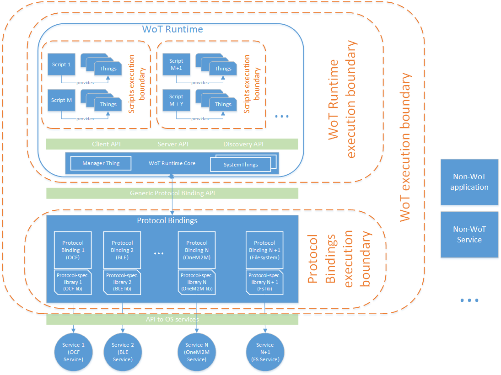

## WoT Threat Model &amp; Security Objectives

**WoT Primary Stakeholders**

This section list primary WoT stakeholders.

| **Description** | **Role** | **Business-driven security goals** | **Interesting edge cases** |
| --- | --- | --- | --- |
| Thing manufacturer (OEM)  | Producer of the HW thing, might define and make TD available for everyone, implements WoT runtime, certifies thing to be WoT compliant. | Don&#39;t want the things to be used in any form of attacks (loss of reputation, possible legal consequences in some countries). Want to satisfy security requirements of solution users and solution providers for better sales.
| Solution provider (solution integrator) | Uses things from OEMs to build various WoT end solutions specific to particular WoT use case(s). OEM might also be a solution provider at the same time. Might define new TDs for things or modify TDs provided by manufacturers. Might use scripting API and runtime provided to implement their solution or might do a full reflash of the thing.  Solution provider&#39;s scripts and their configuration data might require confidentiality and/or integrity | Don&#39;t want their solution to be a target of attacks (loss of reputation, possible legal consequences in some countries). Want to satisfy security requirements of solution users for better sales. Don&#39;t want security to interfere with usability for better sales (usability vs. security). Want solution to be robust and not easily falling down to DoS (at least basic DoS resistance). Want to hide their proprietary scripts and other relevant data from other parties.           ***Any security obligations towards OEMs?*** | There might be several independent solution providers on a single HW Thing. Need to be able to support their isolation within WoT runtime, as well as sharing solution user preferences. |
| Solution user | This might be physical user(s) (as John and his family in their smart home) or an abstract user (as company running the factory). Solutions users might differ in their access to the WoT solution capabilities and transferred data (might be able to configure certain parts of solution only or only use solution as it is). | Don&#39;t want their data to be exposed to any other solution user, solution provider or OEM unless intended (Data confidentiality).Don&#39;t want their data to be modified unless intended (Data integrity).    | Access to the user data might be configurable not only based &quot;who&quot; is the entity accessing data (AC subject), its role, type of access, but also on the time and context data. |

In addition to the above stakeholders, we might need to define a notion of &quot; **Security Owner**&quot;. It defines an entity that provisions a thing with the security root of trust and sets up initial policies on who can provision/update/remove scripts to/from the WoT runtime, if such model is supported. WoT might generally have a number of independent security owners, each with its own set of provisioned certificates and/or credentials. The exact hierarchy of owners that WoT wants to support is to be discussed. ***Todo: this needs more discussion.***

**WoT Supported Physical Roles?**

This section list primary roles that WoT aims to support.

| **Role** | **Description** | **Level of system access?** |
| --- | --- | --- |
| System Maintainer | Administers the WoT network on behalf of solution provider or solution user. ***Todo: need to understand more about this role: what kind of operations would it need to do? Reflash devices, reinstall/install/remove scripts? If it has the level of access equal to solution provider, we just talk about delegation (and there are security mechnisms to do it), not really about separate role...*** | --- |

**Assets**

This section lists all WoT Assets that are important from security point of view.

| **Description** | **Who should have access (Trust Model)** | **Attack Points** |
| --- | --- | --- |
| **Thing Description(TD)** Access Control policies for TDs and resources it provides  are part of TDs and they are managed in discretionary access control model way (owner of TD set the AC policy). Some contents of TDs might be privacy sensitive and therefore should not be shared without a need. TDs integrity is crucial for the system correct operation. | TDs owner: full access Others: read only for minimal required part. | Storage on thing itself, cloud storage, in-transfer (network) including TD updates. |
| **Thing object instance** Thing object instance confidentiality should be guranteed by the system since it might contain privacy-sensitive information. Integrity is also mandatory for the operation. | Thing owner: full access Others: read only for minimal required part. | WoT Runtime |
| **Solution user data** Can be highly privacy sensitive and confidential. | Different solution users might have different level of access to this data based on the use case. Non-authorized access must be minimized since access even to small amount of information (for example last timestamp when door lock API was used) might have severe privacy converns (allows to detect that owner has been away from his house) Mechanism should be flexible to configure and include also RBAC.  Others: should have no access unless specifically allowed | Storage on thing itself, solution provider storage (remote cloud or other), in-transfer (network) |
| **Solution provider scripts and their configuration data** Solution providers might have Intellectual Property (IP) in their scripts, therefore make them highly confidential. | Solution provider: full accessOthers: no access | Storage on the thing itself, remote storage (if scripts are backed up to a remote storage), in-transfer only for initial provisioning and scripts updates |
| **Thing&#39;s resources, WoT Infrastructure resources** | Resources should only be used for legitimate purposes and be available when required. | WoT exposed API |
| **WoT controlled physical environment** | WoT devices that have actuator capabilities are able to affect the physical environment around them. Such capability must only be used by authorized entities and for legitimate purposes only | WoT exposed API |
| **WoT indirectly transmitted behavoir information** Amount of communication between different things, APIs used, distribution of communication over time, etc. | It must not be possible to collect/identify the indirectly transferrable information   | In-trasfer data and usage of WoT Interface  |
| **Unique object indentifier** Highly sensitive asset. ***todo: Need more understanding/discussion on what it is in WoT*** |   |  |
| **Links**  ***todo: Need more understanding/discussion on what it is in WoT, model around links*** |   |  |
| ***Todo: list all the keys/credentials that are used on the level. They will be assets and they will be needed if WoT plans to have its own access control policies and enforce it. The exact list would depend on chosen solution. First step is to obtain the list of protocols that WoT plans to support.*** |   |   |

If in the future the WoT model is extended to allow dynamic installation of scripts inside WoT runtime, the following assets are added:

| **Description** | **Who should have access (Trust Model)** | **Attack Points** |
| --- | --- | --- |
| **Script provisioning/updates policies** Defines who can install/remove new scripts into WOT runtime, update existing ones |  |   |

If in the future the WoT model is extended to allow co-existence of different independent solution providers on a single physical device, the following assets are added:

| **Description** | **Who should have access (Trust Model)** | **Attack Points** |
| --- | --- | --- |
| **Access control policies for co-existing solution providers** Not required if initially a simple model of &quot;full isolation&quot; is applied to scripts, their execution environment and processed data when having more than two solution providers sharing the same WoT runtime. |   | Storage on the thing itself, remote storage (if they are backed up to a remote storage), in-transfer for initial provisioning and policy updates |

**Adversaries**

The following adversaries are in-scope for the WoT threat model: 

| **Persona** | **Motivation** | **Attacker type** |
| --- | --- | --- |
| **WoT Network attacker** | Unauthorised access or modification of any stakeholder's asset. Denial of service. Taking control of WoT network part. Reasons: monetary, fame etc. | Network attack: an attacker has a network access to the WoT network, able to use WoT Interface, perform MitM attacks, drop, delay, reorder, re-play, inject messages. |
| **Malicious authorized solution user** | Unauthorized access of private data of other solution users or other stakeholders (eavesdropping). Unauthorized modification of data of any stakeholder (modification of sensor data). Obtaining higher privileges that originally intended (hotel guest trying to control overall hotel lighting). | Local physical access, WoT configuration point (smartphone, web interface, washing machine interface, etc.). |
| **Malicious unauthorized solution user** | Similar to above, but with no prior access to the WoT system (guest in a house, guest in a factory) | Limited local physical network access, can use proximity factor |
| **Malware developer - 1** | Unauthorised access or modification of any stakeholder's asset. Denial of service. Taking control of WoT network part. Reasons: monetary, fame etc. | Unprivileged software adversary: application intentionally gets installed or code injected into WoT configuration point (user&#39;s smartphone, browser, etc.) or in WoT runtime itself using WoT Interface |
|   |   |   |

If in the future the WoT model is extended to allow co-existence of different independent solution providers on a single physical device, the following adversaries are added:

| **Persona** | **Motivation** | **Attacker type** |
| --- | --- | --- |
| **Malicious solution provider** | Tries to get access or modify other solution providers scripts or data, tries to access or modify solution users data from another solution provider. | Unprivileged software adversary: solution provider scripts running inside WoT runtime |

If in the future the WoT model is extended to allow dynamic installation of scripts inside WoT runtime, the following adversaries are added:

| **Persona** | **Motivation** | **Attacker type** |
| --- | --- | --- |
| **Malware developer - 2** | Same as WoT network attacker | Same as for Malware developer - 1, but in addition WoT management API can be used to install attacker's code into WoT runtime.  |

The following adversaries are out of the scope for the WoT threat model:

| **Persona** | **Motivation** | **Attacker type** |
| --- | --- | --- |
| **Malicious OEM** | Intentionally installs HW, firmware or other lower sw level backdoors, rootkits etc. in order to get unauthorized access to WoT assets or affect WoT system in any form | Local physical access, privileged access |
| **Careless OEM**  | In order to reduce production costs substitutes original HW parts with low quality parts potentially impacting security. | Local physical access, privileged access |
| **Careless Solution provider**  | In order to reduce solution deployment costs utilizes low quality SW, performs poor testing, misconfigures things, TDs and access control policies. | Local physical access, prilividged access |
| **Non-WoT End Point Attacker**  | Tries to get authorized access/modify any asset stored at the non-WoT end points (Cloud, non-WoT devices etc.) Reasons: monetary, fame etc. | Remote or local attack |

**Attack surfaces**

In order to correctly define WoT attack surfaces one needs to determine the system's trust model as well as execution context boundaries. Figure 1 presents high-level view on WoT architecture from the security point of view with all possible execution boundaries. However, in practice certain execution boundaries might not be present and it is dependent on the actual device implementation.

 
Fig.1 WoT High-Level Architecture Security View.

 

The main execution boundaries for WoT system are:

| **Boundary name** | **Description** | **Notes** |
| --- | --- | --- |
| **Scripts execution boundary** | Separates execution contexts between different scripts and script-provided thing instances. If present, this boundary should be implemented either as having different script runtime contexts (with WoT runtime isolation means) or by having separate process execution contexts (with OS process isolation means) | This boundary is required if we assume that WoT Runtime can run untrusted scripts | 
| **WoT execution boundary** | Separates execution contexts between WoT runtime (including Protocol Bindings) and the rest of the system. If present, this boundary should be implemented at least with OS process isolation means, but in addition can be implemented using stronger security measures available on the device (Mandatory Access Control, OS-kernel level virtualization, Full Virtualization etc.)  | This boundary is required if we assume that WoT Runtime might run untrusted scripts or there might be untrusted Protocol Bindings present. It is also required if a device also runs a non-WoT SW stack and elements of that stack can be compromised |
| **WoT Runtime and Protocol Bindings execution boundaries** | Separate execution contexts between WoT runtime and Protocol Bindings. If present, these boundaries should be implemented at least with OS process isolation means. | These boundaries might be needed if we assume that WoT Runtime can run untrusted scripts and would like to implement additional access control measures at the Protocol Binding level. | 

The following WoT attack surfaces are always in-scope for the WoT Security model:

| **System Element** | **Compromise Type(s)** | **Assets exposed** | **Attack Method** |
| --- | --- | --- | --- |
| **WoT Client and Server APIs** | Modification/access to TDs, user data modification/data confidentiality, Unauthorized execution of APIs, DoS | TDs, solution user data, Thing&#39;s resources, WoT Infrastructure resources, WoT controlled environment, WoT indirectly transmitted behaviour information | Network attack |
| **WoT Discovery API/Service** |Modification/access to TDs, Thing&#39;s resources, WoT Infrastructure resources, WoT indirectly transmitted behaviour information | TDs, Thing&#39;s resources, WoT Infrastructure resources | Network attack |
| **Protocol Bindings** | User data modification/data confidentiality, Unauthorized execution of APIs, DoS | Solution user data, Thing&#39;s resources, WoT Infrastructure resources, WoT controlled environment | Network attack |

The following WoT attack surfaces are only in-scope for the WoT Security model if we assume application scripts can be untrusted or we assume co-existence of different solution providers on a single physical device:

| **System Element** | **Compromise Type(s)** | **Assets exposed** | **Attack Method** |
| --- | --- | --- | --- |
| **WoT Script** | Component compromise | TDs, solution user data, solution provider data/scripts | Local attack by other WoT scripts |
| **WoT Runtime** | Component compromise | TDs, solution user data, Thing&#39;s resources, WoT Infrastructure resources, WoT controlled environment, solution provider data/scripts | Local attack by WoT scripts |

If in the future the WoT model is extended to allow dynamic installation of scripts inside WoT runtime, the following attack surfaces are added:

| **System Element** | **Compromise Type(s)** | **Assets exposed** | **Attack Method** |
| --- | --- | --- | --- |
| **WoT Script Management API**  | Compromise of application scripts, including installing older version of legitimate scripts (rollback) |  Solution provider scripts and their execution environment | Network attack  |

Another additional set of attack surfaces might be added if we assume that Protocol Bindings can be untrusted. ***Todo: define them if such model is supported.***

The following attack surfaces are out-of-scope for the WoT Security model:

| **System Element** | **Compromise Type(s)** | **Assets exposed** | **Attack Method** |
| --- | --- | --- | --- |
| **Non-WoT endpoints** This might be non-WoT endpoint devices, user interface devices, remote Clouds etc. | Component compromise | TDs, solution user data, WoT Infrastructure resources | Network attacks, Local attack of all levels |
| **Services below WoT Layer** | Component compromise on levels below WoT | Modification/access to TDs, Thing&#39;s resources, WoT Infrastructure resources | Network attacks, Local attacks of all levels |

**Threats**

This section lists all basic WoT threats, both in-scope and out-of-scope. 

It is important to note that this threat model assumes that WoT User Interface (that might reside on non-WoT device, such as smartphone, PC browser, etc.) communicates with WoT network using standard WoT Interfaces and WoT Protocol Bindings. It is strongly recommended that no other separate communication mean is provided for this purpose. It is also assumed that WoT Protocol Bindings are trusted and cannot come from untrusted parties.    

| **Name** | **Adversary** | **Asset** | **Attack method and pre-conditions** |
| --- | --- | --- | --- |
| **Non-WoT End Point** | All attacker types | TDs, data from solution users, WoT Infrastructure resources stored at non-WoT end points (Cloud, non-WoT devices etc.)  | **Attack method** : Any remote or local attack method that results in attacker to obtain unauthorized access or modify assets stored at the Non-WoT End Point or cause a DoS attack on the service itself. |
| **WoT Platform**  (***currently it incorporates all kinds of attacks on level below WoT runtime. Might break it up a bit later one***) | All attacker types | TDs, data from solution users, Application scripts and their configuration, WoT Infrastructure resources | **Attack method** : Any local or remote attack method on levels below WoT runtime that results in attacker to obtain unauthorized access or modify assets stored at things, or cause DoS attack on thing or WoT infrastructure. |
|**WoT Protocol Bindings** | WoT Network attacker, Malware developer - 1, Malicious solution users | Compromising Protocol Bindings and getting access/control to all WoT assets in the same execution boundary | **Pre-conditions:** General preconditions for network attacker with access to the WoT Interface. In case of Malicious Authorized Solution User or Malware developer - 1 also access to solution user credentials available on the configuration interface (smartphone, tablet etc.) **Attack method:**  Any remote attack method using WoT Interface or directly protocol binding interfaces with the purpose of compromising protocol binding component and access to all available WoT assets |
| **WoT Interface - General Compromise** | Network attacker, Malware developer 1, Malicious solution users | Compromising Thing instance and getting access/control to all available WoT assets in the same execution boundary | **Pre-conditions:** General preconditions for network attacker with access to the WoT Interface. In case of Malicious Authorized Solution User or Malware developer - 1 also access to solution user credentials available on the configuration interface (smartphone, tablet etc.) **Attack method** : Any remote attack method using WoT Interface with the purpose of compromising the Thing instance and as a result getting access/control to all available WoT assets in the same execution boundary  |
| **WoT Interface - Unauthorized API access** | Network attacker, Malware developer 1, Malicious users, Malicious solution provider | Unauthorized access to an asset provided via WoT Interface (WoT controlled environment, users data, non-public parts of TDs, etc.) | **Pre-conditions:** An attacker with an access to the WoT client API **Attack method** : Any remote attack method using WoT Interface with the purpose of obtaining unauthorized access to a WoT asset |
| **WoT TD Privacy** | Network attacker, Malware developer 1| Unauthorized access to privacy-sensitive data exposed via TD| **Attack method** : Passive observation of TD data during transfer or at storage |
| **WoT TD - Local Storage** | Malware developer 1 | TDs authenticity| **Attack method** : Any local or remote attack method on TD in-storage the purpose of its modification, including rolling back to an older version of TD |
| **WoT DoS** | WoT Network attacker, Malware developer - 1, Malicious authorized solution user | Things resources, WoT Infrastructure resources, Infrastructure operability | **Pre-conditions:** General preconditions for network attacker with access to the WoT Interface **Attack method** : Any attack method using WoT Interface in order to cause DoS to an end thing, device or infrastructure (calling WoT Interface methods that require processing, sending too many messages etc.) or to disturb the service operation by intentional dropping all or selective WoT messages |
| **WoT communication - TD Authenticity** | Network attacker, Malware developer 1, Malicious users, Malicious solution provider | TDs authenticity in-transfer | **Pre-conditions:** General preconditions for network attacker with access to the WoT Interface **Attack method** : Any attack method on TDs in-transfer with the purpose of its modification, including rolling back to an older version of TD  |
| **WoT communication - TD Confidentiality** | Network attacker, Malware developer 1, Malicious users, Malicious solution provider | TDs confidentiality in-transfer | **Pre-conditions:** General preconditions for network attacker with access to the WoT Interface **Attack method** : Any attack method on TDs in-transfer with the purpose of obtaining unauthorized access to non-public parts of TDs |
| **WoT communication - Solution Data Authenticity** | Network attacker, Malware developer 1, Malicious users, Malicious solution provider | Solution data authenticity in-transfer | **Pre-conditions:** General preconditions for network attacker with access to the WoT Interface **Attack method** : Any attack method on solution data in-transfer with the purpose of its modification, including sequence of received data, its freshness and illegitimate replay |
| **WoT communication - Solution Data Confidentiality**| Network attacker, Malware developer 1, Malicious users, Malicious solution provider | Solution data confidentiality in-transfer | **Pre-conditions:** General preconditions for network attacker with access to the WoT Interface **Attack method** : Any attack method on solution data in-transfer with the purpose of obtaining unauthorized access to the solution data |
| **WoT communication - Side Channels** | Network attacker, Malicious users, Malicious solution provider | WoT indirectly transmitted behaviour information | **Pre-conditions:** General preconditions for network attacker with access to the WoT client API **Attack method** : Passive observation of WoT network and messages with the intention to learn some behavioural and operational patterns |
| ***Todo: add all the treats respective to the credentials/policy management if any*** |   |   |   |

If in the future the WoT model is extended to allow dynamic installation of scripts inside WoT runtime, the following threats are added:

| **Name** | **Adversary** | **Asset** | **Attack method and pre-conditions** |
| --- | --- | --- | --- |
| **WoT Script Mgm API - 1** | Network attacker, Malware developer, Malicious solution users | Execution inside WoT Runtime(stepping stone to other further local attacks) and all assets within WoT Runtime | **Pre-conditions:** General preconditions for network attacker with access to the WoT Script Mgm API **Attack method**: Attacker installs its own script into WoT runtime using WoT Script Management API or compromises WoT Runtime itself using WoT Script Management API  |
| **WoT Script Mgm API - 2** | Network attacker, Malware developer, Malicious solution users | Execution inside WoT Runtime(stepping stone to other further local attacks) and all assets within WoT Runtime | **Pre-conditions:** General preconditions for network attacker with access to the WoT Script Mgm API **Attack method**: Attacker compromises WoT Runtime itself using WoT Script Management API  |
| **WoT Script Mgm API - 3** | Network attacker, Malware developer, Malicious solution users | Things resources, Infrastructure operability | **Pre-conditions:** General preconditions for network attacker with access to the WoT Script Mgm API **Attack method**: Attacker misuses WoT Script Management API to cause DoS on things or infrastructure, including deleting, corrupting WoT scripts |

If in the future the WoT model is extended to allow co-existence of different independent solution providers on a single physical device or WoT scripts are assumed to be untrusted, it brings the following new threats in addition to the above ones:

| **Name** | **Adversary** | **Asset** | **Attack method and pre-conditions** |
| --- | --- | --- | --- |
| **WoT Script** | Malicious solution provider, Malware developers, Malicious solution users (if they can install their own scripts) | Component compromise | **Pre-conditions:** An attacker has a full control over the script running inside WoT runtime either legitimately (solution provider script) or by compromising a solution provider script or by installing its own script by other means. **Attack method**: Any local attack method on another script running in the same WoT runtime that results in attacker compromising that script and getting controls over it |
| **WoT Runtime** | Malicious solution provider, Malware developers, Malicious solution users (if they can install their own scripts) | Component compromise | **Pre-conditions:** An attacker has a full control over the script running inside WoT runtime either legitimately (solution provider script) or by compromising a solution provider script or by installing its own script by other means. **Attack method**: Any local attack method on WoT runtime with the purpose of elevating its privileges to WoT runtime level |
| **WoT Script - Confidentiality** | Malicious solution provider, Malware developers, Malicious solution users (if they can install their own scripts)| Solution provider scripts and configuration confidentiality | **Pre-conditions:** An attacker has a full control over the script running inside WoT runtime either legitimately (solution provider script) or by compromising a solution provider script or by installing its own script by other means. **Attack method**: Any local attack method on another script running in the same WoT runtime that results in attacker in obtaining knowledge about script or its configuration |
| **WoT Script - Authenticity**| Malicious solution provider, Malware developers, Malicious solution users (if they can install their own scripts) | Solution provider scripts and configuration authenticity | **Pre-conditions:** An attacker has a full control over the script running inside WoT runtime either legitimately (solution provider script) or by compromising a solution provider script or by installing its own script by other means. **Attack method** : Any local attack method on another script running in the same WoT runtime that results in attacker in modifying script or its configuration, including rolling back to an older version of a script |
| **WoT Local - TD Authenticity** |  Malicious solution provider, Malware developers, Malicious solution users (if they can install their own scripts) | TDs authenticity as stored on a thing | **Pre-conditions:** An attacker has a full control over the script running inside WoT runtime either legitimately (solution provider script) or by compromising a solution provider script or by installing its own script by other means. **Attack method**: Any local attack method on another script running in the same WoT runtime that results in attacker unauthorized modification of TDs, including rolling back to an older version of TD |
| **WoT Local - TD Confidentiality** |  Malicious solution provider, Malware developers, Malicious solution users (if they can install their own scripts) | TDs integrity as stored on a thing | **Pre-conditions:** An attacker has a full control over the script running inside WoT runtime either legitimately (solution provider script) or by compromising a solution provider script or by installing its own script by other means. **Attack method**: Any local attack method on another script running in the same WoT runtime that results in attacker unauthorized access to non-public parts of TDs. |
| **WoT Local - Solution Data Authenticity** |  Malicious solution provider, Malware developers, Malicious solution users (if they can install their own scripts) | Solution data authenticity as stored/processed on a thing | **Pre-conditions:** An attacker has a full control over the script running inside WoT runtime either legitimately (solution provider script) or by compromising a solution provider script or by installing its own script by other means. **Attack method**: Any local attack method on another script running in the same WoT runtime that results in attacker in being able to modify solution data, including rolling back to an older version of solution data |
| **WoT Local - Solution Data Confidentiality** |  Malicious solution provider, Malware developers, Malicious solution users (if they can install their own scripts) | Solution data confidentiality as stored/processed on a thing | **Pre-conditions:** An attacker has a full control over the script running inside WoT runtime either legitimately (solution provider script) or by compromising a solution provider script or by installing its own script by other means. **Attack method** : Any local attack method on another script running in the same WoT runtime that results in attacker getting unauthorized access to the solution data |
| **WoT Local - DoS** |  Malicious solution provider, Malware developers, Malicious solution users (if they can install their own scripts) | Thing resources, Infrastructure operability of other solution providers | **Pre-conditions:** An attacker has a full control over the script running inside WoT runtime either legitimately (solution provider script) or by compromising a solution provider script or by installing its own script by other means. **Attack method** : Any local attack method with the goal of consuming things or infrastructure resources that disturb legitimate operation of co-existing providers.

**Security objectives**

**Scenario 1 - Home environment**

In this scenario we assume a standard home environment with a WoT network running behind a firewall that separates it from the rest of the Internet. However the WoT network is shared with the standard user home network that contains other non-WoT devices that have high chances of being compromised. This results on viewing these non-WoT devices as network attackers with access to WoT network and its APIs/Protocol Bindings. WoT scripts and protocol bindings are considered trusted, single solution provider exists on physical WoT devices, no dynamic installation of WoT scripts are possible.

This scenario implies the following **WoT Security objectives**:

| **Threat name** | **Example(s)** | **Mitigation** |
| --- | --- | --- |
| **WoT Protocol Bindings** | A compromised application on a user smartphone connected to the same internal network as WoT devices sends a malformed request to a WoT device using directly Protocol Bindings interface. This malformed request causes the respective Protocol Binding to be compromised and attacker is able to run the code with the privileges of the Protocol Binding on the WoT device.  | TBD |
| **WoT Interface - General Compromise** | A compromised application on a user smartphone connected to the same internal network as WoT devices sends a malformed request to a WoT device using WoT interface. This malformed request causes the respective Thing Instance to be compromised and attacker is able to run the code with the privileges of the Thing Instance on the WoT device.| TBD  |
| **WoT Interface - Unauthorized API access** | A user's party guest with the network access to the same internal network as WoT devices using his device sends a WoT interface request to a user's WoT device for a certain resource access, for example, to get a video stream from user's video camera footage or permission to unlock some rooms in the house. Due to lack of proper authentication, it is able to access this information or execute the required action (opening the door). | TBD  |
| **WoT communication - TD Authenticity** | A compromised application on a user smartphone connected to the same internal network as WoT devices listens to the network and intercepts a legitimate TD send by one of the WoT devices. Then it modifies the TD to state different authentication method or authority and forwards it to the intended device. The device follow the instructions in the modified TD and sends authentication request to the attacker's specified location potentially revealing its credentials, such as keys etc. Similarly instead of modifying the legitimate TD, an attack might save it and use later on, for example when it would be updated to a newer version. Then, an attacker substitutes a new version of TD with an older version to cause DoS to a device trying to get an access to a resource. An additional reason for using an older TD might be exposing a previously available vulnerable interface that got hidden when TD was updated to a newer version. This can be a stepping stone to conducting other attacks on the WoT network.| TBD |
| **WoT communication - TD Confidentiality** | A user's party guest with the network access to the same internal network as WoT devices using his device listens to the network and intercepts a legitimate TD send by one of the WoT devices. While inspecting the TD he/she learns the privacy-sensitive information about the host, such as presence of medical tracking/assistant equipment, name of healthcare provider company etc. | TBD  |
| **WoT communication - Solution Data Authenticity** | A user's party guest with the network access to the same internal network as WoT devices using his device listens to the network and intercepts a legitimate WoT interface request to set some settings on some actuator, for example the time when house doors get locked and unlocked. He then modifies the specified value to the desirable one and then forwards the request to the destination WoT device. The destination WoT device accepts incorrect settings. Another attack example is a replay of a legitimate WoT interface request to set a setting, for example, increase temperature of the house by a number of degrees. When repeated many times, it might not only make living environment unusable, but also break heating equipment. Another attack involves replaying an old legitimate WoT interface request that attacker intercepts while visiting user's home, such as command to unlock the doors, stop camera recordings etc. in a different time when user wants to get authorized access to the house.  |  TBD  |
| **WoT communication - Solution Data Confidentiality**  |  A user's party guest with the network access to the same internal network as WoT devices using his device listens to the network and intercepts WoT interface exchange between legitimate entities. From that exchange the guest learns the privacy-sensitive information about the host, such as data stream from his medical tracking equipment, information about user's preferences in home environment, video/audio camera stream etc. |  TBD  |
| **WoT DoS** | A compromised application on a user smartphone connected to the same internal network as WoT devices sends huge amount of requests to either a single WoT device or all device available in the WoT network using directly Protocol Bindings interface or WoT interface. These requests fully take the processing bandwidth of a WoT device or WoT network and make it impossible for legitimate users to communicate with WoT devices or devices to communicate with each other. Depending on the implementation it can also lead to the case that alarm or authentication systems might be disabled and thieves get into user's house (however systems should always implement "safe defaults" principle and in such cases keeps doors closed despite of inability to authenticate). | TBD |
| **WoT TD Privacy** | A compromised application on a user smartphone connected to the same internal network as WoT devices listens for publicly broadcasted TDs and sends this data to a remote attacker to build a profile of home installed devices and their purpose. | TBD |
| **WoT TD - Local Storage** | | TBD |

As well as the following **Security non-objectives**:

| **Threat name** | **Reasoning &amp; recommendation** |
| --- | --- |
| **Non-WoT End Point** | **Reasoning** : The security of non-WoT end points and their external interfaces is out of the WoT scope. **Recommendations** : Solution providers and OEMs are recommended to use industry best security practices when designing their non-WoT End points, protocols and interfaces.|
| **WoT Platform**| TBD |
| **WoT communication Side Channels** |  TBD |
|   |   |

