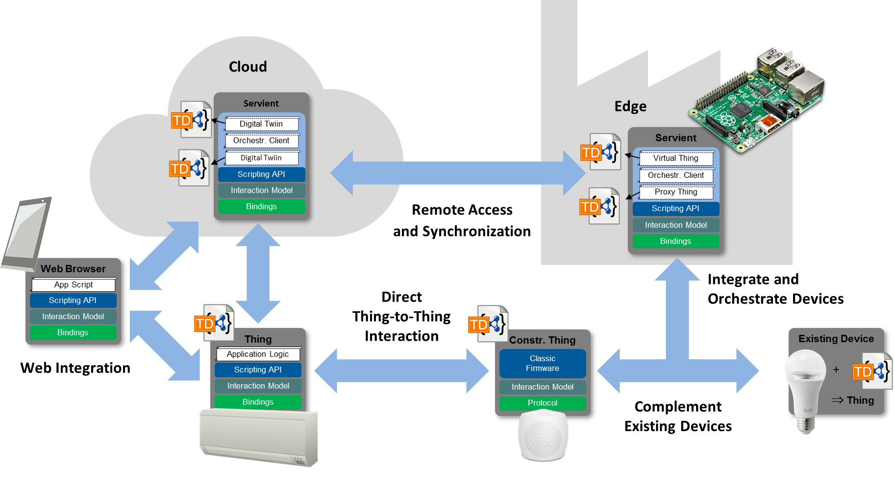
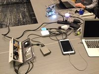
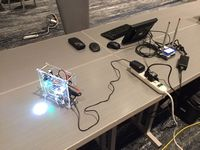
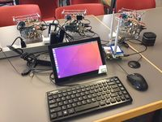
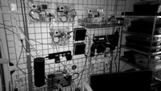
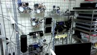
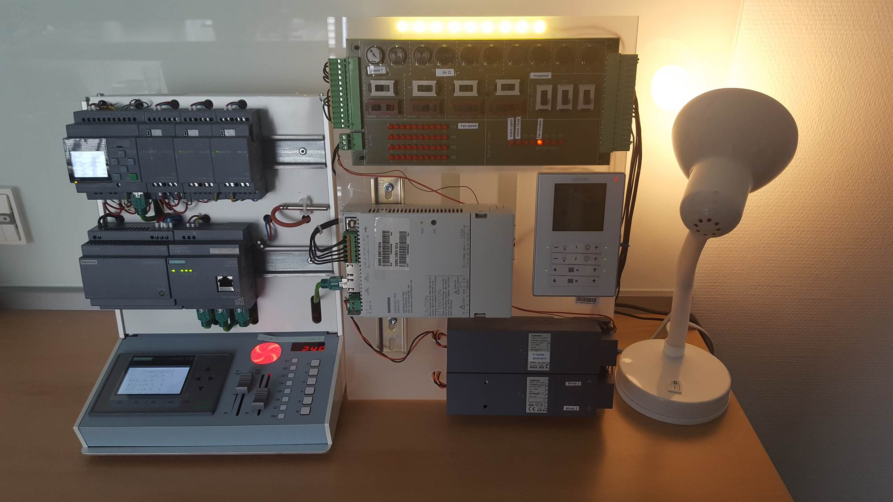
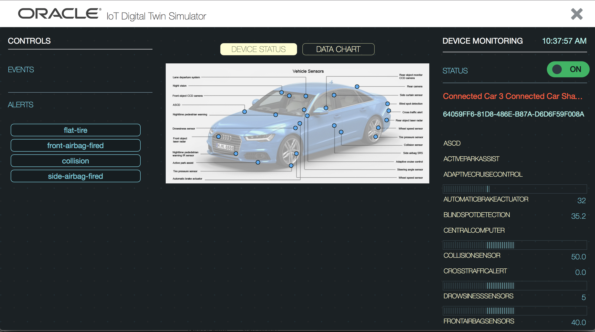
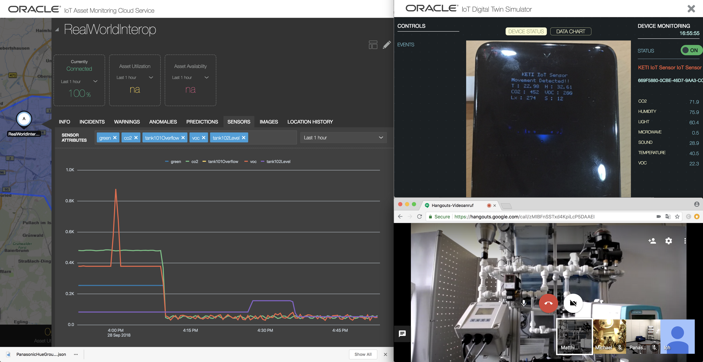

# Web of Things Marketing Material

**The following is WIP and not yet ready for release.** 

For detailed descriptions and high-resolution images, please follow the links.

## Figures

[Abstract WoT architecture](wot-arch.md)

## Joint DemosAC2018_Demo.jpg

[AC2018_Demo - from W3C AC Meeting 2018](AC2018_Demo.md)  

## Prototypes and Test Systems from Intel
  
[Things1 - from Burlingame TPAC 2017](Things1.md)  

  
[Things2 - from Burlingame TPAC 2017](Things2.md)  

  
[Things3 - from Burlingame TPAC 2017](Things3.md)  

  
[Intel WoT Lab, in IR](Intel_WoT_Lab_IR.md)  

  
[Intel WoT Lab](Intel_WoT_Lab_Visible.md)  

## Prototypes and Test Systems from Siemens
   
[WoT-enabled industrial devices](Siemens_Industrial.md)

## Device Simulators from Oracle

 
  
[Digital Twin Simulators](Oracle_Digital_Twin_Simulators.md)

   
[Digital Twin Simulator](Oracle_Digital_Twin_Simulator.md)

   
[Connected_Car_Simulator](Oracle_Connected_Car_Simulator.md)

## Monitoring and Control of Devices

   
[Asset Monitoring and Control](Oracle_Industrial_Scenario.md)

[Asset Monitoring: Home Scenario](Home_Scenario_1.md)
	

[Asset Monitoring: Home Scenario](Home_Senario_2.md)

		
[Asset Monitoring: Industrial Scenario](Industrial_Senario_1.md)

[Asset Monitoring: Industrial Scenario](Industrial_Senario_2.md)	

[Interoperability across manufacturers](Interoperability.md)