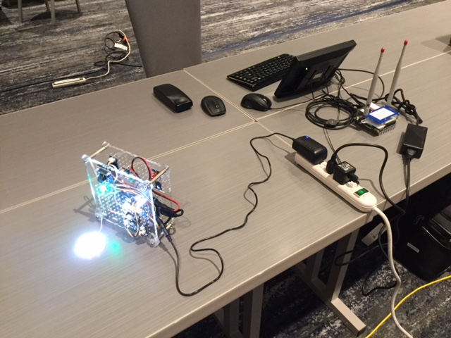

# Things2.JPG
   
OCF devices (enabled by the open-source IoTivity implementation) with WoT Thing Descriptions automatically generated from OCF metadata, accessed via an HTTP bridge running on an Intel gateway.  
Demonstrated at TPAC 2017 in Burlingame, CA.
