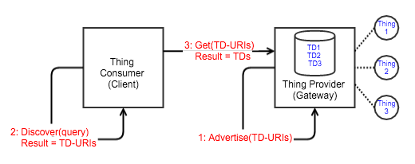

# WoT Discovery

This document describes initial ideas for usage of discovery protocols in WoT. The main goal of discovery in WoT is to find thing descriptions of things that fulfil a specific request (query). 

## Discovery Flows

This section discusses potential discovery options independent from the underlying discovery or lookup technology. Below is an explanation for each of the components used in the diagrams:

 - **Thing Consumer**: is an application component that discovers thing descriptions (TDs) that fulfil a discovery request (query).
 - **Thing Provider**: is an application component that is responsible for providing access to one or multiple things. A Thing Provider may offer the thing descriptions or use central Thing Registry. 
 - **Thing Registry**: is an application component for registering thing descriptions. It offers a lookup interface to find thing descriptions for a specific query. It also offers an interface to retrieve a single thing description. 
 - **TD Generator**: is an application component that generates Thing Descriptions on the fly based on templates for specific devices or technologies. It offers an interface that accepts requests containing metadata of a thing and returns a Thing Description with the corresponding binding information.

### Discovery Flow 1

#### Steps

 1. Thing Provider registers its things in a Thing Registry. The Thing Registry stores for each Thing its corresponding Thing Description. 
 2. Thing Consumer sends a lookup request that contains the search query to the Thing Registry. The Thing Registry responds with a list of Thing Descriptions that fulfil the request.

#### Remarks

 - Thing Consumer and Thing Provider need to use the same Thing Registry

#### Potential Setup and Example Technologies
 
 - Thing Provider runs on a Gateway connected to the Internet using appropriate technologies e.g. HTTP, WS, CoAP, MQTT, ...  
 - Thing Registry uses an appropriate database e.g. SPARQL database and provides interfaces e.g. REST to register or retrieve things.
 - Thing Consumer sends lookup queries using appropriate query language e.g. SPAQL to the REST interface of the Thing Registry.

### Discovery Flow 2

#### Steps

 1. Thing Provider registers its things in a remote Thing Registry. The Thing Registry stores for each Thing its corresponding Thing Description and return the TD-URIs (URIs of registered Thing Descriptions) to the Thing Provider.
 2. Thing Provider advertises the TD-URIs using an appropriate technology.
 3. Thing Consumer discovers TD-URIs advertised in previous step using the same technology.
 4. Thing Consumer requests the thing descriptions for the discovered TD-URIs from the Thing Registry.

#### Remarks

 - After retrieving the thing descriptions, the Thing Consumer may need to filter them according the query depending from the filtering capability of the used discovery technology. 

#### Potential Setup and Example Technologies

 - Thing Provider runs on a Gateway connected to the Internet using appropriate technology e.g. HTTP, WS, CoAP, MQTT, ...  
 - Thing Provider advertises TD-URIs in the Network e.g. using SSDP or to nearby devices using BLE
 - Thing Registry may use a simple web server to host the thing descriptions. It provides interfaces e.g. REST to register or retrieve things.

### Discovery Flow 3

#### Steps

 - Thing Provider hosts the Thing Descriptions locally and advertises corresponding TD-URIs. 
 - Thing Consumer discovers TD-URIs advertised in previous step using the same technology.
 - Thing Consumer requests the thing descriptions for the discovered TD-URIs directly from the Thing Provider. 

#### Remarks

- After retrieving the thing descriptions, the Thing Consumer may need to filter them according the query depending from the filtering capability of the used discovery technology. 

#### Potential Setup and Example Technologies  

 - Thing Provider runs on a Gateway which may not be connected to the internet.
 - Thing Provider advertises local TD-URIs in the Network e.g. using SSDP.
 - Thing Consumer discovers TD-URIs in the Network e.g. using SSDP.
 - Thing Consumer retrieves Thing Descriptions e.g. using HTTP GET.  

### Discovery Flow 4

#### Steps

 1. Thing Provider stores thing descriptions in a local database and advertises the local Lookup-Endpoint. 
 2. Thing Consumer discovers the Lookup-Endpoint advertised in previous step using the same technology.
 3. Thing Consumer sends the search query to the Lookup-Endpoint and receives the thing descriptions that fit the criteria of the query.

#### Remarks

 - Filtering capabilities for discovery technology is not required

#### Potential Setup and Example Technologies

 - Thing Provider consists of a simple database for things description e.g. document oriented DB where each document represents a Thing Description.
 - Thing Provider advertises its local Lookup-Endpoint e.g. using mDNS.
 - Thing Consumer discovers Lookup-Endpoints e.g. using mDNS.
 - Thing Consumer retrieves Thing Descriptions by sending the query to each discovered Lookup-Endpoint e.g. using REST.

### Discovery Flow 5

#### Steps

 1. The Thing Provider advertises Things-Metadata using appropriate technology.
 2. The Thing Consumer discovers Things-Metadata from previous step.
 3. The Thing Consumer sends discovered Things-Metadata including information about used technology to a TD Generator that creates the Thing Descriptions on the fly based on existing templates and Things-Metadata.
 4. The Thing Consumer may cache generated Thing Descriptions and use them when the same things are discovered again. 

#### Remarks

 - The TD Generator may run on the Thing Consumer.

#### Potential Setup and Example Technologies

 - Thing Provider is a BLE device that offers GATT services.
 - Thing Consumer is a BLE device that discovers and consumes discovered GATT services.
 - TD Generator supports templates for BLE GATT. It creates Thing Descriptions with BLE-GATT bindings.
 
## Bindings to Discovery Protocols

This section discusses bindings to state of the art discovery technologies. Each subsection considers one concrete technology.

### SSDP Binding

TBD

### mDNS Binding

TBD

### BLE-GATT Binding

TBD

### Eddystone Binding

TBD