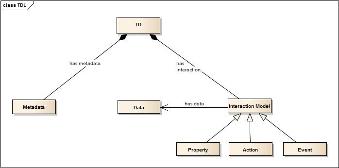

# About this Tutorial
This tutorial explains how to use the Thing Description (TD) and its minimal vocabulary set. As example, an LED lamp will be modeled with the TD using the JSON-LD format.

A sample protocol binding for CoAP will be discussed at the end of this tutorial.

## Table of Contents
1. [ Basics about Thing Description](#basics-about-thing-description)
2. [Sample Thing: LED Lamp](#sample-thing-led-lamp)
  1. [Thing Description LED Lamp](#sample-thing-led-lamp)
  2. [CoAP Protocol Binding](#coap-protocol-binding)


# Basics about Thing Description
The TD is mainly based on the entities Metadata, Data, and the 3 interaction models Property, Action, and Event.





### Metadata
Metadata is used to provide some generic information which may be not that relevant at runtime. There are 3 mandatory vocabularies defined within the Metadata:

* Name: Name of the Thing
* Protocol: Which kind of protocol is supported (e.g., HTTP, CoAP, XMPP, etc,)
* Encoding: Which kind of serialization format is supported (e.g., JSON, XML, etc.)

Note: Besides of these 3 defined vocabularies additional characteristics can be defined such as product id, firmware version, location, etc..

### Data
This field is used to define application-specific data types that are used by the interaction models (property, action, event).

Per default, a subset of XML Schema simple data types is supported which includes string, int, float, byte, short, boolean, unsignedByte, unsignedShort, unsignedInt, and hexBinary (=byte array).

An input or output data fields can be assigned as empty which is equivalent to 'void' or 'null'.

### Property

The interaction variant Property is used to serve properties of a Thing which can be static and/or dynamic (e.g., temperature value, fill level of water, etc.).

There are 3 mandatory vocabularies defined within the Property:

* Name: Name of the property
* OutputData: Which data type is associated with this property
* Writeable: Is this property writeable (true/false).
* Stability: [optional] Max time of stability of the property value in ms (0ms=stable/static property value)  

Note: If the property is writeable=true, then the property accepts inputData which has the same data type as defined by the outputData.  

### Action
The interaction variant Action invokes actions on a Thing which may or may not result in state change (e.g., move a robot, brew a cup of coffee, etc).

There are 3 mandatory vocabularies defined within the Action:

* Name: Name of the action
* InputData: Which input data is associated with this action
* OutputData: Which output data is associated with this action

### Event
The interaction variant Event enables an intention to be notified by the Thing on a certain condition.
There are 2 mandatory vocabularies defined within the Event:

* Name: Name of the action
* OutputData: Which data is associated with this event

Note: Event can also be seen as a specializiation of a Property with ability for subscription.

# Sample Thing: LED Lamp
A LED Lamp 'MyLED' has following characteristics:
* supports CoAP and HTTP as application protocol
* supports only JSON as exchange data format
* can be switched on / off (ledOnOff) using a boolean value (true=On, false=Off)
* fade in (fadeIn) and fade out (fadeOut) with a fade in/out time in seconds (=unsignedByte)
* provides the color temperature (colorTemperature) in unsignedShort; color temperature can be changed by a client
* provides current rgb values (red, green, blue) each of them in unsignedByte
* notifies when color temperate is changed (colorTemperatureChanged)

Bringing this in the Thing Description context, we would categorize this information in the following way

##### Metadata
* Name = "MyLED"
* Protocol = CoAP and HTTP
* Encoding = JSON

##### Property
1)
* Name =  "colorTemperature"
* OutputData = unsignedShort
* Writeable= true

2)
* Name =  "rgbValueRed"
* OutputData = unsignedByte
* Writeable= false

3)
* Name =  "rgbValueGreen"
* OutputData = unsignedByte
* Writeable= false

4)
* Name =  "rgbValueBlue"
* OutputData = unsignedByte
* Writeable= false

5)
* Name =  "ledOnOff"
* InputData = boolean
* OutputData = void/null

##### Action
1)
* Name =  "fadeIn"
* InputData = unsignedByte
* OutputData = void/null

2)
* Name =  "fadeOut"
* InputData = unsignedByte
* OutputData = void/null

##### Event
* Name =  "colorTemperatureChanged"
* OutputData = unsignedShort

The resulting JSON-LD document is located at [`wot/TF-TD/TD Samples/led.json`](/TD Samples/led.json).

It includes a default JSON-LD context file, which is hosted [here](https://w3c.github.io/wot/w3c-wot-td-context.jsonld).
The ontology referenced by the context can be found as an .owl file at [`wot/TF-TD/Ontology/w3c-wot-td.owl`](/Ontology/w3c-wot-td.owl).

## CoAP Protocol Binding

[Note: This subsection is in work in progress and reflects the current status of the WoT discussion.]

The LED TD points CoAP as application transport protocol and JSON as data serialization format. A simple protocol binding convention can be met as describt in [CoAP binding for WoT interaction patterns](https://github.com/w3c/wot/blob/master/plugfest/binding_coap.md):

##### Property colorTemperature
###### Read Request (with HATEOAS)
GET coap://www.example.com:5683/ledlamp/colorTemperature


###### Payload Response (with HATEOAS)

```
{
    "value" : 4000
    "links" : {
      "method" : "PUT",
      "href" : "/colorTemperature"
  }
}
```
###### Read Request (without HATEOAS)
GET coap://www.example.com:5683/ledlamp/colorTemperature/value


###### Payload Response (without HATEOAS)

```
{
	"value" : 4000
}
```


###### Write Request
PUT coap://www.example.com:5683/ledlamp/colorTemperature/value

Payload

```
{
	"value" : 4500
}
```

###### Payload Response
empty

###### Payload Response (with HATEOAS)
```
{
  "links" : {
    "method" : "GET",
    "href" : "/colorTemperature"
  }
}
```

##### Action fadeIn

POST coap://www.example.com:5683/ledlamp/fadeIn

Payload


```
{
    value : 5
}
```

###### Payload Response
```
{
  "actionStatus" : {
    "status" : "running",
    "createdTime" : "201509021310",
    "links" : [
      {
        "href" : "/fadeIn/1",
        "rel" : "execution"
      }

    ]
  }
}
```
