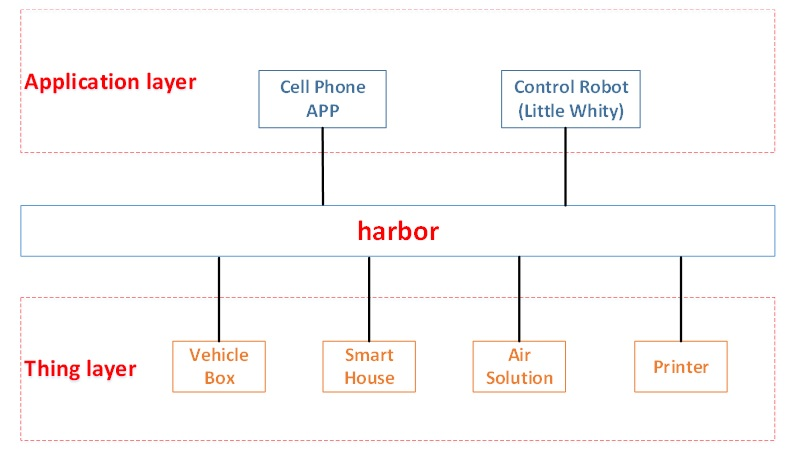
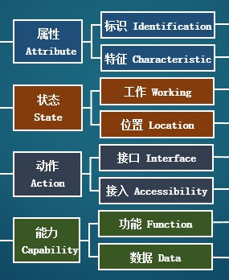

# CETC Beijing Demo Use Cases

## Architecture

The main idea of CETC Open IoT System Architecture is to build a harbor between Apps and things. The things need to register to the harbor to operate. The harbor controls the of things and exposes some standard APIs. Apps can be installed on a smartphone, PC, other IoT devices etc.

In the Demo we used two Apps to control things, one was installed on a cellphone and the other one was integrated with a robot.

The protocol we currently use between Apps and harbor is WebSocket and the protocol between harbor and things is E-things Communication Protocol. For more information please visit [E-things Communication Protocol](https://www.w3.org/WoT/IG/wiki/File:E-things_Communication_Protocol.docx). We plan to support mutiple protocols in the future.

## Things Description

We use ASAC thing description language to describe a thing. We believe that core to connect things is to connect the capabilities of things. ASAC indicates Attribute, State, Action and Capability. We do not have the exact defenition of these terms right now. We are working on that.

### Attribute

Attributes are the inherent properties, they are the information about the things that usually will not change during operation.

#### Identification

Identifications are the basic information of the thing, for example the model, producer etc.

#### Characteristic

Characteristics are the individual information of the things, for example the serial number, owner etc.

### State

States are the information of things that shows its working status. These may change during the lifecycle of the thing.

#### Working

Working states indicates how the things is working. It includes working and fault states with states name, states ID etc. It also shows the resources the thing is consuming.

#### Location

This field shows the geological location, network location and time reference of the thing.

### Action

Action shows how to use the thing.

#### Interface

Interface field describe the resources of the thing. These resources can be called to supply data, do some work etc. This is the part that teaches the harbor how to use the capabilities of the thing. 

#### Access

This field shows the communication method and protocol the thing support and the administrator of the thing. This field is about how to communicate with the thing.

### Capability

Capability field includes information about the thing's operation.

#### Function

Functions are the semantic expression about interfaces. For example a printer has an interface named "Print_Doc" and here is a function named "Print". The fuction is referenced to the interface. In the actual use of things there will be more and more functions. One function can reference to mutiple interfaces.

#### Data

Data are quite like a function, except the result here is not an action of the thing, but some data.  

## Examples

In this folder there are Thing Description for the for things we displayed in the Demo. There may be some Chinese character but those are for the semantic meaning. That should not effect the understanding of the description file. I'll translate some of them.