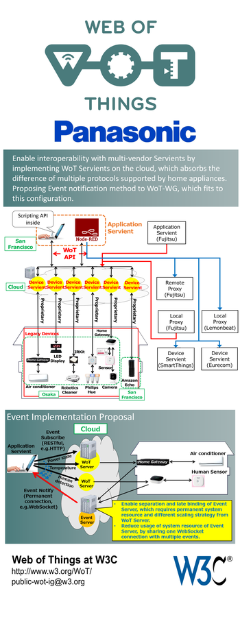
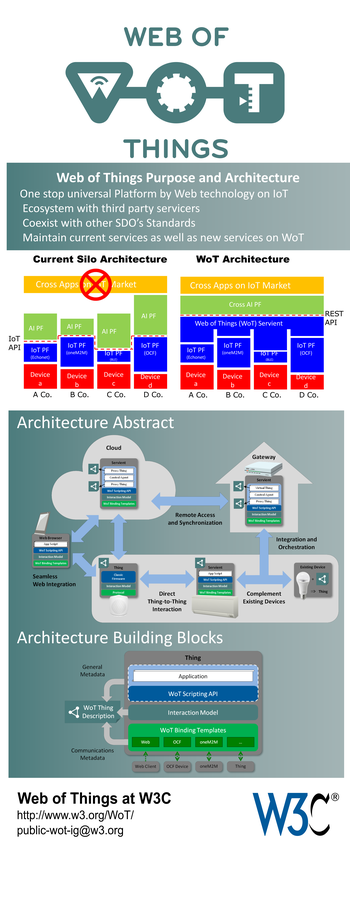

Posters prepared for and displayed for TPAC 2017 in Burlingame.

This archive contains both source vector graphics files (SVG or PPT),
derived vector graphics files (PDF) and rasterized images (PNG).
The images with an "ssm" suffix are 350 x 916 and are meant only for
preview.
The images with an "sm" suffix are 4800 x 12562 pixels and are
suitable for small 16" x 40" vertical banners at 300 dpi.  
The images without prefixes are 
suitable for printing on 32" x 80" vertical banners at 300 dpi
but are fairly large (9600 x 25125 pixels).
