# Plugfest preparation for TPAC2017

# 1. Introduction

This document describes the information related to the next plugfest in Sunnyvale and demonstration in TPAC, Burlingame in November.

## 1.1 Backgroud

In the past plugfest, we've already checked consistency of the interfaces of two Servients provided by different members. They were combinations of application and device, or device to device. These application and devices were compatible to WoT and talked with it.
To setup a larger scale system, the gateawy functions are required to connect multiple applications and devices located on the different places. Since some Servients may be connected to the local network and the others to the Internet, new issues for these connections should be considered such as security, firewall and NAT, device management and so on. This plugfest will be good opportunity to new issues to resoluve in the future in WoT-WG.

## 1.2 Use case

The drawing below is an use case for the next plugfest. This is the smarthome application that the application on the smartphone can control the air conditioner in the house. The agent and the gateway have gateway functions that connects with applications, devices, and gateways.

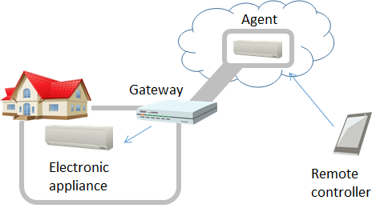

## 1.3 Available Services

* [PlugFest Playground](http://plugfest.thingweb.io/)
* [Thing Directory](http://plugfest.thingweb.io:8081/api.json) (Swagger Documentation)
  * [HTTP interface](http://plugfest.thingweb.io:8081/td)
  * [CoAP interface](coap://plugfest.thingweb.io:5681/td)
* [WebUI](http://plugfest.thingweb.io/webui/)

## 1.4 Available Code

* [Servient (node-wot)](https://github.com/thingweb/node-wot)
* [Thing Directory (Thingweb Directory)](https://github.com/thingweb/thingweb-directory)
* ...

# 2. Servients

## 2.1 4-layered Servients

3 types of WoT Servients was derived from the use case described in 1.2. These are defined below:  
* Device Servient: WoT Servient with Exposed Thing, e.g. devices
* Application Servient: WoT Servient with Consumed Thing, e.g. applications
* Proxy Servient: WoT Servient with both Exposed and Consumed Thing, e.g. gateways

The Proxy Servient are seperated to 2 types fo them, Remote Proxy and Local Proxy. The Remote Proxy Servient is deployed on the Internet and connected with the Applicationd Serivent and the Local Proxy Servient. The Local Proxy Servient is done on the Local network and connects with the Remote Proxy Servient and the Device Servient. The layered diagram is shown below.

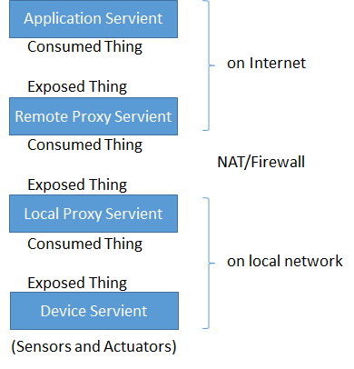

## 2.2 Servients and Protocols

<table>
 <tr><th>Servients</th><th colspan=2>Fujitsu</th><th colspan=2>Panasonic</th><th>Internet Reserach Institute</th><th colspan=2>Siemens</th><th>Lemonbeat</th><th colspan=2>Intel</th><th colspan=2>SmartThings</th><th>EURECOM</th><th></th></tr>
 <tr><th>Application</th><th>Scripting App.</th><th>NodeRED</th><th>Scripting App.</th><th>NodeRED</th><th>NodeRED</th><th>Scripting App.</th><th>WebUI</th><th></th><th>AWS WoT Skill</th><th>AlexNet Recog Service</th><th>NodeRED Local</th><th>NodeRED Remote</th><th></th><th></th></tr>
 <tr><th>=protocol</th><th>HTTP</th><th>HTTP(s)</th><th colspan=2></th><th>HTTP(s)</th><th>HTTP, CoAP, BACnet, Modbus</th><th>HTTP, CoAP
</th><th></th><th colspan=2>HTTPS</th><th colspan=2>HTTP</th><th></th><th></th></tr>
 <tr><th>Remote Proxy</th><th colspan=2>Fujitsu Cloud</th><th colspan=2></th><th></th><th colspan=2>WoS Messaging Service</th><th></th><th colspan=2>Cloud proxy shadow</th><th colspan=2>Remote Gateway</th><th></th><th></th>
 <tr><th>=protocol</th><th colspan=2>HTTP(s)+WS</th><th colspan=2></th><th></th><th colspan=2>(tunnel)</th><th></th><th colspan=2>HTTPS/CoAP(s)</th><th colspan=2>Multi</th><th></th><th></th>
 <tr><th>Local Proxy</th><th>Local Gateway</th><th>Local Gateway</th><th colspan=2></th><th></th><th colspan=2>WoS Messaging Service, TD Registration Agent</th><th></th><th colspan=2>Local Proxy</th><th colspan=2>Local gateway</th><th></th><th></th></tr>
 <tr><th>=Protocol</th><th>HTTP</th><th>HTTP</th><th>HTTPS</th><th>HTTPS+WSS</th><th></th><th colspan=2>HTTP</th><th>HTTP</th><th colspan=2>CoAP</th><th colspan=2>Multi</th><th>???</th><th></th></tr>
 <tr><th>Device</th><th>Sensors(Luminance sensor, Humidity sensor, Temperature sensor, Accelerometer), Rotating Light</th><th>Air conditioner, LED light, Blind</th><th>LED light, Air conditioner, Robot Cleaner</th><th>Human Detection Sensor, Amazon Echo, Google Home</th><th></th><th colspan=2>Remote Festo Plant (valve, pump, levelmeter), BACnet Demonstrator, Logo! Demonstrator, RGB LED Light</th><th>Sensors(Luminance sensor, Humidity sensor, Temperature sensor), Binary actuator</th><th colspan=2>OCF RGB light, OCF Light, OCF Buzzer, OCF temperture, OCF Button, OCF Proximity, OCF Slider, Still camera</th><th colspan=2>Dimmable Light(OCF), Motion Sensor(OCF), Dimmable Light(ST), Motion Sensor(ST), Gas Sensor(IPSO), PM2.5 Sensor(IPSO), Temperature Sensor(IPSO), Humidity Sensor(IPSO), Loudness Sensor(IPSO), Illuminance Sensor(IPSO), PIR Sensor(IPSO), Barometer Sensor(IPSO), OCF Bridge</th><th>Sensors and Actuators in the car(BMW X5)</th><th></th></tr>
</table>

## 2.3 Servients from plugfest participants

The following figure shows diagrams of Servients that the participants provide for the plugest. 

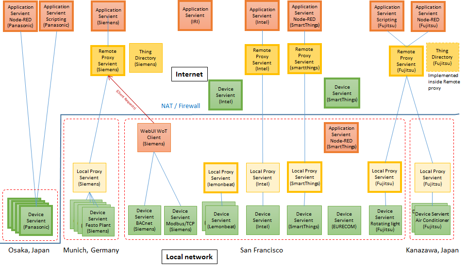

# 3. Plugfest scenarios

## 3.1 main part 

### 3.1.1 Scenario 1
Remote application servients connect to each Remote proxy and device servient. Each participant setup and check the behavior before the connections. 

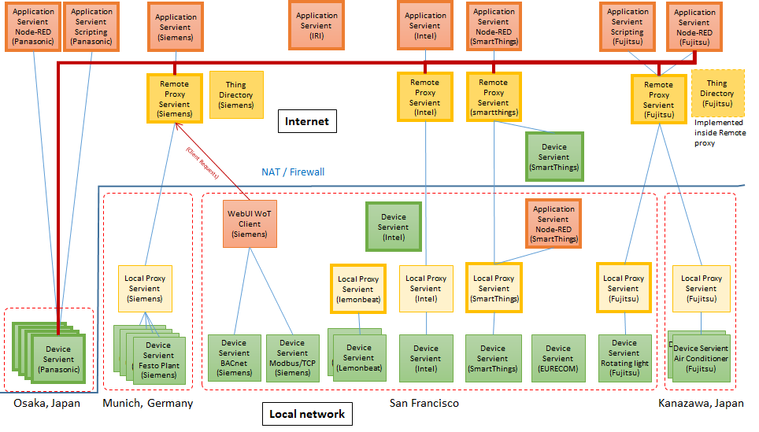

### 3.1.2 Scenario 2
A remote proxy servient can accept request from an application and operate local devices via a local proxy servient. The remote proxy has a Thing directory that keeps the TDs corresponding to all devices. The application can get the TD from it.

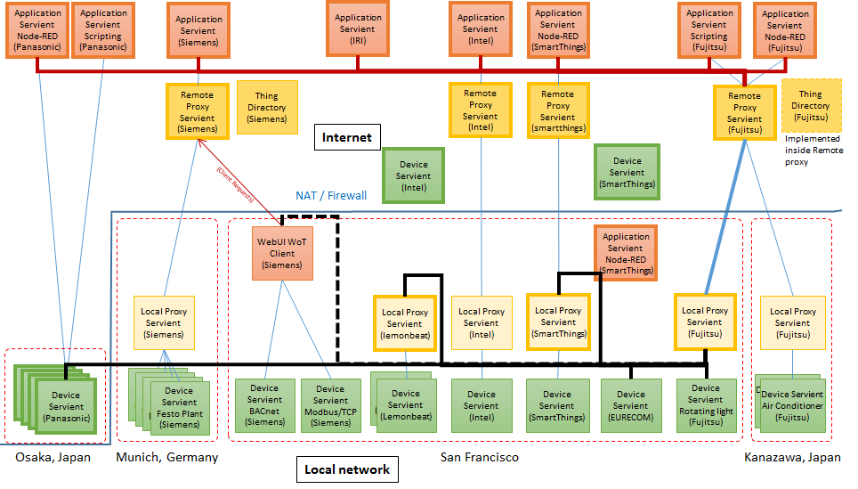

### 3.1.3 Scenario 3
Local application servients connect to each local proxy and device servient.

## 3.2 additional part

## 3.2.1 Scenario 1: Smart Alarm System
[overview] When a motion sensor associated with one or
more still cameras is triggered,
the camera takes a picture and sends it to a person detection compute service running on a local gateway.
If the person detection service detects a person and the alarm is armed, an alert (buzzer + light) goes on
and stays on until the alert is cancelled.
The various controls (buttons, sensors, lights, etc) are all individual Things.

[proposer] Michael McCool, Intel

[servients] The servients provided are:
* Light - used for status (2x): armed on/off, alert on/off.  OCF/CoAP (from OCF Smart Home Demo)
* Button - used for control (2x): armed/disarm, cancel alert.  OCF/CoAP (from OCF Smart Home Demo)
* Person - analyse image, indicate if a person is present.  Compute service (virtual Thing) running on gateway.
Custom HTTPS-based service, implemented using node-wot scripting wrapper around Caffe CNN.
* Buzzer - used for alarm (1x): alert.  OCF/CoAP (from OCF Smart Home Demo)
* Camera - take still image (nx): custom web service.  Can take JPEG image when polled.
* Motion - detect motion near camera (nx): OCF/CoAP (from OCF Smart Home Demo)
* Alarm - application logic (1x): virtual Thing running on gateway implementing alarm system logic.

Note that the Thing Descriptions for the OCF devices above will be generated by an OCF/WoT metadata bridge.
However, other devices are expected to talk to the OCF devices directly using information in the TD.
There will also be a OCF/HTTP bridge running so the OCF devices can be connected to via either HTTP or CoAP.

## 3.2.2 Scenario 2: Voice Control
[overview] Support generic voice control for all semantically annotated Things.
AVS adapter (running in AWS cloud) will access TDs from Thing directory and map iot.schema.org semantic tags to 
Alexa Home Skill semantics.  All Things so annotated will then be controllable and observable from an
Echo device.

[proposer] Michael McCool, Intel

[servients] All tagged devices.  In addition, the AVS adapter will read in TDs and can be considered to be
a "consuming" servient (running in the cloud).

## Scenario Template

[overview] Brief introduction of the application you propose.

[proposer] Name, affiliation of the proposer

[servients] Servients 

# 4. High level description of Issues

## Fujitsu’s issues
* Interface between Servients
* Authentication
  * Discovery and exchange of TDs
  * Firewall and NAT traversal
  * Event operation using HTTP
* Sequence diagram 
* Thing Description management
  * Life cycle management of TD
  * TD repositories on the Servient

## Panasonic’s issues
* Event operation using WSS

## Siemens’s issues
* TD Model
  * Event representation (TD-style "Event Description" with Interactions to confirm/resolve?)
  * Complex Action representation (TD-style "Action Description" with Interactions to monitor/update/cancel?)
  * Semantic annotations
* Connectivity
  * Interoperable firewall and NAT traversal patterns
  * WebSocket usage without definition of a new protocol (WSS as pure data pipe; Panasonic's event-handle might be to avoid race condition in event delivery?)
* Thing Description management
  * Identity management (e.g., when in multiple Directories, partial rewrite for proxy addresses, etc.)
  * Life cycle management of TD

## Intel’s issues
* TD Model
  * Semantic annotation
  * Mapping from iot.schema.org to AVS Home Skill categories
  * Protocol bindings, especially for OCF payloads (HTTP/CoAP and JSON/CBOR)
* Connectivity
  * NAT Traversal - Remote/local proxies, dynamic proxy management
* TD Translation
  * OCF Metadata Bridge
* IoT Service Architecture and non-Device Servients
  * Compute Servient: providing local ("fog") compute service
  * Application servient: providing application logic
  * Integration with AVS, including security and authentication requirements

# 5. Schedule on the plugfest and TPAC

## Plugfest and demonstration
The demonstration on TPAC will be separated to 2 parts. The first part is the main to show the over view and some features of Web of Things in a single session. The second part is additional demonstrations from some participants in parallel sessions if needed.

### Nov. 4, 5 (Fujitsu)
'''Nov. 4'''

*9am:
** open and setup

*10am-2pm:
** testing each module by each team

*(12am-1pm) lunch

*2pm-5pm:
** testing each module by each team
** some of the teams may start integration

'''Nov. 5'''

*9am-12am:
** integration and application development
** scenario 1, 2 and 3

*12am-1pm: lunch

*1pm-5pm:
** demonstrations and discussion for TPAC breakout on 8th.

### Nov. 8 (TPAC2017)
The demonstration on TPAC will be separated 2 parts. The first part is the main to show the over view and some features of Web of Things in a single session. The second part is additional demonstrations from some participants in parallel sessions if needed.

The main demonstration is composed of some applications, each of which wll be developed under the collaborations with 8 companies in the plugfest in Nov. 4 and 5. It is based on 3 or 4 layered model with application, remote / local proxies, and device Servients from the results of the interoperability tests. It will be single session to show a series of some demonstrations at the main table.

The additional demonstrations are shown by some companies that want to appeal their own features to be proposed in the future meeting in WoT-IG/WG. 

Main demonstration is to show the interoperability with 8 members.
* Explain the purpose and the points of this plugfest
* Some applications will be shown in the main table
* Q & A

Other demonstrations from members if required.
* If some members prepare own demonstrations, we have a session for them after main session.
* Who want to show in this session?

# Appendix: Inter-Servient interface

## Sequence Diagrams

## A1. Preparation
### A1.1 Use Case
One or more base uri are assigned to the servients to enable to be access from remote and local servients.

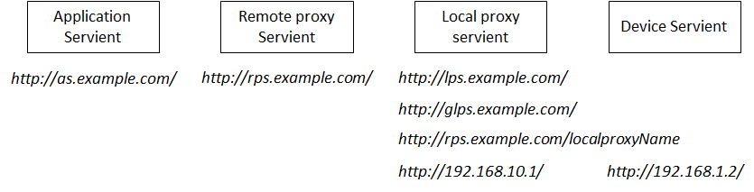

### A1.2 Things directories on proxy servients
The figure shows below is a directory structure for management of things in a servient. This example is the thing directory for the remote proxy servient “remoteProxy”, Base url for the remote proxy servient. 

## A2. Sequence diagrams
### A2.1 Register
A device servient is registered to the local proxy servient and remote proxy servient. The proxy servient returned the TD with public uri. The proxy servients have TD repositories to store TDs registered from the other servients.

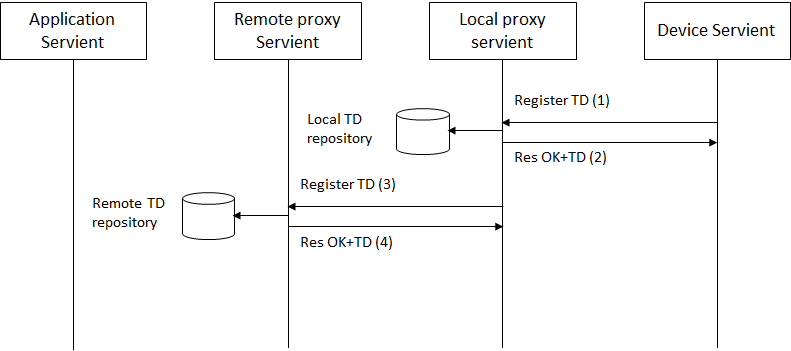

*Example: using HTTP*

(1) HTTP POST http://lps.example.com/Things/register 
Body: TD 
(2) 201 Created 

(3) (1) HTTP POST http://lps.example.com/Things/register 
Body: TD 

(4) 201 Created 

## A2.2 Lookup
An application servient can lookup TDs registered the remote proxy servient with its URI. If the URI indicates the servient, it returns the list of the devices connected. If the URI specifies the devices registered on the proxy servient, it returns TD of it.

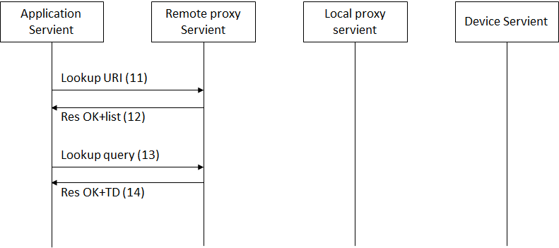

*Example: using HTTP*

(11) HTTP GET http://rps.example.com/Things/ 
Body: none 

(12) 200 OK 
Body: list of registered things [FujitsuAirConditioner, PanasonicAirConditioner, …] 

(13) HTTP GET http://rps.example.com/Things/deviceName 
Body: none 

(14) 200 OK 
Body: TD

## A2.3 Get property
The application servient sends a request to get the value of the property of the device servient to the remote proxy servient. The remote and local proxy servient relay to this request to the device servient.

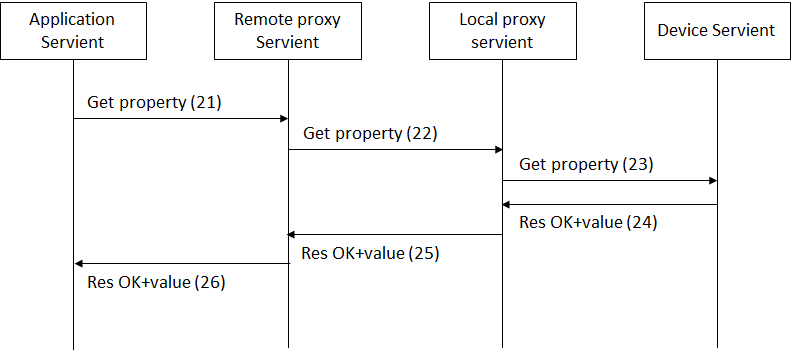

*Example: using HTTP*

The application gets a value of a certain property of the device servient. For this purpose, it gets the URI for the property from TD of the device servient.

(21) HTTP GET http://rps.example.com/lps1/Things/deviceName/Property/temperature 
Body: none 

The remote proxy gets the URI for the property from TD of the device servient registered in the repository. "glps.example.com" is global address which can be accessed from remote proxy.

(22) HTTP GET http://glps.example.com/Things/deviceName/Property/temperature 
Body: none 

The local proxy gets the URI for the property from TD of the device servient registered in the repository.

(23) HTTP GET http://192.169.1.2/Things/deviceName/Property/temperature 
Body: none 

(24) 200 OK 
Body: 25(value) 

(25) 200 OK 
Body: 25(value) 

(26) 200 OK 
Body: 25(value) 

## A2.4 Set property
The application servient sends a request to set the value to the property of the device servient to the remote proxy servient. The remote and local proxy servient relay to this request to the device servient.

*Example: using HTTP*

The application puts a value of a certain property of the device servient. For this purpose, it gets the URI for the property from TD of the device servient.

(31) HTTP PUT http://rps.example.com/lps1/Things/deviceName/Property/status 
Body: ON 

The remote proxy puts the URI for the property from TD of the device servient registered in the repository.
"glps.example.com" is global address which can be accessed from remote proxy.

(32) HTTP PUT http://glps.example.com/Things/deviceName/Property/status 
Body: ON 

## A2.5 Subscribe and Event
The application servient sends a request to subscribe the property of the device servient to the remote proxy servient. The device servient keep to send the value of the specified property periodically.

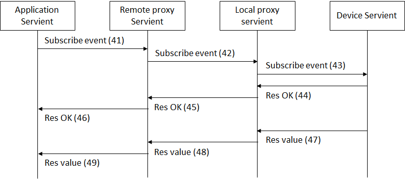

*Example: using HTTP*

The application subscribes an event of the device servient to be periodically notified. The application gets URI for this event and send a request to the remote proxy servient.

(41) HTTP POST http://rps.example.com/lps1/Things/deviceName/Event/change 
Body: none 

The remote proxy gets the URI for the event from TD of the device servient registered in the repository.

(42) HTTP POST http://glps.example.com/Things/deviceName/Event/change 
Body: none 

The local proxy gets the URI for this event from TD of the device servient registered in the repository.

(43) HTTP POST http://192.169.1.2/Things/deviceName/Event/change 
Body: none 

The device servient sends a notify to the application via the local and remote proxy servient with Server Sent Events specified by W3C.  The device responses “200 OK” with a header “Context-Type: text/event-stream”.

(44)-(46) 200 OK 
Context-Type:text/event-stream 
Body: none 

If this subscription succeeded, the events keep to be notified to the application via the local and remote proxy servients. This event is sent as chunk data.

(47)-(49)  
Body: data:25(value) 

## A2.6 Unsubscribe
The application servient sends a request to unsubscribe to the remote proxy servient to stop to notify the event from the device servient.

*Example: using HTTP*

The application unsubscribes the event “change. The application deletes URI for this event and send a request to the remote proxy servient.

(51) HTTP DELETE http://rps.example.com/lps1/Things/deviceName/Event/change 
Body: none 

The remote proxy gets the URI for the event from TD of the device servient unregistered in the repository.

(52) HTTP DELETE http://glps.example.com/Things/deviceName/Event/change 
Body: none 

The local proxy gets the URI for this event from TD of the device servient unregistered in the repository.

(53) HTTP DELETE http://192.169.1.2/Things/deviceName/Event/change 
Body: none 

The device servient stops sending event and returns the response with “200 OK”.

(54)-(56) 200 OK 
Body: none 

### A2.7 Unregister
The device servient unregister from the local proxy servient before shutdown. The local proxy servient unregister this device servient from the remote proxy not to access from the application.

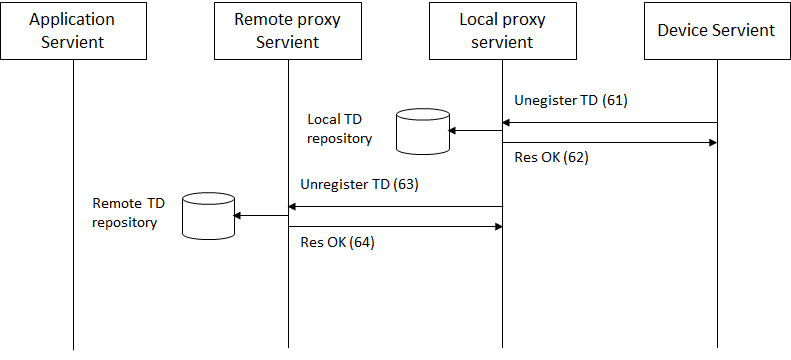

*Example: using HTTP*

(61) HTTP DELETE http://lps.example.com/Things/deviceName 
Body: none 

(62) 200 OK 
       Body:none 

(63) HTTP POST http://rps.example.com/Things/deviceName 
Body: none 

(64) 200 OK 
Body:none 

## A3. Sequence diagrams using WebScoket

Another sequence diagrams to go beyond NAT and firewall is described in this section. WebScoket is used for the connection between remote and local proxy servient. In this case, the local proxy servient creates WebSocket connection to the remote proxy servient and keep it until closing. The messages between the remote and local proxy servients described in session A2 are carried over this WebSocket connection.

### A3.1 Setup the connection

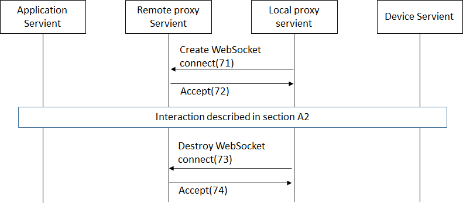

### A3.2 Get property

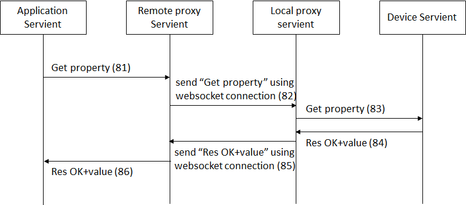

### A3.3 Set property

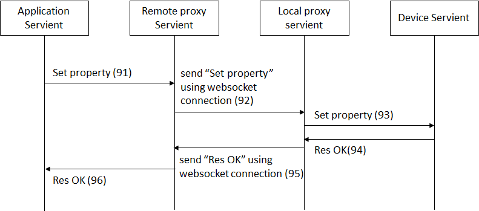

### A3.4 Subscribe and Event

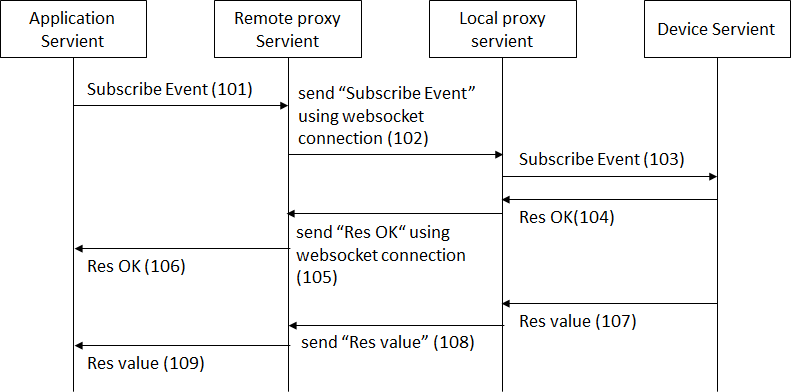

### A3.5 Unsubscribe

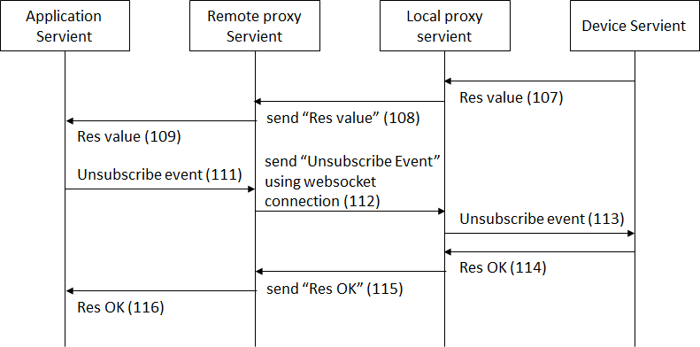

