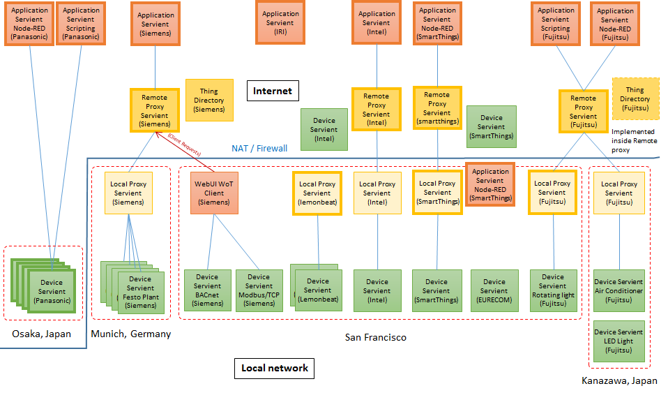

# Plugfest preparation for TPAC2017

# 1. Introduction

This document describes the information related to the next plugfest in Sunnyvale and demonstration in TPAC, Burlingame in November.

## 1.1 Backgroud

In the past plugfest, we've already checked consistency of the interfaces of two Servients provided by dirfferent menbers. They were combinations of application and device, or deivce to device. These application and devices were compatible to WoT anc talked with it.
To setup a larger scale system, the gateawy functions are required to connect multiple applications and devices located on the different places. Since some Servients may be connected to the local network and the others to the Internet, new issues for these connections should be considered such as security, firewall and NAT, device mangement and so on. This plugfest wiil be good opportunity to new issues to resoluve in the futre in WoT-WG.

## 1.2 Use case

The drawing below is an use case for the next plugfest. This is the smarthome application that the application on the smartphone can control the air conditioner in the house. The agent and the gateway have gateway functions that connects with appliations, devices, and gateways.

## 1.3 Available Services

* [PlugFest Playground](http://plugfest.thingweb.io/)
* [Thing Directory](http://plugfest.thingweb.io:8081/api.json) (Swagger Documentation)
  * [HTTP interface](http://plugfest.thingweb.io:8081/td)
  * [CoAP interface](coap://plugfest.thingweb.io:5681/td)
* [WebUI](http://plugfest.thingweb.io/webui/)

## 1.4 Available Code

* [Servient (node-wot)](https://github.com/thingweb/node-wot)
* [Thing Directory (Thingweb Directory)](https://github.com/thingweb/thingweb-directory)
* ...

# 2. Servients

## 2.1 4-layered Servients

3 types of WoT Servients was derived from the use case described in 1.2. These are defined below:  
* Device Servient: WoT Servient with Exposed Thing, e.g. devices
* Application Servient: WoT Servient with Comsumed Thing, e.g. applications
* Proxy Servient: WoT Servient with both Exposed and Comsumed Thing, e.g. gateways

The Proxy Servient are seperated to 2 types fo them, Remote Proxy and Local Proxy. The Remote Proxy Servient is deployed on the Internet and connected with the Applicationd Serivent and the Local Proxy Servient. The Local Proxy Servient is done on the Local network and connects with the Remote Proxy Servient and the Device Servient. The layered diagram is shown below.

## 2.3 Servients and Protocols

<table>
 <tr><th>Servients</th><th colspan=2>Fujitsu</th><th colspan=2>Panasonic</th><th>Internet Reserach Institute</th><th colspan=2>Siemens</th><th>Lemonbeat</th><th colspan=2>Intel</th><th colspan=2>SmartThings</th><th>EURECOM</th><th></th></tr>
 <tr><th>Application</th><th>Scripting App.</th><th>NodeRED</th><th>Scripting App.</th><th>NodeRED</th><th>NodeRED</th><th>Scripting App.</th><th>WebUI</th><th></th><th>AWS WoT Skill</th><th>AlexNet Recog Service</th><th>NodeRED Local</th><th>NodeRED Remote</th><th></th><th></th></tr>
 <tr><th>=protocol</th><th>HTTP</th><th>HTTP(s)</th><th colspan=2></th><th>HTTP(s)</th><th>HTTP, CoAP, BACnet, Modbus</th><th>HTTP, CoAP
</th><th></th><th colspan=2>HTTPS</th><th colspan=2>HTTP</th><th></th><th></th></tr>
 <tr><th>Remote Proxy</th><th colspan=2>Fujitsu Cloud</th><th colspan=2></th><th></th><th colspan=2>WoS Messaging Service</th><th></th><th colspan=2>Cloud proxy shadow</th><th colspan=2>Remote Gateway</th><th></th><th></th>
 <tr><th>=protocol</th><th colspan=2>HTTP(s)+WS</th><th colspan=2></th><th></th><th colspan=2>(tunnel)</th><th></th><th colspan=2>HTTPS/CoAP(s)</th><th colspan=2>Multi</th><th></th><th></th>
 <tr><th>Local Proxy</th><th>Local Gateway</th><th>Local Gateway</th><th colspan=2></th><th></th><th colspan=2>WoS Messaging Service, TD Registration Agent</th><th></th><th colspan=2>Local Proxy</th><th colspan=2>Local gateway</th><th></th><th></th></tr>
 <tr><th>=Protocol</th><th>HTTP</th><th>HTTP</th><th>HTTPS</th><th>HTTPS+WSS</th><th></th><th colspan=2>HTTP</th><th>HTTP</th><th colspan=2>CoAP</th><th colspan=2>Multi</th><th>???</th><th></th></tr>
 <tr><th>Device</th><th>Sensors(Luminance sensor, Humidity sensor, Temperature sensor, Accelerometer)</th><th>Air conditioner, LED light, Blind</th><th>LED light, Air conditioner, Robot Cleaner</th><th>Human Detection Sensor, Amazon Echo, Google Home</th><th></th><th colspan=2>Remote Festo Plant (valve, pump, levelmeter), BACnet Demonstrator, Logo! Demonstrator, RGB LED Light</th><th>Sensors(Luminance sensor, Humidity sensor, Temperature sensor), Binary actuator</th><th colspan=2>OCF RGB light, OCF Light, OCF Buzzer, OCF temperture, OCF Button, OCF Proximity, OCF Slider, Still camera</th><th colspan=2>Dimmable Light(OCF), Motion Sensor(OCF), Dimmable Light(ST), Motion Sensor(ST), Gas Sensor(IPSO), PM2.5 Sensor(IPSO), Temperature Sensor(IPSO), Humidity Sensor(IPSO), Loudness Sensor(IPSO), Illuminance Sensor(IPSO), PIR Sensor(IPSO), Barometer Sensor(IPSO), OCF Bridge</th><th>Sensors and Actuators in the car(BMW X5)</th><th></th></tr>
</table>

## 2.2 Servients from plugfest participants

The following figure shows diagrams of Servients that the participants provide for the plugest. 

# 3. Application scenarios

## 3.1 Scenario 1: Smart Alarm System
[overview] When a motion sensor associated with one or
more still cameras is triggered,
the camera takes a picture and sends it to a person detection compute service running on a local gateway.
If the person detection service detects a person and the alarm is armed, an alert (buzzer + light) goes on
and stays on until the alert is cancelled.
The various controls (buttons, sensors, lights, etc) are all individual Things.

[proposer] Michael McCool, Intel

[servients] The servients provided are:
* Light - used for status (2x): armed on/off, alert on/off.  OCF/CoAP (from OCF Smart Home Demo)
* Button - used for control (2x): armed/disarm, cancel alert.  OCF/CoAP (from OCF Smart Home Demo)
* Person - analyse image, indicate if a person is present.  Compute service (virtual Thing) running on gateway.
Custom HTTPS-based service, implemented using node-wot scripting wrapper around Caffe CNN.
* Buzzer - used for alarm (1x): alert.  OCF/CoAP (from OCF Smart Home Demo)
* Camera - take still image (nx): custom web service.  Can take JPEG image when polled.
* Motion - detect motion near camera (nx): OCF/CoAP (from OCF Smart Home Demo)
* Alarm - application logic (1x): virtual Thing running on gateway implementing alarm system logic.

Note that the Thing Descriptions for the OCF devices above will be generated by an OCF/WoT metadata bridge.
However, other devices are expected to talk to the OCF devices directly using information in the TD.
There will also be a OCF/HTTP bridge running so the OCF devices can be connected to via either HTTP or CoAP.

## 3.2 Scenario 2: Voice Control
[overview] Support generic voice control for all semantically annotated Things.
AVS adapter (running in AWS cloud) will access TDs from Thing directory and map iot.schema.org semantic tags to 
Alexa Home Skill semantics.  All Things so annotated will then be controllable and observable from an
Echo device.

[proposer] Michael McCool, Intel

[servients] All tagged devices.  In addition, the AVS adapter will read in TDs and can be considered to be
a "consuming" servient (running in the cloud).

## Scenario Template

[overview] Brief introduction of the application you propose.

[proposer] Name, affiliation of the proposer

[servients] Servients 

# 4. High level description of Issues

## Fujitsu’s issues
* Interface between Servients
* Authentication
  * Discovery and exchange of TDs
  * Firewall and NAT traversal
  * Event operation using HTTP
* Sequence diagram 
* Thing Description management
  * Life cycle management of TD
  * TD repositories on the Servient

## Panasonic’s issues
* Event operation using WSS

## Siemens’s issues
* TD Model
  * Event representation (TD-style "Event Description" with Interactions to confirm/resolve?)
  * Complex Action representation (TD-style "Action Description" with Interactions to monitor/update/cancel?)
  * Semantic annotations
* Connectivity
  * Interoperable firewall and NAT traversal patterns
  * WebSocket usage without definition of a new protocol (WSS as pure data pipe; Panasonic's event-handle might be to avoid race condition in event delivery?)
* Thing Description management
  * Identity management (e.g., when in multiple Directories, partial rewrite for proxy addresses, etc.)
  * Life cycle management of TD

## Intel’s issues
* TD Model
  * Semantic annotation
  * Mapping from iot.schema.org to AVS Home Skill categories
  * Protocol bindings, especially for OCF payloads (HTTP/CoAP and JSON/CBOR)
* Connectivity
  * NAT Traversal - Remote/local proxies, dynamic proxy management
* TD Translation
  * OCF Metadata Bridge
* IoT Service Architecture and non-Device Servients
  * Compute Servient: providing local ("fog") compute service
  * Application servient: providing application logic
  * Integration with AVS, including security and authentication requirements

## SmartThings’s issues
## IRI’s issues
## Comapany name’s issues

# 4. Deadline and Schedule

## Deadlines
### Oct. 18
* Complete the table “Servient and protocol”
  * Who provides which servients?
* Collection of TD for the Servients on the plugfest
* Application scenarios
### Oct. 25
* Specify Inter-Servient interface

## Plugfest and demonstration
### Nov. 4, 5 (Fujitsu)
* OPEN: 9am-6pm on Nov. 4 and 5
* 1st day: preparation and plugfest
* 2nd day: plugfest in the morning 
* demonstration and discussion in the afternoon
### Nov. 8 (TPAC2017)
* Demonstrations

