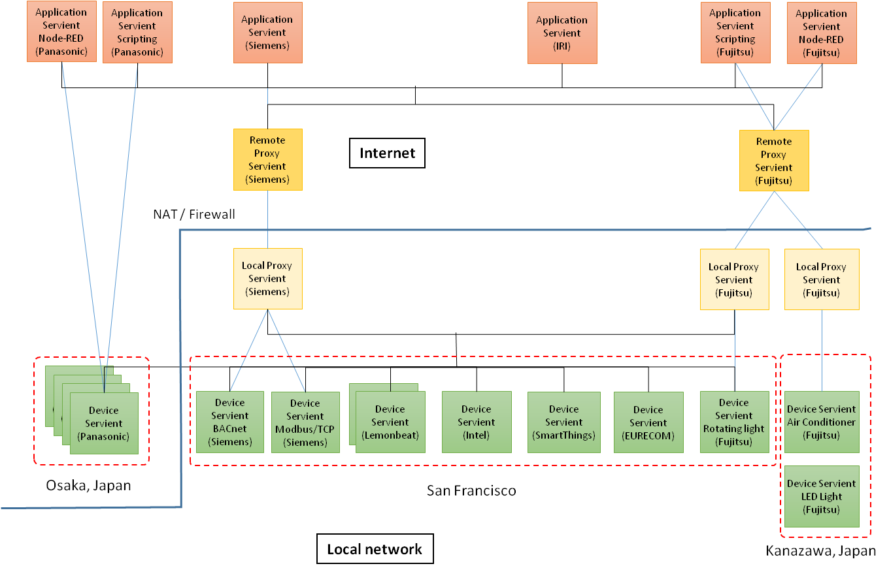

# Plugfest preparation for TPAC2017

# 1. Introduction

This document describes the information related to the next plugfest in Sunnyvale and demonstration in TPAC, Burlingame in November.

## 1.1 Backgroud

In the past plugfest, we've already checked consistency of the interfaces of two Servients provided by dirfferent menbers. They were combinations of application and device, or deivce to device. These application and devices were compatible to WoT anc talked with it.
To setup a larger scale system, the gateawy functions are required to connect multiple applications and devices located on the different places. Since some Servients may be connected to the local network and the others to the Internet, new issues for these connections should be considered such as security, firewall and NAT, device mangement and so on. This plugfest wiil be good opportunity to new issues to resoluve in the futre in WoT-WG.

## 1.2 Use case

The drawing below is an use case for the next plugfest. This is the smarthome application that the application on the smartphone can control the air conditioner in the house. The agent and the gateway have gateway functions that connects with appliations, devices, and gateways.

## 1.3 Available Services

* [PlugFest Playground](http://plugfest.thingweb.io/)
* [Thing Directory](http://plugfest.thingweb.io:8081/api.json) (Swagger Documentation)
  * [HTTP interface](http://plugfest.thingweb.io:8081/td)
  * [CoAP interface](coap://plugfest.thingweb.io:5681/td)
* [WebUI](http://plugfest.thingweb.io/webui/)

## 1.4 Available Code

* [Servient (node-wot)](https://github.com/thingweb/node-wot)
* [Thing Directory (Thingweb Directory)](https://github.com/thingweb/thingweb-directory)
* ...

# 2. Servients

## 2.1 4-layered Servients

3 types of WoT Servients was derived from the use case described in 1.2. These are defined below:  
* Device Servient: WoT Servient with Exposed Thing, e.g. devices
* Application Servient: WoT Servient with Comsumed Thing, e.g. applications
* Proxy Servient: WoT Servient with both Exposed and Comsumed Thing, e.g. gateways

The Proxy Servient are seperated to 2 types fo them, Remote Proxy and Local Proxy. The Remote Proxy Servient is deployed on the Internet and connected with the Applicationd Serivent and the Local Proxy Servient. The Local Proxy Servient is done on the Local network and connects with the Remote Proxy Servient and the Device Servient. The layered diagram is shown below.

## 2.2 Servients from plugfest participants

The following figure shows diagrams of Servients that the participants provide for the plugest. 

## 2.4 Servients and Protocols

| Servients | Fujitsu | Panasonic | Internet Research Institute | Siemens | Lemonbeat | Intel | SmartThings | EURECOM | |
| --- | --- | --- | --- | --- | --- | --- | --- | --- | --- |
| Application | Scripting, NodeRED | Scripting, NodeRED | NodeRED | | | | | | | |
| =Protocol | HTTP(S) | HTTPS+WSS | HTTP(S) | | | | | | | |
| Remote proxy | Server | | | | | | | | | |
| =Protocol | HTTP(S) | | | | | | | | | |
| Local proxy | Gateway | | | | | | | | | |
| =Protocol | HTTP | | | | | | | | | |
| Device | LED light, Air conditioner, Blind | LED light, Air conditioner, Robot cleaner | | | | | | | | |

# 3. Application scenarios

## 3.1 Scenario 1

[overview] Brief introdction of the application you propose.

[proposer] Name, affiliation of the proposer

[servients] Servients 

## 3.2 Scenario 2

## 3.3 Scenario 3

# 4. High level description of Issues

## Fujitsu’s issues
* Interface between Servients
* Authentication
  * Discovery and exchange of TDs
  * Firewall and NAT traversal
  * Event operation using HTTP
* Sequence diagram 
* Thing Description management
  * Life cycle management of TD
  * TD repositories on the Servient

## Panasonic’s issues
* Event operation using WSS

## Siemens’s issues
* TD Model
  * Event representation (TD-style "Event Description" with Interactions to confirm/resolve?)
  * Complex Action representation (TD-style "Action Description" with Interactions to monitor/update/cancel?)
  * Semantic annotations
* Connectivity
  * Interoperable firewall and NAT traversal patterns
  * WebSocket usage without definition of a new protocol (WSS as pure data pipe; Panasonic's event-handle might be to avoid race condition in event delivery?)
* Thing Description management
  * Identity management (e.g., when in multiple Directories, partial rewrite for proxy addresses, etc.)
  * Life cycle management of TD

## Intel’s issues
## SmartThings’s issues
## IRI’s issues
## Comapany name’s issues

# 4. Deadline and Schedule

## Deadlines
### Oct. 18
* Complete the table “Servient and protocol”
  * Who provides which servients?
* Collection of TD for the Servients on the plugfest
* Application scenarios
### Oct. 25
* Specify Inter-Servient interface

## Plugfest and demonstration
### Nov. 4, 5 (Fujitsu)
* OPEN: 9am-6pm on Nov. 4 and 5
* 1st day: preparation and plugfest
* 2nd day: plugfest in the morning 
* demonstration and discussion in the afternoon
### Nov. 8 (TPAC2017)
* Demonstrations

