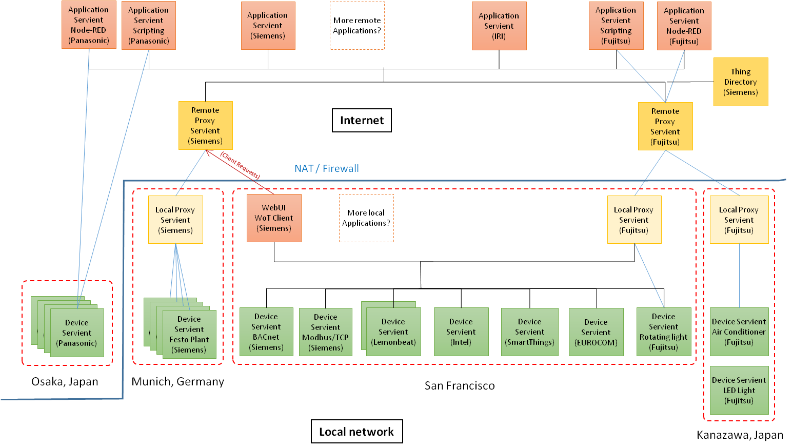

# Plugfest preparation for TPAC2017

# 1. Introduction

This document describes the information related to the next plugfest in Sunnyvale and demonstration in TPAC, Burlingame in November.

# 1.1 Backgroud

In the past plugfest, we've already checked consistency of the interfaces of two Servients provided by dirfferent menbers. They were combinations of application and device, or deivce to device. These application and devices were compatible to WoT anc talked with it.
To setup a larger scale system, the gateawy functions are required to connect multiple applications and devices located on the different places. Since some Servients may be connected to the local network and the others to the Internet, new issues for these connections should be considered such as security, firewall and NAT, device mangement and so on. This plugfest wiil be good opportunity to new issues to resoluve in the futre in WoT-WG.

# 1.2. Use case

The drawing below is an use case for the next plugfest. This is a smarthome application that an application on a smartphone can control an air conditioner in a house. 

# 2. Servients
## 2.1 Servients structure

The following figure shows diagrams of Servients that the participants provide for the plugest. 

## 2.2 Servients and Protocols

| Servients | Fujitsu | Panasonic | Internet Research Institute | Siemens | Lemonbeat | Intel | SmartThings | EUROCOM | |
| --- | --- | --- | --- | --- | --- | --- | --- | --- | --- |
| Application | Scripting, NodeRED | Scripting, NodeRED | NodeRED | | | | | | | |
| =Protocol | HTTP(S) | HTTPS+WSS | HTTP(S) | | | | | | | |
| Remote proxy | Server | | | | | | | | | |
| =Protocol | HTTP(S) | | | | | | | | | |
| Local proxy | Gateway | | | | | | | | | |
| =Protocol | HTTP | | | | | | | | | |
| Device | LED light, Air conditioner, Blind | LED light, Air conditioner, Robot cleaner | | | | | | | | |

## 2.3 Application scenarios

# 3. High level description of Issues

## Fujitsu’s issues
* Interface between Servients
* Authentication
  * Discovery and exchange of TDs
  * Firewall and NAT traversal
  * Event operation using HTTP
* Sequence diagram 
* Thing Description management
  * Life cycle management of TD
  * TD repositories on the Servient

## Panasonic’s issues
* Event operation using WSS
## Siemens’s issues
## Intel’s issues
## SmartThings’s issues
## IRI’s issues
## xxx’s issues

# 4. Deadline and Schedule

## Oct. 18
* Complete the table “Servient and protocol”
  * Who provides which servients?
* Collection of TD for the Servients on the plugfest
* Application scenarios
## Oct. 25
* Specify Inter-Servient interface
## Open: 9am-6pm on Nov. 4, 5
* 1st day: preparation and plugfest
* 2nd day: plugfest in the morning 
* demonstration and discussion in the afternoon
