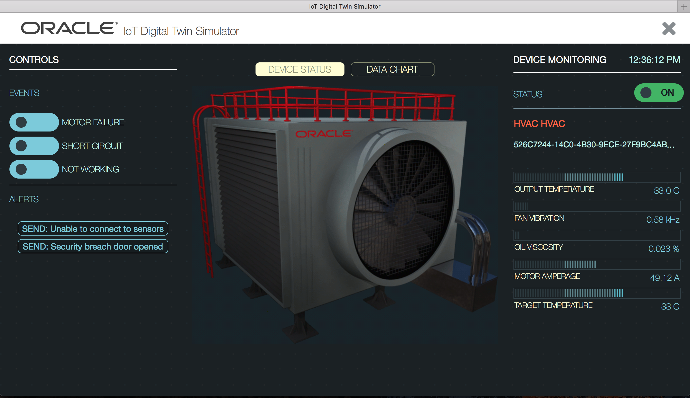

# PlugFest Preparation for Bundang 2018

This document describes the Bundang PlugFest held on June 30 and July 1.

A summary of the previous Prague PlugFest can be found [here](https://github.com/w3c/wot/blob/master/plugfest/2018-prague/result.md).

Features marked with <i>italics</i> are work-in-progress.

## 1 PlugFest Infrastructure
This section lists the infrastructure available for the PlugFest, which can be used for individual testing (see [Section 3.1](#31-testing-individually))

### 1.1 Public Thing Directories

* IMPLEMENTATION-NAME at URI

### 1.2 Public Proxies

* IMPLEMENTATION-NAME at URI

### 1.3 Public Tools

Oracle IoT Cloud Service - Management console at https://129.150.193.97/ui

Oracle IoT Digital Twin Simulator - Simulator console at https://129.150.193.97/ui

Login credentials are available for all plug fest participants from Michael.Lagally@oracle.com.

## 1.2 Participants and Servients

<table>
  <tr>
    <th>Participants</th>
    <th>Appliation</th>
    <th>=protocol=</th>
    <th>Remote proxy</th>
    <th>=protocol=</th>
    <th>Local proxy</th>
    <th>=protocol=</th>
    <th>Device</th>
  </tr>
  <tr>
    <td>Oracle</td>
    <td>IOT Cloud Service</td>
    <td>REST/HTTP(s)</td>
    <td>N/A</td>
    <td>REST/HTTP(s)</td>
    <td>Accessible via node-WoT + Oracle binding</td>
    <td>REST/HTTP(s)</td>
    <td>Cloud Service Management Console</td>
  </tr>
  <tr>
    <td>Oracle</td>
    <td>Digital Twin Simulator</td>
    <td>REST/HTTP(s)</td>
    <td>N/A</td>
    <td>REST/HTTP(s)</td>
    <td>Accessible via node-WoT + Oracle binding</td>
    <td>REST/HTTP(s)</td>
    <td>on-demand simulations for Plugfest participants' devices based on TDs</td>
  </tr>
  <tr>
    <td>Oracle</td>
    <td>Festo-Simulator5</td>
    <td>REST/HTTP(s)</td>
    <td>N/A</td>
    <td>REST/HTTP(s)</td>
    <td>Accessible via node-WoT + Oracle binding</td>
    <td>REST/HTTP(s)</td>
    <td>Festo Simulator</td>
  </tr>
  <tr>
    <td>Oracle</td>
    <td>Audi-A8-4</td>
    <td>REST/HTTP(s)</td>
    <td>N/A</td>
    <td>REST/HTTP(s)</td>
    <td>Accessible via node-WoT + Oracle binding</td>
    <td>REST/HTTP(s)</td>
    <td>Connected Car</td>
  </tr>
  <tr>
    <td>Oracle</td>
    <td>HVAC2</td>
    <td>REST/HTTP(s)</td>
    <td>N/A</td>
    <td>REST/HTTP(s)</td>
    <td>Accessible via node-WoT + Oracle binding</td>
    <td>REST/HTTP(s)</td>
    <td>HVAC</td>
  </tr>
  <tr>
    <td>Oracle</td>
    <td>BMW_X5-3</td>
    <td>REST/HTTP(s)</td>
    <td>N/A</td>
    <td>REST/HTTP(s)</td>
    <td>Accessible via node-WoT + Oracle binding</td>
    <td>REST/HTTP(s)</td>
    <td>BMW_X5</td>
  </tr>
</table>

## 3 Checking points for the next plugfest

These were described in result.md in the Prague plugfest.

### (1) Connect with remote/local proxy

### (2) Application servients

### (3) Connect with node-wot

The Oracle IoT Cloud Service and the devices in the Digital Twin Simulator are accessible via a node-WoT instance
which includes an Oracle binding. 
This binding provides the integration between the IoT Cloud Service Product and the node-WoT reference implementation.

### (4) Scripting API

### (5) Thing Directory operation

### (6) Device Servients

### (7) Device simulators

#### Oracle Digital Twin Simulator
Oracle provides a Digital Twin Simulator for W3C WoT members, which is part of the Oracle IoT Cloud Service product.
This is a flexible simulation environment, which hosts multiple instances of various devices and a
simulation engine that allows the functional definition of a simulated device from a Web user interface.
It allows to build new device simulations with very small effort.

These device simulations are exposed via node-WoT and behave just like regular node-WoT devices.

The simulator can serve for:
* visualizing a device from a TD in a Web UI
* testing interoperability with node-WoT based devices
* defining a new device and generating a TD
* generating device data based on a functional simulation model

#### Simulated devices
Oracle provides "out of the box" device simulators for a variety of devices that are managed by the Digital Twin Simulator.
These are hosted in the Oracle IoT Cloud and are accessible via a node-WoT instance via an Oracle binding. 
The initial set of devices are a simulated Festo plant (Siemens), a Connected Car, HVAC, Blue Pump and several 
simulated devices that were built from the TDs from the Prague Plug Fest. 

##### Festo Simulator

The Thing Description for the Festo plant is at [Festo_Simulator](TDs/Oracle/Festo-Simulator5.jsonld).

##### Connected Car

The Thing Description for the Connected car is at [Connected-Car-Simulator](TDs/Oracle/Audi-A8-4.jsonld).

##### HVAC

The Thing Description for the HVAC device is at [HVAC-Simulator](TDs/Oracle/HVAC2.jsonld).

#### Additional Device Simulations - TD import
Additional Device simulations can be easily defined by importing a device description in the 
Oracle Device Model format into the simulator.
The Device Model can be automatically generated from a Thing Description using the td2dm converter. 
This td2dm converter is provided in the "oracle-tools" folder.

#### Generating Thing Descriptions 
Alternatively, a device model for a new device can be easily created in the Oracle IoT Cloud Service using the management console.
This device model can be exported and the corresponding Thing Description can be automatically generated using the dm2td converter.
The dm2td converter is provided in the "oracle-tools" folder.

Oracle offers to assist other Plugfest participants to create simulated devices on demand.
If you are interested, please contact Michael.Lagally@oracle.com - preferably already before the plug fest.

## 4 Use cases

Multiple integration scenarios with other WoT devices and servients.

## 5 Requirements for PlugFest Environment

| Participant | Number of Participants | Number of Power outlets | Network | Remarks |
|-------------|------------------------|-------------------------|---------|---------|
| Oracle | 1                      | 1                       | Wi-Fi |  |

## 6 Implementation Guidelines

DOCUMENTATION OF OWN IMPLEMENTATION OR REQUESTS TO OTHERS -OR- N/A
