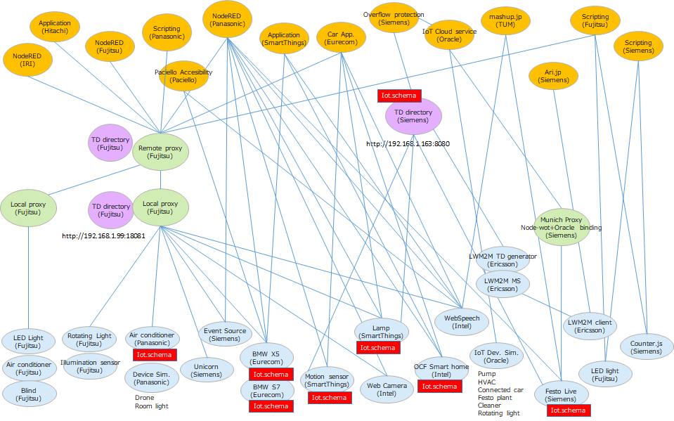

# PlugFest Preparation for Bundang F2F 2018

# 1. Introduction
 
This document describes general information related to the next plugfest in Bundang F2F meeting. 
The rest of this section shows the results of the last plugfest held in Prague on March 24-25.

## 1.1 Last plugfest

The following figure is the result of the Prague plugfest.

## 1.2 Participants and Servients

The following is a list of the participants and servients described in the "preparation.md" of the Prague plugfest.

<table>
  <tr>
    <th>Participants</th>
    <th>Application</th>
    <th>=protocol=</th>
    <th>Remote proxy</th>
    <th>=protocol=</th>
    <th>Local proxy</th>
    <th>=protocol=</th>
    <th>Device</th>
  </tr>
  <tr>
    <th rowspan="3">Intel</th>
    <td>OCF Smart Home</td>
    <td>HTTPS</td>
    <td rowspan="3">Digital Ocean and AWS</td>
    <td">SSH Tunnel + Remote Proxy</td>
    <td>IoT REST API Server</td>
    <td>CoAP</td>
    <td>Button, Light, RGB LED, Buzzer, Temperature, Illuminance, Motion</td>
  </tr>
  <tr>
    <td>Web Camera</td>
    <td>HTTPS</td>
    <td">SSH Tunnel + Remote Port Forwarding</td>
    <td>Direct via tunnel</td>
    <td>HTTPS</td>
    <td>Camera</td>
  </tr>
  <tr>
    <td>Web Speech</td>
    <td>HTTPS</td>
    <td">SSH Tunnel + Remote Port Forwarding</td>
    <td>Direct via tunnel</td>
    <td>HTTPS</td>
    <td>Speaker</td>
  </tr>
  <tr>
    <th rowspan="2">Fujitsu</th>
    <td>NodeRED</td>
    <td>HTTP(s)</td>
    <td rowspan="2">Fujitsu Cloud</td>
    <td rowspan="2">HTTP(s)+WS</td>
    <td>Local gateway</td>
    <td>HTTP</td>
    <td>Air conditioner, LED light, Blind</td>
  </tr>
  <tr>
    <td>Scripting App.</td>
    <td>HTTP</td>
    <td>Local gateway</td>
    <td>HTTP</td>
    <td>Sensors(Luminance sensor, Humidity sensor, Temperature sensor, Accelerometer), Rotating Light</td>
  </tr>
  <tr>
    <th rowspan="2">Panasonic</th>
    <td>NodeRED</td>
    <td rowspan="2"></td>
    <td rowspan="2"></td>
    <td rowspan="2"></td>
    <td rowspan="2"></td>
    <td>HTTP</td>
    <td>WoT Simulator, Google Home mini</td>
  </tr>
  <tr>
    <td>Scripting App.</td>
    <td>HTTPS(+WSS)</td>
    <td>LED light, Air conditioner (home/car), Robot Cleaner, Amazon Echo Dot, Google Home mini</td>
  </tr>
  <tr>
    <th>Internet Research Institute</th>
    <td>NodeRED</td>
    <td>HTTP(s)</td>
    <td></td>
    <td></td>
    <td></td>
    <td></td>
    <td></td>
  </tr>
  <tr>
    <th rowspan="2">Siemens</th>
    <td>Scripting App.</td>
    <td>HTTP, CoAP, BACnet, Modbus</td>
    <td rowspan="2">WoS Messaging Service</td>
    <td rowspan="2">(tunnel)</td>
    <td rowspan="2">WoS Messaging Service, TD Registration Agent</td>
    <td rowspan="2">HTTP</td>
    <td rowspan="2">Remote Festo Plant (valve, pump, levelmeter), BACnet Demonstrator, Logo! Demonstrator, RGB LED Light</td>
  </tr>
  <tr>
    <td>WebUI</td>
    <td>HTTP, CoAP</td>
  </tr>
  <tr>
    <th rowspan="2">Intel</th>
    <td>AWS WoT Skill</td>
    <td rowspan="2">HTTPS</td>
    <td rowspan="2">Cloud proxy shadow</td>
    <td rowspan="2">HTTPS/CoAP(s)</td>
    <td rowspan="2">Local Proxy</td>
    <td rowspan="2">CoAP</td>
    <td rowspan="2">OCF RGB light, OCF Light, OCF Buzzer, OCF temperture, OCF Button, OCF Proximity, OCF Slider, Still camera</td>
  </tr>
  <tr>
    <td>AlexNet Recog Service</td>
  </tr>
  <tr>
    <th rowspan="2">SmartThings</th>
    <td>NodeRED Local</td>
    <td rowspan="2">HTTP</td>
    <td rowspan="2">Remote gateway</td>
    <td rowspan="2">HTTP+MQTT</td>
    <td rowspan="2">Local gateway</td>
    <td rowspan="2">HTTP+MQTT</td>
    <td rowspan="2">Dimmable Light(ST), Motion Sensor(IPSO), Loudness Sensor(IPSO), Illuminance Sensor(IPSO)</td>
  </tr>
  <tr>
    <td>NodeRED Remote</td>
  </tr>
  <tr>
    <th>EURECOM</th>
    <td></td>
    <td></td>
    <td></td>
    <td></td>
    <td></td>
    <td>HTTP</td>
    <td>Sensors and Actuators in the car(BMW X5)</td>
  </tr>
</table>

# 2. Next plugfest

This section describes the Bundang plugfest held on June 30 and July 1.

## 2.1 Participants and Servients

Each participant is expected to fill in the following table to share between them.

<table>
  <tr>
    <th>Participants</th>
    <th>Appliation</th>
    <th>=protocol=</th>
    <th>Remote proxy</th>
    <th>=protocol=</th>
    <th>Local proxy</th>
    <th>=protocol=</th>
    <th>Device</th>
  </tr>
  <tr>
    <th rowspan="2">Fujitsu</th>
    <td>NodeRED</td>
    <td>HTTP(s)</td>
    <td rowspan="2">Fujitsu Cloud</td>
    <td rowspan="2">HTTP(s)+WS</td>
    <td>Local gateway</td>
    <td>HTTP</td>
    <td>Air conditioner, LED light, Blind</td>
  </tr>
  <tr>
    <td>Scripting App.</td>
    <td>HTTP</td>
    <td>Local gateway</td>
    <td>HTTP</td>
    <td>Sensors(Luminance sensor, Humidity sensor, Temperature sensor, Accelerometer), Rotating Light</td>
  </tr>
  <tr>
    <th>company or university</th>
    <td></td>
    <td></td>
    <td></td>
    <td></td>
    <td></td>
    <td></td>
    <td></td>
  </tr>
  <tr>
    <th>company or university</th>
    <td></td>
    <td></td>
    <td></td>
    <td></td>
    <td></td>
    <td></td>
    <td></td>
  </tr>
</table>

## 2.2 Checking points for the next plugfest

These were described in result.md in the Prague plugfest.

### (1) Connect with remote/local proxy

### (2) Application servients

### (3) Connect with node-wot

### (4) Scripting API

### (5) Thing Directory operation

### (6) Device Servients

### (7) Device simulators

### (8) Semantic integration

### (9) Security

### (10) Accessibility

### (11) Event handling

## 2.3 Other issues

The following points are picked up from Koster-san's material.

### (1) Validate the simplified TD

Use either [Thing Description Playground](http://plugfest.thingweb.io/playground/) or validate your TD against the JSON Schema called td-schema-bundang.json, found in this directory. You can use any JSON Schema validator that supports Draft 6, such as [ajv](https://www.npmjs.com/package/ajv) as an npm package or [JSON Schema Lint](https://jsonschemalint.com/#/version/draft-06/markup/json) as a GUI.

To use Thing Description Playground locally, download it from the Github [repository](https://github.com/thingweb/thingweb-playground), go to WebContent and open index.html in a browser.

### (2) Extended Actions

### (3) Notification - websockets, webhooks

### (4) Discovery using Feature of Interest annotation

### (5) Application Scenarios, recipes

### (6) Proxy integration with Thing Directory

### (7) New security patterns

### (8) Test Framework

### (9) Other

## 2.3 Use cases

Please make orchestration use cases using WoT.

# 3 Schedule

Sat 30.6.18:  9:00-18:00  
Sun 1.7.18:  9:00-18:00  

Venue: TTA

# 4 Requirements for PlugFest Setting

| Participant | Number of Participants | Number of Power outlets | Network | Remarks |
|-------------|------------------------|-------------------------|---------|---------|
| Panasonic   | 3                      | 2                       | Wi-Fi(b/g/n), Ports: 22, 80, 443, 1880, 8001, 8003, 8091 | |
| Fujitsu     | 4                      | 2                       | Wi-Fi   |         |
| IRI         |                        |                         | Wi-Fi   |         |
| Siemens     | 4+(1)                  | 2                       | Wi-Fi   |         |
| Intel       | 1                      | 1                       | Wi-Fi and/or wired Ethernet | External ports: 22, 80, 443. Will bring own router and power bar.   |
| SmartThings | 1                      | 1                       | Wired   | 4sq ft table space |
| EURECOM     | 2                      | 2                       | Wi-Fi   |         |
| Oracle      | 1                      | 1                       | Wi-Fi   |         |
| Hitachi     | 1                      | 1                       | Wi-Fi(Ports: 443/tcp,443/udp(optional))   | use for note PC to access corporate servers via VPN. |
| Paciello    | 1                      | 1                       | Wi-Fi   |Will only need power outlet for laptop. Won't be bringing additional equipment.|
| Others      |                        |                         | Wi-Fi   |         |

# 5 Implementation guidelines

* "name" field of Thing Description shall be unique among the things which will be registered to Fujitsu Proxy.  
  Recommended convention is 'Company name'+'Thing name'  
  e.g.) "name": "PanasonicAirConditionerP1"
