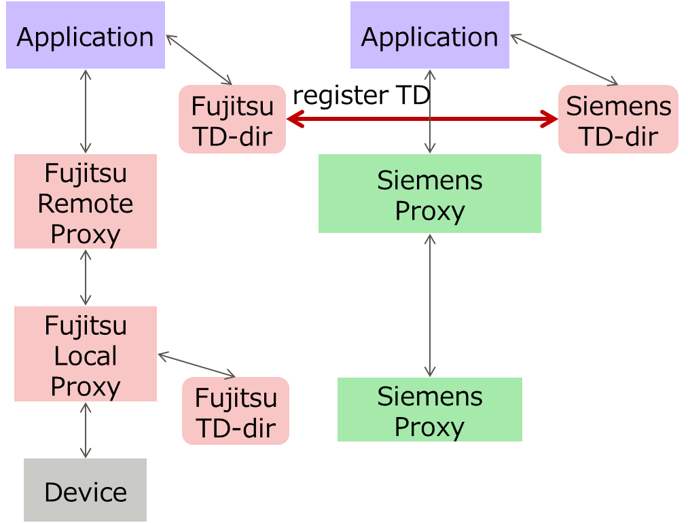
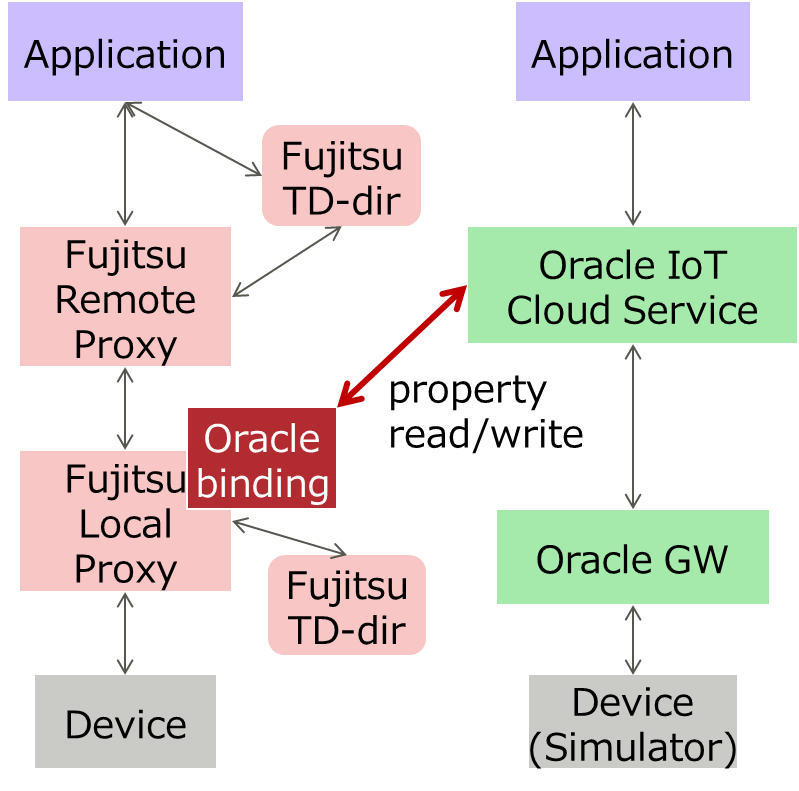

# PlugFest Preparation for Bundang F2F 2018 (Fujitsu)

## 3 Checking points for 2018 Bundang plugfest

### 3.1 Testing Individually
The following checking points can be completed by the participant alone by using the PlugFest infrastructure (TD Playground, Thing Directory, Proxies).

#### 3.1.1 Validate Simplified TDs -- was Other Issues (1)

* Fujitsu: checked Fujitsu TDs using TD Playground.

#### 3.1.2 Register with Thing Directory -- was (5)

* Fujitsu: provided Thing Directory at local network and Internet. We tried to synchronize TDs of device to be connected to Fujitsu Proxy to Siemens directory, but could not connect because our implementation.

#### 3.1.3 Connect with Remote/Local Proxy -- was (1)

* Fujitsu: provided Remote/Local Proxy. And Fujitsu Local Proxy could connect with Oracle binding to transform Oracle IoT Cloud Service property interface.

#### 3.1.4 Connect with node-wot -- was (3)

* Fujitsu: Next PlugFest todo

#### 3.1.5 Scripting API -- was (4)

* Fujitsu: N/A

### 3.2 Testing in Client Role
The following checking points must be completed together with a partner in server role.

#### 3.2.1 Metadata Handling

* Fujitsu: N/A

#### 3.2.2 Property Handling -- was part of (2)

* Fujitsu: checked the following get bindings
  * HTTP(S)
* Fujitsu: checked the following set bindings
  * HTTP(S)

#### 3.2.3 Action Handling -- was part of (2)

* Fujitsu: N/A

#### 3.2.4 Event Handling -- was part of (11)

* Fujitsu: N/A

#### 3.2.5 Security -- was part of (9)

* Fujitsu: N/A

#### 3.2.6 Semantic integration -- was part of (8)

* Fujitsu: N/A

#### 3.2.7 Accessibility -- was (10)

* Fujitsu: N/A

### 3.3 Testing in Server Role
The following checking points must be completed together with a partner in client role.

#### 3.3.1 Metadata

* Fujitsu: N/A

#### 3.3.2 Properties -- was part of (6) and (7)

* Fujitsu: checked the following get bindings
  * HTTP: Rotary Beacon Light
* Fujitsu: checked the following set bindings
  * HTTP: Rotary Beacon Light

#### 3.3.3 Actions -- was part of (6) and (7)

* Fujitsu: N/A

#### 3.3.4 Events -- was part of (11)

* Fujitsu: N/A

#### 3.3.5 Security -- was part of (9)

* Fujitsu: N/A

#### 3.3.6 Semantic Integration -- was part of (8)

* Fujitsu: N/A

### 3.4 Other issues

#### 3.4.1 Running Actions and Event Instances -- was Other Issues (2)

* Fujitsu: N/A

#### 3.4.2 Discovery using Feature of Interest -- was Other Issues (4)

* Fujitsu: N/A

#### 3.4.3 New Security Patterns -- was Other Issues (7)

* Fujitsu: N/A

#### 3.4.4 Miscellaneous -- was Other Issues (9)

* Fujitsu: N/A
