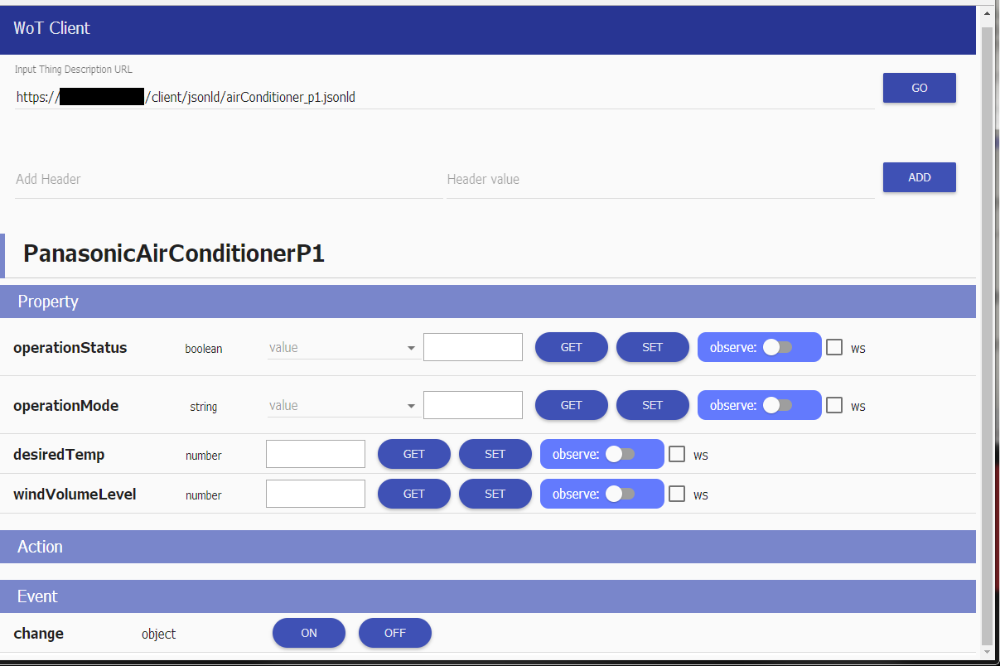
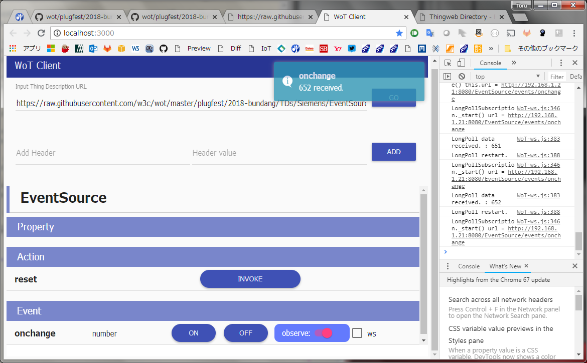
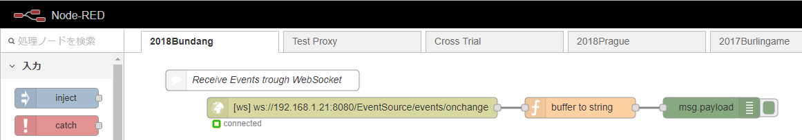
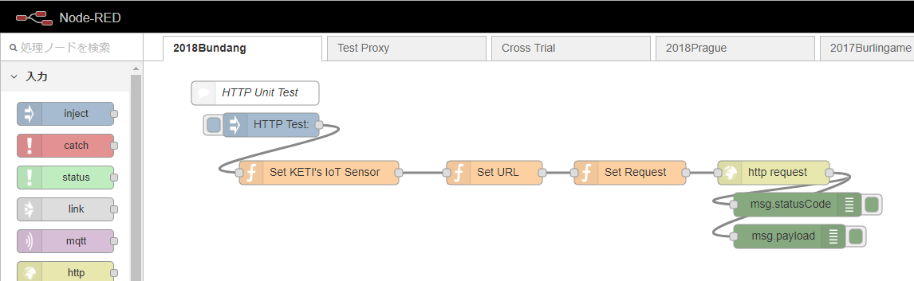
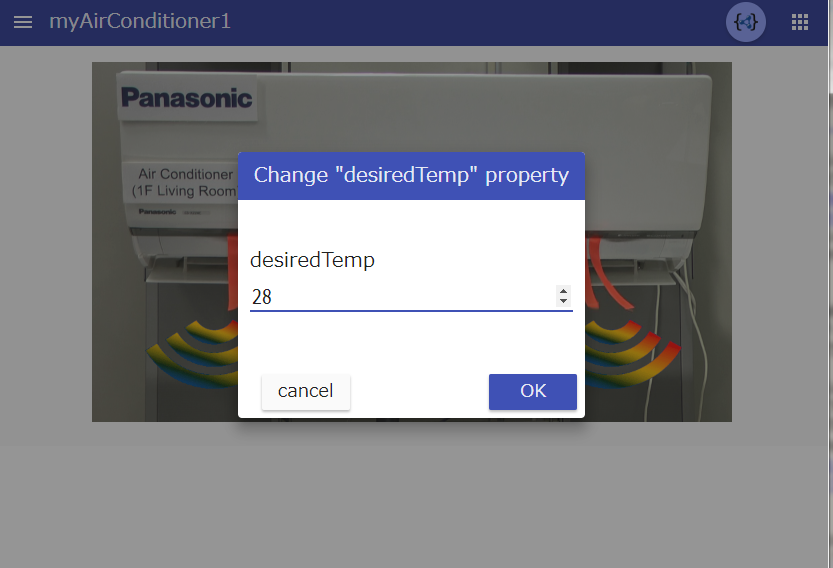
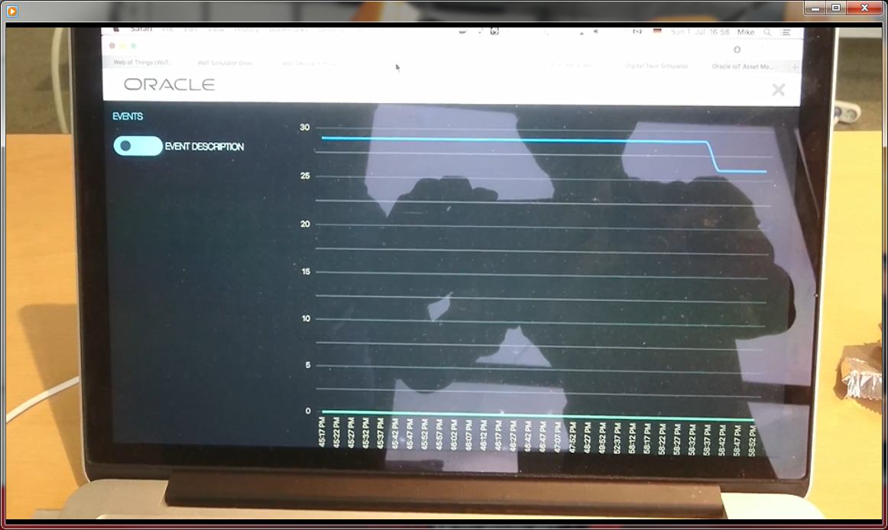
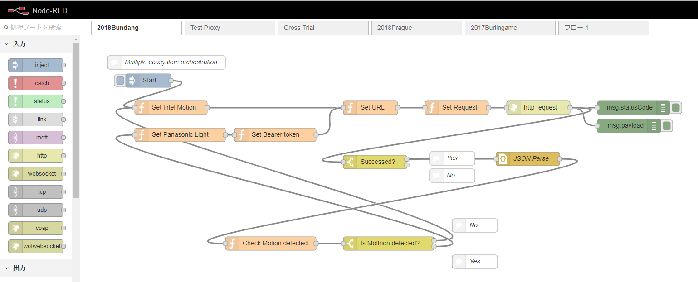

# PlugFest Preparation and Result for Bundang 2018

This document describes the Bundang PlugFest held on June 30 and July 1.

A summary of the previous Prague PlugFest can be found [here](https://github.com/w3c/wot/blob/master/plugfest/2018-prague/result.md).

Features marked with <i>italics</i> are work-in-progress.

The result of individual item is written after [RESULT].

## 1 PlugFest Infrastructure
This section lists the infrastructure available for the PlugFest, which can be used for individual testing (see [Section 3.1](#31-testing-individually))

### 1.1 Public Thing Directories

* N/A

### 1.2 Public Proxies

* N/A

### 1.3 Public Tools -- was (o8) Test Framework

* Online WoT Server Simulator available (contact to kawaguchi.toru [at] jp.panasonic.com to get access information).

## 2 Participants and Servients

<table>
  <tr>
    <th>Participants</th>
    <th>Appliation</th>
    <th>=protocol=</th>
    <th>Remote proxy</th>
    <th>=protocol=</th>
    <th>Local proxy</th>
    <th>=protocol=</th>
    <th>Device</th>
  </tr>
  <tr>
    <th rowspan="4">Panasonic</th>
    <td rowspan="2">NodeRED</td>
    <td rowspan="4">HTTP(S)</td>
    <td rowspan="4">(N/A)</td>
    <td rowspan="4">(N/A)</td>
    <td rowspan="4">(N/A)</td>
    <td rowspan="2">HTTPS + bearer token, WebSocket</td>
    <td>(Remote devices in Osaka Lab) Air conditioner, Lighting, Robotics Cleaner</td>
  </tr>
  <tr>
    <td>(Online Simulator) Air conditioner, Lighting, Robotics Cleaner</td>
  </tr>
  <tr>
    <td rowspan="2">Scripting App.</td>
    <td>HTTP, WebSocket</td>
    <td>(Local Simulator) Air conditioner, Lighting, Robotics Cleaner</td>
  </tr>
  <tr>
    <td>HTTPS + bearer token, WebSocket</td>
    <td>(Located locally, servient on the cloud) Google Home Mini</td>
  </tr>
</table>

## 3 Checking points for the next plugfest

### 3.1 Testing Individually
The following checking points can be completed by the participant alone by using the PlugFest infrastructure (TD Playground, Thing Directory, Proxies).

#### 3.1.1 Validate Simplified TDs -- was Other Issues (1)

* Panasonic will validate their updated TDs

[RESULT]
- All TDs in [repository](https://github.com/w3c/wot/tree/master/plugfest/2018-bundang/TDs/Panasonic) have been validated by [Thing Description Playground](http://plugfest.thingweb.io/playground/).

#### 3.1.2 Register with Thing Directory -- was (5)

* Panasonic will register all Things with the Directory

[RESULT]
* Local Thing
    * Some TDs in [repository](https://github.com/w3c/wot/tree/master/plugfest/2018-bundang/TDs/Panasonic) such as [Simulator Air Conditioner](https://github.com/w3c/wot/blob/master/plugfest/2018-bundang/TDs/Panasonic/simulator/PanasonicSimulatedAirConditioner1.jsonld) have been registered to Fujitsu Local Proxy/Directory manually by using YARC on Raspberry Pi, and have been discovered through its Remote Proxy/Directory by using ARC on PC.
    * <b>Interaction with things on Remote Proxy was NOT successful due to some internal issue of the proxy</b>.

#### 3.1.3 Connect with Remote/Local Proxy -- was (1)

* Panasonic will register local Things with the Fujitsu local proxy.
* Registeration to other proxies TBD

[RESULT]
* Included in [Result] of 3.1.2.

#### 3.1.4 Connect with node-wot -- was (3)

* N/A (Currently Panasonic does not use node-wot to implement Things or applications)

#### 3.1.5 Scripting API -- was (4)
* Panasonic wrote Generic HTML Client script against the Wot Scripting API implemented as JavaScript library.

[RESULT]
* The client worked successfully.  

### 3.2 Testing in Client Role
The following checking points must be completed together with a partner in server role.

#### 3.2.1 Metadata Handling

* Panasonic will use WoT Scripting API implemented as JavaScirpt library, which can consume any Thing metadata with HTTP bindings.
* Panasonic will use NodeRED with the node which can consume any Thing metadata with HTTP bindings.

[RESULT]
* Panasonic Generic WoT client with WoT Scripting API loaded following TDs and accessed things successfully:
    * Oracle's [Fest Simulator](https://github.com/w3c/wot/blob/master/plugfest/2018-bundang/TDs/Oracle/Festo-Simulator5.jsonld) with following local modification.
        * <b>Changed "type" from "boolean" to "object" with "properties": {"PumpStatus" : {	"type": "boolean"
				}}, to align with actual endpoint implementation.</b>
    * Intel's [Button](https://github.com/w3c/wot/blob/master/plugfest/2018-bundang/TDs/Intel/intel-button.jsonld), [Light](https://github.com/w3c/wot/blob/master/plugfest/2018-bundang/TDs/Intel/intel-light.jsonld), [Motion](https://github.com/w3c/wot/blob/master/plugfest/2018-bundang/TDs/Intel/intel-motion.jsonld) and [RGB- Light](https://github.com/w3c/wot/blob/master/plugfest/2018-bundang/TDs/Intel/intel-rgb-light.jsonld).
      * <b>Issue:  Only first binding could be chosen from Multiple HTTP bindings written in Intel's TD, since there seems to be no way to distinguish and specify particular binding through Scripting API (?) </b>
    * Siemens's [EventSource](https://github.com/w3c/wot/blob/master/plugfest/2018-bundang/TDs/Siemens/EventSource.jsonld) and [EventSource-WS](https://github.com/w3c/wot/blob/master/plugfest/2018-bundang/TDs/Siemens/EventSource-WS.jsonld)
* Panasonic Node-RED client loaded following TDs and accessed things successfully:
    * Intel's [Motion](https://github.com/w3c/wot/blob/master/plugfest/2018-bundang/TDs/Intel/intel-motion.jsonld)
    * Siemens's [EventSource-WS](https://github.com/w3c/wot/blob/master/plugfest/2018-bundang/TDs/Siemens/EventSource-WS.jsonld)
    * KETI's [IoT Sensor](https://github.com/w3c/wot/blob/master/plugfest/2018-bundang/TDs/KETI/keti_iot_sensor1.jsonld)

#### 3.2.2 Property Handling -- was part of (2)

* Panasonic implements the following get bindings
   * HTTP(S)
* Panasonic implements the following set bindings
   * HTTP(S)
* Panasonic implements the following observe bindings
   * HTTP(S)+Longpoll
   * WebSocket

[RESULT]
* Panasonic Generic WoT client could GET properties from following things through HTTP successfully:
   * Oracle's [Fest Simulator](https://github.com/w3c/wot/blob/master/plugfest/2018-bundang/TDs/Oracle/Festo-Simulator5.jsonld) with following local modification.
         * Changed "type" from "boolean" to "object" with "properties": {"PumpStatus" : {	"type": "boolean"
 				}}, to align with actual endpoint implementation.
    * Intel's [Button](https://github.com/w3c/wot/blob/master/plugfest/2018-bundang/TDs/Intel/intel-button.jsonld), [Light](https://github.com/w3c/wot/blob/master/plugfest/2018-bundang/TDs/Intel/intel-light.jsonld), [Motion](https://github.com/w3c/wot/blob/master/plugfest/2018-bundang/TDs/Intel/intel-motion.jsonld) and [RGB- Light](https://github.com/w3c/wot/blob/master/plugfest/2018-bundang/TDs/Intel/intel-rgb-light.jsonld).
* Panasonic NodeRED client could GET properties from following things through HTTP+Polling successfully:
    * Intel's [Motion](https://github.com/w3c/wot/blob/master/plugfest/2018-bundang/TDs/Intel/intel-motion.jsonld)

#### 3.2.3 Action Handling -- was part of (2)

* Panasonic implements the following invoke bindings
   * HTTP(S)

[RESULT]
* *Panasonic Generic WoT client and NodeRED client DID NOT try any Action in other company's things this time.*

#### 3.2.4 Event Handling -- was part of (11)

* Panasonic implements the following subscribe bindings
   * HTTP(S)+Longpoll
   * WebSocket

[RESULT]
* Panasonic Generic WoT client could subscribe and receive events from following thing through HTTP+Longpoll successfully:
  * Siemens's [EventSource](https://github.com/w3c/wot/blob/master/plugfest/2018-bundang/TDs/Siemens/EventSource.jsonld)

  

* Panasonic Node-RED client could receive events from following thing through WebSocket successfully:
  * Siemens's [EventSource-WS](https://github.com/w3c/wot/blob/master/plugfest/2018-bundang/TDs/Siemens/EventSource-WS.jsonld)
  

* Panasonic NodeRED client could receive events from following thing through HTTP+Longpoll successfully:
  * KETI's [IoT Sensor](https://github.com/w3c/wot/blob/master/plugfest/2018-bundang/TDs/KETI/keti_iot_sensor1.jsonld)
  

#### 3.2.5 Security -- was part of (9)

* Panasonic can consume the following Security Schemes:
   * basic
   * digest
   * bearer

[RESULT]
* Panasonic Generic WoT client could access following thing using BASIC authentication through Authorization header successfully:
  * Oracle's [Fest Simulator](https://github.com/w3c/wot/blob/master/plugfest/2018-bundang/TDs/Oracle/Festo-Simulator5.jsonld).
* Panasonic NodeRED client could access following thing using BASIC authentication through Authorization header successfully:
    * Intel's [Motion](https://github.com/w3c/wot/blob/master/plugfest/2018-bundang/TDs/Intel/intel-motion.jsonld)

#### 3.2.6 Semantic integration -- was part of (8)

* Panasonic will use manual queries for the Thing Directory to find specific Things of the test partner (no integration to client this time).

[RESULT]
* *Panasonic DID NOT try any queries for other company's things this time.*

#### 3.2.7 Accessibility -- was (10)

* N/A (Panasonic does not implement Accessibility front-ends for Things)

### 3.3 Testing in Server Role
The following checking points must be completed together with a partner in client role.

#### 3.3.1 Metadata

* Panasonic will expose Things as listed in the table

[RESULT]
* Panasonic exposed thing descriptions with DUMMY URI in [repository](https://github.com/w3c/wot/tree/master/plugfest/2018-bundang/TDs/Panasonic).
* Panasnoic exposed thing descriptions of online real things with real URI in [zip file](https://github.com/w3c/wot/blob/master/plugfest/2018-bundang/TDs/Panasonic/panasonic_lab_online_TDs.zip) with password protected (same as WiFi password of W3CWOT).
* Panasonic exposed thing descriptions online simulated things with real URI at simulator portal (available to only WoT members who requests access information).

#### 3.3.2 Properties -- was part of (6) and (7)

* Panasonic implements the following get bindings
  * HTTP(S)
* Panasonic implements the following set bindings
  * HTTP(S)
* Panasonic implements the following observe bindings
  * HTTP(S)+Longpoll
  * WebSocket

[RESULT]
* Panasonic's [Simulator Air Conditioner](https://github.com/w3c/wot/blob/master/plugfest/2018-bundang/TDs/Panasonic/simulator/PanasonicSimulatedAirConditioner1.jsonld) was accessed from Oracle's Node-WoT based client. Its "desiredTemp" property was read using HTTPS GET periodically, and Oracle's client copied the value into Oracle IoT simulator's Air Conditioner instance, making it possible to monitor the change of the property value.

#### 3.3.3 Actions -- was part of (6) and (7)

* Panasonic implements the following invoke bindings
   * HTTP(S)

[RESULT]
TBD

#### 3.3.4 Events -- was part of (11)

* Panasonic implements the following subscribe bindings
   * HTTP(S)+Longpoll
   * WebSocket

[RESULT]
TBD

#### 3.3.5 Security -- was part of (9)

* Panasonic will offer the following Security Schemes:
   * bearer

[RESULT]
* Panasonic's [Simulator Air Conditioner](https://github.com/w3c/wot/blob/master/plugfest/2018-bundang/TDs/Panasonic/simulator/PanasonicSimulatedAirConditioner1.jsonld) was accessed from Oracle's Node-WoT based client, by using bearer token embedded in custom header (X-PWOT-TOKEN). To achieve this, following modification was necessary:
  * <b>Security field of TD has to be set to {"schema": "apikey", "in": "header", "pname": "X-PWOT-TOKEN"}</b>
  * <b>wot-servient.conf.json of Node-WoT has to be set to {"credential": {"\<Thing's id>": {"apikey": "\<Token value>"}}} </b>

  (see [Github issue](https://github.com/eclipse/thingweb.node-wot/issues/7))

#### 3.3.6 Semantic Integration -- was part of (8)

* Panasonic will annotate their Things with iot.schema.org vocabulary

[RESULT]
TBD

### 3.4 Other issues

#### 3.4.1 Running Actions and Event Instances -- was Other Issues (2)

* N/A (Future study)

#### 3.4.2 Discovery using Feature of Interest -- was Other Issues (4)

* N/A (Future study)

#### 3.4.3 New Security Patterns -- was Other Issues (7)

* N/A (What does "New Security Patterns" particularly mean?)

#### 3.4.4 Miscellaneous -- was Other Issues (9)

* N/A

## 4 Use cases -- was Other Issues (5) and (6)

* Panasonic currently has smart home application with simple "I'm Home" and "Bye" scenario triggered by voice command through Google Home.
* Panasonic want to find out some meaningful scenarios, such as:
  - Multiple ecosystem orchestration in smart home area, such as collaboration of Echonet device and OCF device.
  - Smart home and other area orchestration, such as automotive, building, industry or smart city infrastructure.

[RESULT]
* Panasonic carried out the scenario orchestrating OCF device and Echonet device. The scenario is "When OCF device (Intel's   [Motion](https://github.com/w3c/wot/blob/master/plugfest/2018-bundang/TDs/Intel/intel-motion.jsonld)) detects a motion, Echonet device (Panasonic's [Light](https://github.com/w3c/wot/blob/master/plugfest/2018-bundang/TDs/Panasonic/huegroup_p1.jsonld)) is turned on.".

* The scenario explained in 3.3.2 implemented by Oracle was a new use case which synchronizes physical and virtual things to enable monitoring and analysis of the physical thing's behavior easily.
* The number received from Siemens's [EventSource-WS](https://github.com/w3c/wot/blob/master/plugfest/2018-bundang/TDs/Siemens/EventSource-WS.jsonld) in Bundang, Korea through WebSocket displayed on Panasonic's [LED Board](https://github.com/w3c/wot/blob/master/plugfest/2018-bundang/TDs/Panasonic/electricBulletinBoard_p2.jsonld) in Osaka, Japan.

## 5 Requirements for PlugFest Environment

| Participant | Number of Participants | Number of Power outlets | Network | Remarks |
|-------------|------------------------|-------------------------|---------|---------|
| Panasonic   | 3                      | 2                       | Wi-Fi(b/g/n), Ports: 22, 80, 443, 1880, 3000, 3001, 3002, 3003, 3004, 8001, 8003 | |

## 6 Implementation Guidelines

## request to proxy implementors
Panasonic would like to ask proxies to support multiple bindings per each property and event. We use multiple bindings to distinguish:
- "read/write" and "observe" of particular property
- multiple method of notification (property observe or event subscribe) such as HTTP long polling and simple WebSocket.
