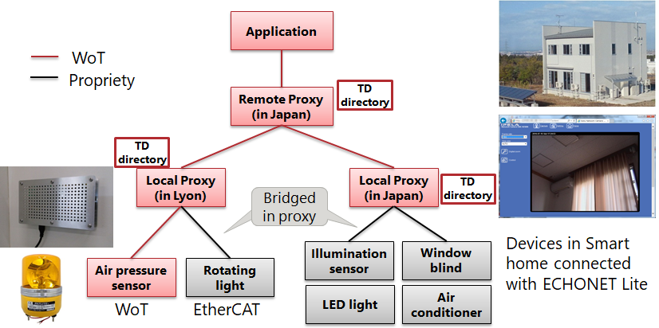
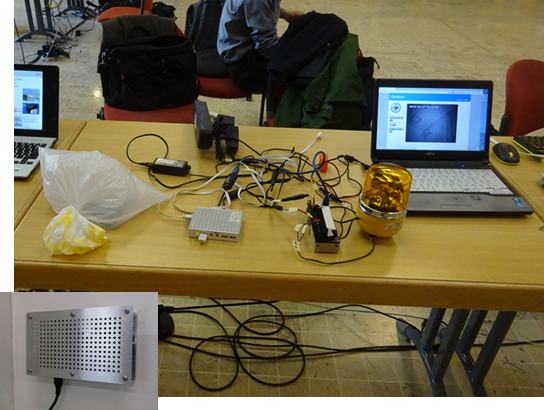
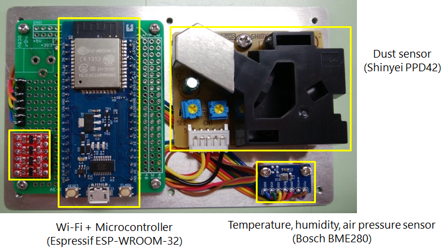
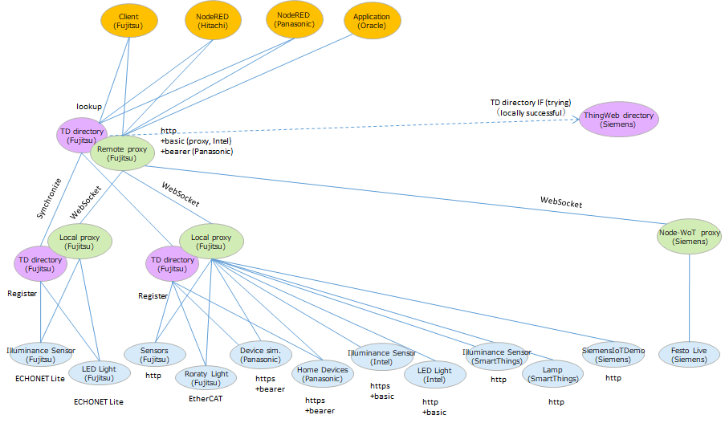

# PARTICIPANT PlugFest Result for Lyon 2018

This document summerizes the results of the Lyon PlugFest held Oct 20 and 21.

## 1 PlugFest Infrastructure
This section lists the infrastructure available for the PlugFest, which can be used for individual testing (see [Section 3.1](#31-testing-individually))

### Overview of Fujitsu plugfest system

Figure 1. shows Fujitsu plugfest diagram to be provided.  There are 1 remote proxy servient and 2 local proxy servients in the different locations.  One of the local proxies was in Lyon, Lyon, and the other was in Kanazawa, Japan.  The remote proxy servient was in Nagoya, Japan.
Some device servients were connected to these local proxy serivents.  Air pressure sensor, Rotating light and members' devices connected to the local proxy servient in Lyon.  Illumination sensor and some Home appliances connected to the local serivient in Japan, set up in the smart home.  These proxy servient have the TD directories that have TD of all device to be connected.  The remote proxy servient was connected with these local proxy servients and local TDs.  TDs' addresss (URL) in these proxy servientes were renamed in each proxy serivnet because all messages from application and upper proxies have to be relayed.

 Figure 1. Fujitsu diagram for plugfest in Lyon

Figure 2. shows Fujitsu booth in the plugfest.  Air pressure sensor was in the bag in the left, connected the local proxy with Wi-Fi.  The local proxy servient runed on the linux mini server, white box in the center.  The rotating light in the right, connected with EthernCAT controller in between the light and the proxy.  the contoller turned ON/OFF to power supply to the light according to the messeage from the proxy. 

 Figure 2. Photo of Fujitsu demos.

Figure 3. shows our device servient equipped with temperature, humidity, air pressure, and particle sensors. This device has WoT interface on Wi-Fi communication module. 

 Figure 3. device servient with Wi-Fi module WoT stack implemented

## 2 Particpants and Servients

## 3 Checking Points 

Test results can have one of 4 states:

* OK: Test passed
* NO: Test failed
   * Use "Issue: ..." to note down the reason
   * Comment if there is a known fix
* OT: Out-of-time to complete test
* NA: Test not applicable, e.g., because feature is not implemented
   * Comment if feature is planned to be implemented in the future

### Result summary

The figure below shows our results of what and how to connect to our proxies.

Figure. Result summary of plugfest

### 3.1 Testing Individually

#### 3.1.1 Validate Simplified TDs

* OK
   * Comment: checked Fujitsu TDs using TD Playground.

#### 3.1.2 Register with Thing Directory

* OK/OT
   * Comment: provided Thing Directory at local network
    and Internet. We tried to synchronize TDs of device 
    to be connected to Fujitsu Proxy to ThingWeb directory, 
    but could not connect because ThingWeb directory had stopped.
    (We have checked the synchronization between Fujitsu proxy
    and ThingWeb directory using local ThingWeb directory.)

#### 3.1.3 Connect with Remote/Local Proxy

##### IMPLEMENTATION at URI

* OK
   * Comment: Fujitsu provided Remote/Local Proxy. 

#### 3.1.4 Connect with node-wot

* OK
   * Comment: Fujitsu Remote Proxy could connect with Siemens node-wot, and could control FestLive via Fujitsu Remote Proxy.

#### 3.1.5 Scripting API

* NA

### 3.2 Testing in Client Role
#### 3.2.1 Metadata Handling

* NA

#### 3.2.2 Read Property

##### HTTP

###### 
* OK
   * SiemensIoTDemo
   * SmartThings Lamp and Illuminance Sensor
   * Intel LED Light and Illuminance Sensor (https)
   * Panasonic Device Sim. and Home Devices (https)
   * Fujitsu airPressure sensor
   
##### CoAP

* NA

##### MQTT

* NA

##### Other

###### ECHONET Lite
* OK
   * Fujitsu Illuminance Sensor and LED Light

###### EtherCAT
* OK
   * Fujitsu Rotary Light

#### 3.2.3 Write Property

##### HTTP

###### 
* OK
   * SmartThings Lamp
   * Intel LED Light (https)
   * Panasonic Device Sim. and Home Devices (https)
   
##### CoAP

* NA

##### MQTT

* NA

##### Other

###### ECHONET Lite
* OK
   * Fujitsu LED Light

###### EtherCAT
* OK
   * Fujitsu Rotary Light

#### 3.2.4 Observe Property

##### HTTP+Longpoll

* NA
   * Comment: we checked in online plugfest

##### HTTP+Webhooks

* NA

##### CoAP

* NA

##### WebSockets

* NA

##### MQTT

* NA

##### Other

* NA

#### 3.2.5 Invoke Action

##### HTTP

* NA

##### CoAP

* NA

##### MQTT

* NA

##### Other

* NA

#### 3.2.6 Subscribe Event

##### HTTP+Longpoll

* NA

##### HTTP+Webhooks

* NA

##### CoAP

* NA

##### WebSockets

* NA

##### MQTT

* NA

##### Other

* NA

#### 3.2.7 Security

##### BASIC

###### Intel
* OK
   * Comment: we can control intel devices using basic schema via fujitsu proxy.
   
###### other nosec devices
* OK
   * If a device does not have authentication capability, remote proxy provides basic authentication to the application and rewrites the security metadata in TD for adding a term "basic".

##### BEARER

###### Panasonic
* OK
   * Comment: we can control panasonic devices using basic schema via fujitsu proxy.

#### 3.2.8 Semantic integration

##### PARTNER
* OK/NO/OT/NA
   * Issue: 
   * Comment: 

#### 3.2.9 Accessibility

* NA

### 3.3 Testing in Server Role
#### 3.3.1 Metadata

* NA

#### 3.3.2 Read Property

##### HTTP

###### HITACHI
* OK
   * Comment: HITACHI can read fujitsu devices value.

##### CoAP

* NA

##### MQTT

* NA

##### Other

* NA

#### 3.3.3 Write Property

##### HTTP

###### HITACHI, Panasonic, Oracle
* OK
   * Issue: 
   * Comment: they can control fujitsu devices via proxy

##### CoAP

* NA

##### MQTT

* NA

##### Other

* NA

#### 3.3.4 Observe Property

##### HTTP+Longpoll

* NA

##### HTTP+Webhooks

* NA

##### CoAP

* NA

##### WebSockets

* NA

##### MQTT

* NA

##### Other

* NA

#### 3.3.5 Invoke Action

##### HTTP

* NA

##### CoAP

* NA

##### MQTT

* NA

##### Other

* NA

#### 3.3.6 Subscribe Event

* NA

##### HTTP+Webhooks

* NA

##### CoAP

* NA

##### WebSockets

* NA

##### MQTT

* NA

##### Other

* NA

#### 3.3.7 Security

##### BASIC
   
###### nosec devices
* OK
   * If a device does not have authentication capability, remote proxy provides basic authentication to the application and rewrites the security metadata in TD for adding a term "basic".

#### 3.3.8 Semantic integration

* NA

### 3.4 Other issues

#### 3.4.1 Producing Running Actions and Event Instances

* NA

#### 3.4.2 Consuming Running Actions and Event Instances

* NA

#### 3.4.3 New Security Patterns

* NA

#### 3.4.4 Miscellaneous

* NA

## 4 Use cases

### USE CASE

* OK/NO/OT/NA
   * Issue: 
   * Comment: 
