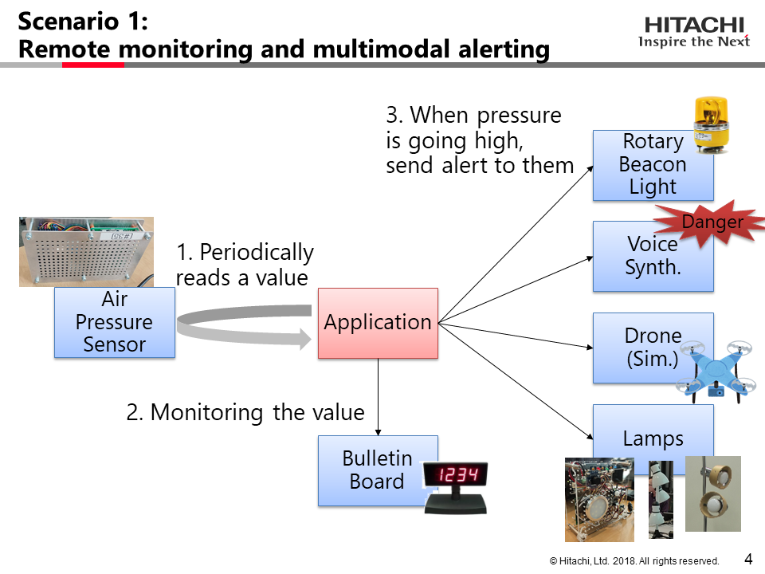
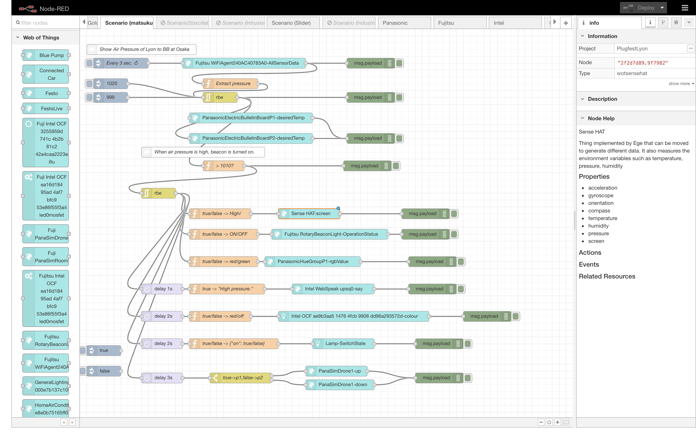
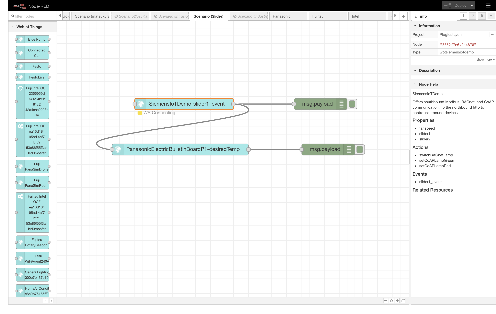
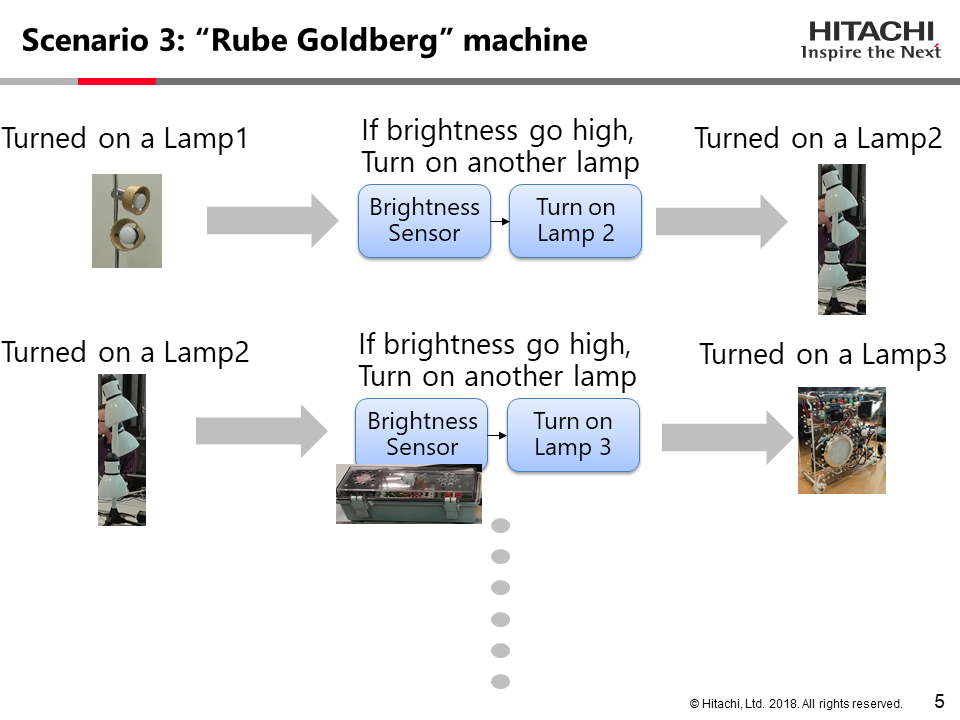
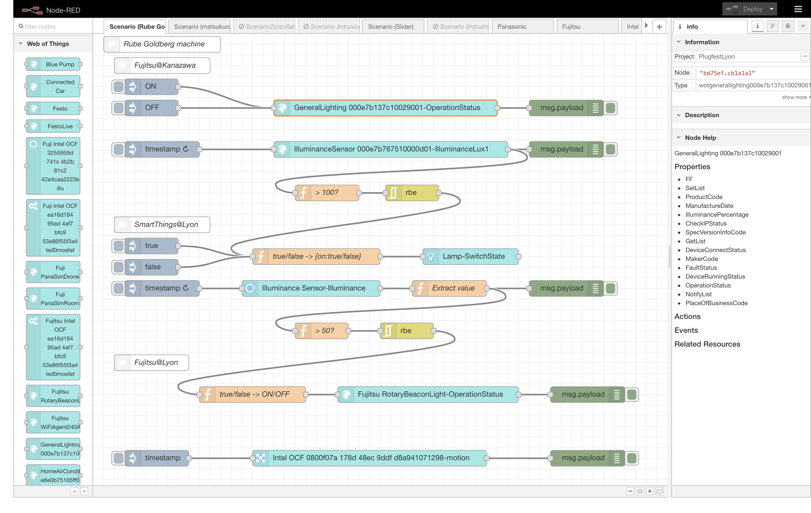
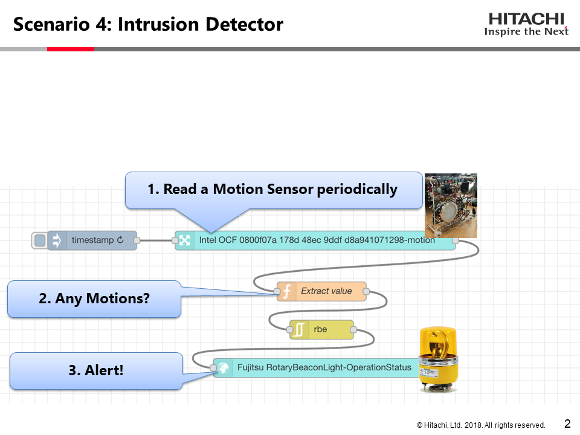
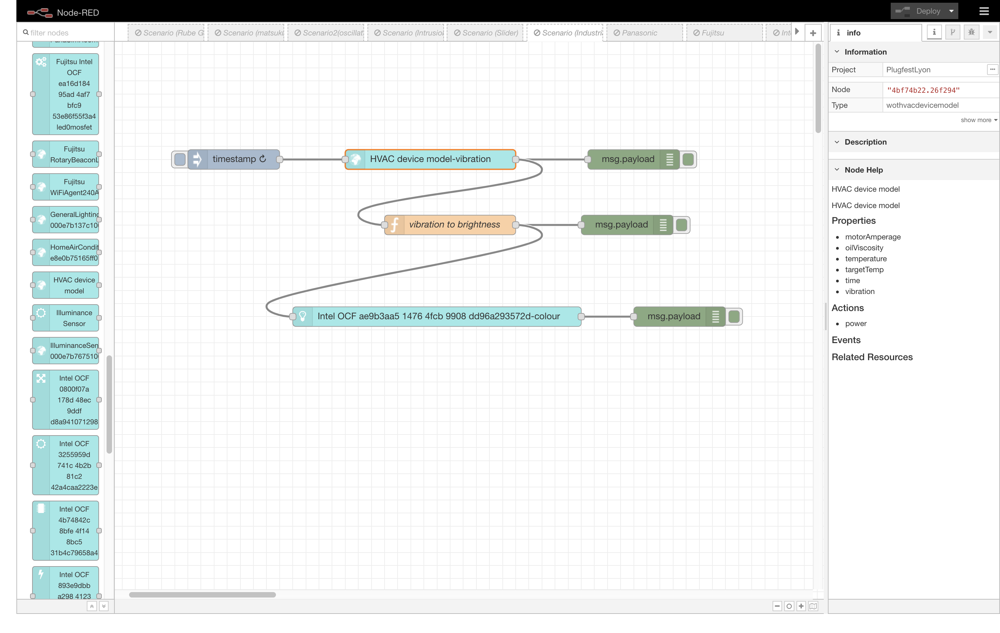

# Hitachi PlugFest Result for Lyon 2018

This document summerizes the results of the Lyon PlugFest held Oct 20 and 21.

## 3 Checking Points 

Test results can have one of 4 states:

* OK: Test passed
* NO: Test failed
   * Use "Issue: ..." to note down the reason
   * Comment if there is a known fix
* OT: Out-of-time to complete test
* NA: Test not applicable, e.g., because feature is not implemented
   * Comment if feature is planned to be implemented in the future

### 3.1 Testing Individually
#### 3.1.1 Validate Simplified TDs

* NA

#### 3.1.2 Register with Thing Directory

* NA 

#### 3.1.3 Connect with Remote/Local Proxy

* OK
   * Comment: Connected with Fujitsu's Remote Proxy

#### 3.1.4 Connect with node-wot

* OK
   * Comment: Connected with Siemens's IoT Demo (Slider)

#### 3.1.5 Scripting API

* NA

### 3.2 Testing in Client Role

#### Node-red-nodegen Test Result against Servients

##### Prerequisite
###### Limitation 

- TDs are retrieved by `curl` command, not retrieved from generated nodes dynamically/automatically.
- In order to access a correct endpoint, some forms in interactions are eliminated manually.

##### Test results

Legends:
- Load: Client could load TD file
- CORS: Client could handle CORS operation (otherwise used non-sec Browser)
- Auth: Client could be authorized to access the endpoint
- interactions: Client could successfully make interactions

| Company | Thing| Load | CORS | Auth | interactions | Note |
| - | - | - | - | - | - | - | - |
| Fujitsu | [RotaryBeaconLight](TDs/Fujitsu/Fujitsu-RotaryBeaconLight.jsonld)      |  NA  |  NA  | Basic:OK | readP: OK    |                 | 
|||||| writeP: OK   |              
|         | [WiFiAgent](TDs/Fujitsu/Fujitsu-WiFiAgent240AC40783A0.jsonld)              |  NA  |  NA  | basic:OK | readP: OK |
|         | [BlindOpen](TDs/Fujitsu/Fujitsu-BlindOpen) | NA | NA | basic:OK | writeP:OK |
|         | [BlindClose](TDs/Fujitsu/Fujitsu-BlindClose)| NA | NA | basic:OK | writeP:OK |
|         | [LED](TDs/Fujitsu/Fujitsu-LEDLight.jsonld) | NA | NA | basic:OK | writeP:OK |
|         | IlluminanceSensor | NA | NA | basic:OK | readP:OK |
|Panasonic | [HueGroupP1](TDs/Panasonic/huegroup_p1.jsonld) | NA | NA | bearer:OK | writeP:OK|
|          |||||obserP:OK|
|         | [ElectricBulletinBoardP1](TDs/Panasonic/electricBulletinBoard_p1.jsonld) | NA | NA | bearer:OK | writeP:OK |
|         | [ElectricBulletinBoardP2](TDs/Panasonic/electricBulletinBoard_p2.jsonld) | NA | NA | bearer:OK | writeP:OK |
|         | [AirConditonerP1](TDs/Panasonic/airConditioner_p1.jsonld) | NA | NA | bearer:OK | writeP:OK |
|         | [SimDrone1](TDs/Panasonic/Local_simulator/PanaSimDrone1.jsonld) | NA | NA | bearer:OK | invokeA:OK |
| Intel | [WebSpeak](TDs/Intel/webspeak.jsonld) | NA | NA | basic:OK | invokeA:OK |
|       | [SimpleWebCamera](TDs/Intel/SimpleWebCamera.json) | NA | NA | nosec:OK | readP:OK|
|       | [Motion1](TDs/Intel/OCF/motion1.jsonld) | NA | NA | nosec:OK | readP:OK |
|       | [Illuminamce0](TDs/Intel/OCF/illuminance0.jsonld) | NA | NA | nosec:OK | readP:OK|
|       | [RGBLED1](TDs/Intel/OCF/rgbled1.jsonld) | NA | NA | nosec:OK | writeP:OK |
|       | [LED1red](TDs/Intel/OCF/led1red.jsonld) | NA | NA | nosec:OK | writeP:OK |
|       | [Temperature1](TDs/Intel/OCF/temperature1.jsonld) | NA | NA | nosec:OK | readP:OK |
| Oracle| [HVAC](TDs/Oracle/HVAC_Shared.jsonld) | NA | NA | basic:OK | readP:OK |
|       | [Connected Car](TDs/Oracle/Connected_Car_Shared.jsonld) | NA | NA | basic:OK | readP: OK |
|       | [Festo](TDs/Oracle/Festo_Shared.jsonld) | NA | NA | basic:OK | readP:OK |
|       | [Truck](TDs/Oracle/Truck_Shared.jsonld) | NA | NA | basic:OK | readP:OK |
|       | [Blue Pump](TDs/Oracle/Blue_Pump_Hitachi.jsonld) | NA | NA | basic:OK | readP:OK |
|Siemems| [IoTDemo](TDs/Siemens/bacnet-logo-coap-demo.jsonld) | NA | NA | nosec:OK | readP:OK |
||||||subE/ws:OK|
|SmartThings| [Lamp](TDs/SmartThings/td-light-local.json) | NA | NA | nosec:OK | writeP:OK |
|           | [Illuminance Sensor](TDs/SmartThings/td-illuminance-local.json) | NA | NA | nosec:OK | readP:OK | 
|TUM| [SenseHAT](TDs/TUM/senseHat.json) | NA | NA | nosec:OK | writeP:OK |

#### 3.2.1 Metadata Handling

##### Oracle/Siemens/Fujitsu/Intel/Panasonic/SmartThing/TUM

* OK

#### 3.2.2 Read Property

##### HTTP

###### Oracle/Siemens/Fujitsu/Intel/Panasonic/SmartThing/TUM

* OK

##### CoAP

* NA

##### MQTT

* NA

#### 3.2.3 Write Property

##### HTTP

###### Oracle/Siemens/Fujitsu/Intel/Panasonic/SmartThing/TUM

* OK

##### CoAP

* NA

##### MQTT

* NA

#### 3.2.4 Observe Property

##### HTTP+Longpoll

###### Panasonic
* OK

##### HTTP+Webhooks

* NA

##### CoAP

* NA

##### WebSockets

###### Siemens/Panasonic
* OK

##### MQTT

* NA
   * Comment: 

##### Other

#### 3.2.5 Invoke Action

##### HTTP

###### Oracle/Siemens/Fujitsu/Intel/Panasonic/SmartThing/TUM

* OK
 

##### CoAP

* NA
 
##### MQTT

* NA 

##### Other

* NA

#### 3.2.6 Subscribe Event

##### HTTP+Longpoll

###### Oracle/Siemens/Fujitsu/Intel/Panasonic/SmartThing/TUM

* OK

##### HTTP+Webhooks

* NA

##### CoAP

* NA

##### WebSockets

###### Siemens/Panasonic

* OK

##### MQTT

* NA

#### 3.2.7 Security

##### HTTPS

###### Panasonic/Intel/Oracle
* OK 

#### 3.2.8 Semantic integration

* NA

#### 3.2.9 Accessibility

* NA

### 3.3 Testing in Server Role

* NA

### 3.4 Other issues

* NA

## 4 Use cases

### Remote Monitoring and Multimodal Alerting

* Periodically reads a value of air pressure sensor (Fujitsu's), and display its value on LED display (Panasonic's)
* If pressure is going high, send alert to:
  * Rotary Beacon Light (Fujitsu's)
  * Voice Synth. (Intel's WebSpeak)
  * Drone (Panasonic's)
  * Lights (Panasonic's HueGroup, Intel's LED and SmartThing's Lamp)
  * Display (TUM's SenseHAT)

### Realtime control

* Control numeric value of a LED display (Panasonic's) using a slider (Siemens').

### (Demo)"Rube Goldberg" machine

* Turn on a light in Kanazawa (Fujitsu's)
* It sensed by an brightness sensor, and application turns on a light in Lyon (SmartThings')
* It sensed by an brightness sensor at Lyon, and
application turns on a Rotary Beacon Light. (Fujitsu's)

### Intrusion detector

* Periodically watches a motion sensor (Intel's) 
* When some motion is detected, turn on Rotary Beacon Light (Fujitsu's).

### Realtime monitoring

* Periodically watches a vibration value of HVAC (Oracle's).
* Display its value by color (green=normal, red=high) of LED (Intel's). 

## Appendix

### node-red-nodegen for Web of Things

* You can download source file from [our repository](https://github.com/k-toumura/node-red-nodegen/tree/webofthings).

* Updated features (from last plugfest)
  * Support recent TD format (td4lyon)
  * Support websocket
  * Automatic icon selection
  * Support URI template (but not tested)
