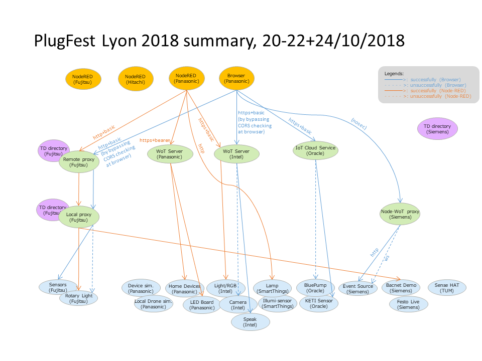
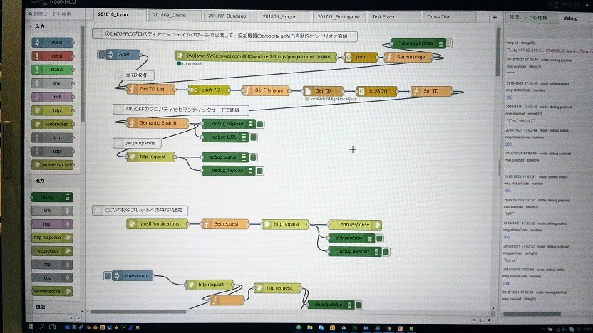
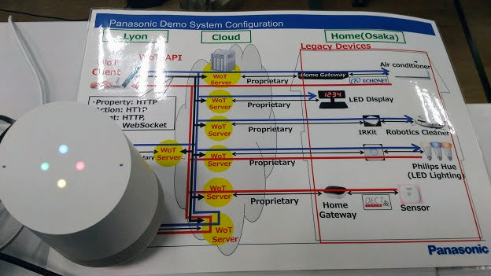
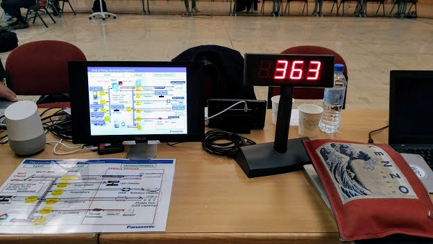
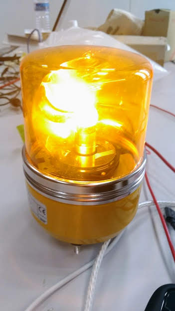
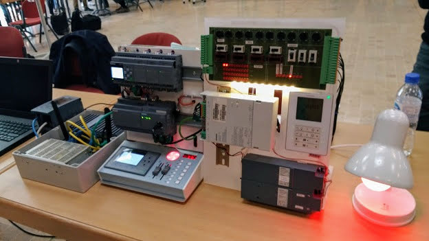
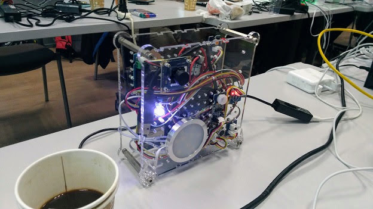

# PARTICIPANT PlugFest Result for Lyon 2018

This document summerizes the results of the Lyon PlugFest held Oct 20-22 and 24.

## 3 Checking Points

Test results can have one of 4 states:

* OK: Test passed
* NO: Test failed
   * Use "Issue: ..." to note down the reason
   * Comment if there is a known fix
* OT: Out-of-time to complete test
* NA: Test not applicable, e.g., because feature is not implemented
   * Comment if feature is planned to be implemented in the future

Result of Panasonic projects  

### 3.1 Testing Individually

#### 3.1.1 Validate TDs

##### Panasonic validated all TDs using [Thingweb Playground](https://github.com/thingweb/thingweb-playground)

* OK

#### 3.1.2 Register with Thing Directory

* OT

#### 3.1.3 Connect with Remote/Local Proxy

##### Panasonic proxied Smart Home Things through Proprietery WebSocket connection.

* OK

#### 3.1.4 Connect with node-wot

* NA

#### 3.1.5 Scripting API

* NA

### 3.2 Testing in Client Role

To confirm the implementation coverage of each client, see the following tables.

#### Browser WoT Client Test Result against Servients

##### Prerequisite
###### Limitation from Browser WoT Client implementation

- Only supports Content-Type: application/json as payload
- Cannot read file with multiple TDs in array

###### Lmitation from operational environment

- Only Cloud-accesible servients have been tested
- Tested TDs as of 2018/10/20(Sat)

##### Test results

Legends:
- Load: Client could load TD file
- CORS: Client could handle CORS operation (otherwise used non-sec Browser)
- Auth: Client could be authorized to access the endpoint
- interactions: Client could successfully make interactions

| Company | Thing                  | Load | CORS | Auth | interactions | Note            |
| ------- | ---------------------- | ---- | ---- | ---- | ------------ | --------------- |
| Fujitsu | RotaryBeaconLight      | OK   | NG   | OK   | readP  : NG  | The client didn't support "Content-Type: text/plain" as payload. |
|         |                        |      |      |      | writeP : NG  | The client didn't support "Content-Type: text/plain" as payload. |
|         | WiFiAgent              | OK   | NG   | OK   | readP  : OK  |                 |
| Intel   | OCF                    | NG   |      |      |              | multiple TDs    |
|         | WebCamera (frame)      | OK   | NG   | OK   | readP  : NG  | The client didn't support "Content-Type: image/jpeg" as payload. |
|         | WebCamera (other)      |      |      |      | readP  : OK  |                 |
|         | webspeak               | OK   | NG   | OK   | invokeA: OK  |                 |
| KETI    | Sim_Environment_Sensor | OK   | OK   | OK   | readP  : OK  |                 |
|         | iot-sensor             | NG   |      |      |              |                 |
| Oracle  | Blue_Pump              | OK   | OK   | OK   | readP  : OK  |                 |
|         |                        |      |      | OK   | invokeA: NG  | 400 Bad Request |
|         | Connected_Car          | OK   | OK   | OK   | readP  : OK  |                 |
|         |                        |      |      |      | writeP : NG  | 400 Bad Request |
|         | Connected_Car          | OK   | OK   | OK   | invokeA: NG  | 400 Bad Request |
| Siemens | EventSource            | OK   | OK   | N/A  | subE/lp: OK  |                 |
|         |                        |      |      |      | subE/ws: NG  |                 |
|         | TestThing              | OK   | NG   | N/A  | readP  : OK  |                 |
|         |                        |      |      |      | writeP : OK  |                 |

#### Node-RED Test Result against Servients

##### Purpose

- Focused on the [semantics integration scenario](Scenarios.md#scenario-1-search-devices-ex-lights-which-can-be-turned-offon-by-semantic-annotation).

##### Prerequisite
###### Limitation from Node-RED implementation

- Cannot read file with multiple TDs in array

###### Lmitation from operational environment

- None

##### Test results

Legends:
- Load: Client could load TD file
- CORS: Client could handle CORS operation (otherwise used non-sec Browser)
- Auth: Client could be authorized to access the endpoint
- interactions: Client could successfully make interactions

| Company     | Thing                  | Load | CORS | Auth | interactions | Note            |
| ----------- | ---------------------- | ---- | ---- | ---- | ------------ | --------------- |
| Panasonic   | Google Home 1          | OK   | N/A  | OK   | subE/ws: OK  | bearer token    |
|             | LED Board 1 + 2        | OK   | N/A  | OK   | writeP : OK  | bearer token    |
|             | Hue Light              | OK   | N/A  | OK   | writeP : OK  | bearer token    |
| Fujitsu     | Rotary Beacon Light    | OK   | N/A  | OK   | writeP : OK  | basic auth      |
| Siemens     | BACnet Lamp            | OK   | N/A  | OK   | invokeA: OK  | basic auth      |
| Intel       | OCF                    | NG   | -    | -    | -            | multiple TDs    |
|             | RGB Light              | OK   | N/A  | OK   | invokeA: OK  | basic auth      |
| SmartThings | Lamp via local net     | OK   | N/A  | N/A  | invokeA: OK  | no auth         |

#### 3.2.1 Metadata Handling

##### Panasonic used Node-RED and Browser based Generic WoT Client which could consume any Thing metadata with HTTP bindings.

* NO (Partially)
   * Issue: [OCF.json](TDs/Intel/OCF.json) could not be consumed because it had multiple TDs in one file.
   * Comment: After it divided into the single TD files, clients could consume them.

#### 3.2.2 Read Property

##### HTTP

###### Generic WoT Client

* NO (Partially)
    * Issue: Some servients could not be read.
    * Comment: See [Browser WoT Client Test Result against Servients](#browser-wot-client-test-result-against-servients).

###### Node-RED

* OK

##### CoAP

* NA

##### MQTT

* NA

##### Other

* NA

#### 3.2.3 Write Property

##### HTTP

###### Generic WoT Client

* NO (Partially)
    * Issue: Some servients could not be written.
    * Comment: See [Browser WoT Client Test Result against Servients](#browser-wot-client-test-result-against-servients).

###### Node-RED

* OK

##### CoAP

* NA

##### MQTT

* NA

##### Other

* NA

#### 3.2.4 Observe Property

##### HTTP+Longpoll

###### Client: Generic WoT Client

* OK

##### HTTP+Webhooks

* NA

##### CoAP

* NA

##### MQTT

* NA

##### Other

##### Simple WebSocket

###### Generic WoT Client

* OK

#### 3.2.5 Invoke Action

##### HTTP

###### Generic WoT Client

* NO (Partially)
    * Issue: Some servients could not be invoked.
    * Comment: See [Browser WoT Client Test Result against Servients](#browser-wot-client-test-result-against-servients).

###### Node-RED

* OK

##### CoAP

* NA

##### MQTT

* OT

##### Other

* NA

#### 3.2.6 Subscribe Event

##### HTTP+Longpoll

###### Client: Generic WoT Client

* OK

##### HTTP+Webhooks

* NA

##### CoAP

* NA

##### MQTT

* NA

##### Other

##### Simple WebSocket

###### Generic WoT Client

* NO (Partially)
    * Issue: Some servients could not be subscribed.
    * Comment: See [Browser WoT Client Test Result against Servients](#browser-wot-client-test-result-against-servients).

##### Node-RED

* OK

#### 3.2.7 Security

##### Basic authentication

###### IoT Cloud Service (Oracle)

* OK

###### Remote proxy (Fujitsu)

* OK

###### RBG Light and WebCamera and WebSpeak (Intel)

* OK

##### Bearer token

###### Home Devices and Simulators (Panasonic)

* OK

##### CORS

###### IoT Cloud Service (Oracle)

* OK

###### EventSource (Siemens)

* OK

###### Remote proxy (Fujitsu)

* NO
   * Issue: The browser **could** access Remote proxy (Fujitsu) **only after** bypassing CORS checking at the browser.
   * Comment: Example of bypassing CORS (at Chrome Browser on Windows):  `> "C:\Program Files (x86)\Google\Chrome\Application\chrome.exe" --disable-web-security --user-data-dir="C://Chrome dev session"`

###### WebCamera and WebSpeak (Intel)

* NO
    * same as above

###### TestThing (Siemens)

* NO
    * same as above

#### 3.2.8 Semantic integration

* OK

#### 3.2.9 Accessibility

* NA

### 3.3 Testing in Server Role

#### 3.3.1 Metadata

##### Panasonic provided [TDs](TDs/Panasonic).

* OK

#### 3.3.2 Read Property

##### HTTP

* OK

##### CoAP

* NA

##### MQTT

* NA

##### Other

* NA

#### 3.3.3 Write Property

##### HTTP

* OK

##### CoAP

* NA

##### MQTT

* NA

##### Other

* NA

#### 3.3.4 Observe Property

##### HTTP+Longpoll

* OK

##### HTTP+Webhooks

* NA

##### CoAP

* NA

##### MQTT

* NA

##### Other

###### Simple WebSocket

* OK

#### 3.3.5 Invoke Action

##### HTTP

* OK

##### CoAP

* NA

##### MQTT

* NA

##### Other

* NA

#### 3.3.6 Subscribe Event

##### HTTP+Longpoll

* OK

##### HTTP+Webhooks

* NA

##### CoAP

* NA

##### MQTT

* NA

##### Other

###### Simple WebSocket

* OK

#### 3.3.7 Security

##### Bearer

* OK

#### 3.3.8 Semantic integration

* OK

### 3.4 Other issues

#### 3.4.1 Producing Running Actions and Event Instances

* NA

#### 3.4.2 Consuming Running Actions and Event Instances

* NA

#### 3.4.3 New Security Patterns

* NA

#### 3.4.4 Miscellaneous

* NA

## 4 Use cases

#### Semantics integration scenarios

##### Scenario 1: Search lights by semantic annotation

* See [Scenarios.md - semantic  search](Scenarios.md#scenario-1-search-devices-ex-lights-which-can-be-turned-offon-by-semantic-annotation)

* OK
    * Comment: The following scenario was demonstrated successfully.
        1. Register TDs to directory
        2. Say "I'm home"/"Bye" to Google Home
        3. Search lights by semantic annotation
        4. Turn lights on/off

|Node-RED (Panasonic)|Google Home (Panasonic)|LED board (Panasonic)|Rotary Light (Fujitsu)|BACnet Lamp (Siemens)|RGB Light (Intel)|Lamp (SmartThings)|
|---|---|---|---|---|---|---|
||||||||
