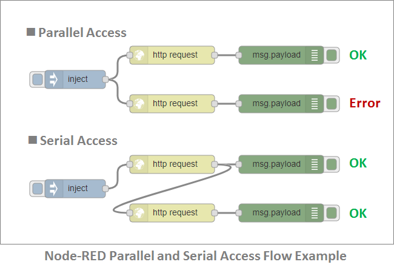

# Panasonic TDs

## Notice

- **Correct URL and JWT will be informed you locally.**
    - For the security reason, the URL in TD is tentative.
    - JSON Web Token(JWT) should be added, when you access to Panasonic servient.

- **[air-conditioner-p1](air-conditioner-p1.jsonld) and [air-conditioner-p2](air-conditioner-p2.jsonld) don't support a parallel access.**
    - A clinet should access these things in series, like bellow.
    
