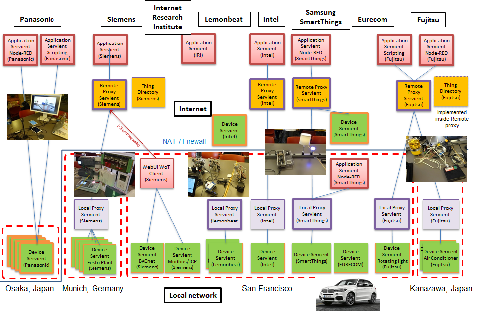
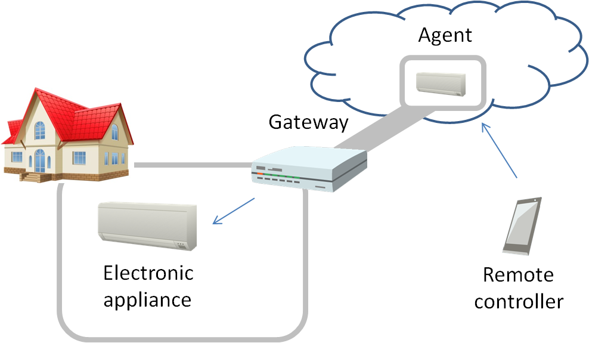
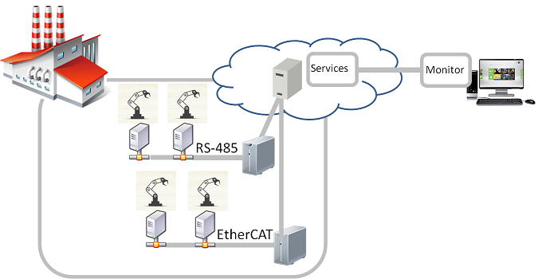
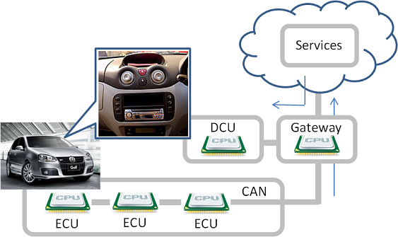

# PlugFest Preparation for Prague F2F 2018

# 1. Introduction

This document describes a general information related to the next plugfest in Prague F2F meeting. The detail specification will be descirbed in the guideline document, please see https://github.com/w3c/wot/blob/master/plugfest/2018-prague/guideline.md.

## 1.1 Backgroud

In the past plugfest, we've already checked consistency of the interfaces of two Servients provided by different members. They were combinations of application and device, or device to device. These application and devices were compatible to rWoT and talked with it. To setup a larger scale system, the gateawy functions are required to connect multiple applications and devices located on the different places. We'd introduced proxy Servients in the Burlingame plugfest to archieve this purpose. As a result of this, a variety of devices settled in some cases could be connected from the application running both on the cloud and on the local controlers. 
The figure below shows the diagram of all the Serviente connected to the network of the plugfest. 8 companies brought applications, remote proxies, local proxies and devices as WoT Serivients or protocol converters with legacy devicee, such as home appliances, building facilities, factory facilities and vihcles. 

## 1.2 Use case

Some use cases are described in below but not limited to the followings.

(1) Smart home
This is the smarthome application that the application on the smartphone can control the air conditioner in the house. The agent and the gateway have gateway functions that connects with applications, devices, and gateways.

(2) Smart factory

(3) Connected car

# 2. Servients

## 2.1 4-layered Servients

3 types of WoT Servients was derived from the use case described in 1.2. These are defined below:  
* Device Servient: WoT Servient with Exposed Thing, e.g. devices
* Application Servient: WoT Servient with Consumed Thing, e.g. applications
* Proxy Servient: WoT Servient with both Exposed and Consumed Thing, e.g. gateways

The Proxy Servient are seperated to 2 types fo them, Remote Proxy and Local Proxy. The Remote Proxy Servient is deployed on the Internet and connected with the Applicationd Serivent and the Local Proxy Servient. The Local Proxy Servient is done on the Local network and connects with the Remote Proxy Servient and the Device Servient. The layered diagram is shown below.

## 2.2 Servients and Protocols
Notes: The following contents has been just copied from Barlingame table. Please modify below directly or this powerpoint, https://github.com/w3c/wot/tree/master/plugfest/2018-prague/servients_prague.pptx

<table>
 <tr><th>Servients</th><th colspan=2>Fujitsu</th><th colspan=2>Panasonic</th><th>Internet Reserach Institute</th><th colspan=2>Siemens</th><th>Lemonbeat</th><th colspan=2>Intel</th><th colspan=2>SmartThings</th><th>EURECOM</th><th></th></tr>
 <tr><th>Application</th><th>Scripting App.</th><th>NodeRED</th><th>Scripting App.</th><th>NodeRED</th><th>NodeRED</th><th>Scripting App.</th><th>WebUI</th><th></th><th>AWS WoT Skill</th><th>AlexNet Recog Service</th><th>NodeRED Local</th><th>NodeRED Remote</th><th></th><th></th></tr>
 <tr><th>=protocol</th><th>HTTP</th><th>HTTP(s)</th><th colspan=2></th><th>HTTP(s)</th><th>HTTP, CoAP, BACnet, Modbus</th><th>HTTP, CoAP
</th><th></th><th colspan=2>HTTPS</th><th colspan=2>HTTP</th><th></th><th></th></tr>
 <tr><th>Remote Proxy</th><th colspan=2>Fujitsu Cloud</th><th colspan=2></th><th></th><th colspan=2>WoS Messaging Service</th><th></th><th colspan=2>Cloud proxy shadow</th><th colspan=2>Remote Gateway</th><th></th><th></th>
 <tr><th>=protocol</th><th colspan=2>HTTP(s)+WS</th><th colspan=2></th><th></th><th colspan=2>(tunnel)</th><th></th><th colspan=2>HTTPS/CoAP(s)</th><th colspan=2>Multi</th><th></th><th></th>
 <tr><th>Local Proxy</th><th>Local Gateway</th><th>Local Gateway</th><th colspan=2></th><th></th><th colspan=2>WoS Messaging Service, TD Registration Agent</th><th></th><th colspan=2>Local Proxy</th><th colspan=2>Local gateway</th><th></th><th></th></tr>
 <tr><th>=Protocol</th><th>HTTP</th><th>HTTP</th><th>HTTPS</th><th>HTTPS+WSS</th><th></th><th colspan=2>HTTP</th><th>HTTP</th><th colspan=2>CoAP</th><th colspan=2>Multi</th><th>HTTP</th><th></th></tr>
 <tr><th>Device</th><th>Sensors(Luminance sensor, Humidity sensor, Temperature sensor, Accelerometer), Rotating Light</th><th>Air conditioner, LED light, Blind</th><th>LED light, Air conditioner, Robot Cleaner</th><th>Human Detection Sensor, Amazon Echo, Google Home</th><th></th><th colspan=2>Remote Festo Plant (valve, pump, levelmeter), BACnet Demonstrator, Logo! Demonstrator, RGB LED Light</th><th>Sensors(Luminance sensor, Humidity sensor, Temperature sensor), Binary actuator</th><th colspan=2>OCF RGB light, OCF Light, OCF Buzzer, OCF temperture, OCF Button, OCF Proximity, OCF Slider, Still camera</th><th colspan=2>Dimmable Light(OCF), Motion Sensor(OCF), Dimmable Light(ST), Motion Sensor(ST), Gas Sensor(IPSO), PM2.5 Sensor(IPSO), Temperature Sensor(IPSO), Humidity Sensor(IPSO), Loudness Sensor(IPSO), Illuminance Sensor(IPSO), PIR Sensor(IPSO), Barometer Sensor(IPSO), OCF Bridge</th><th>Sensors and Actuators in the car(BMW X5)</th><th></th></tr>
</table>

## 2.3 Servients from plugfest participants ( diagram )

TBD

# 3 Plugefest scenarios

TBD

# 4 Schedule

TBD
