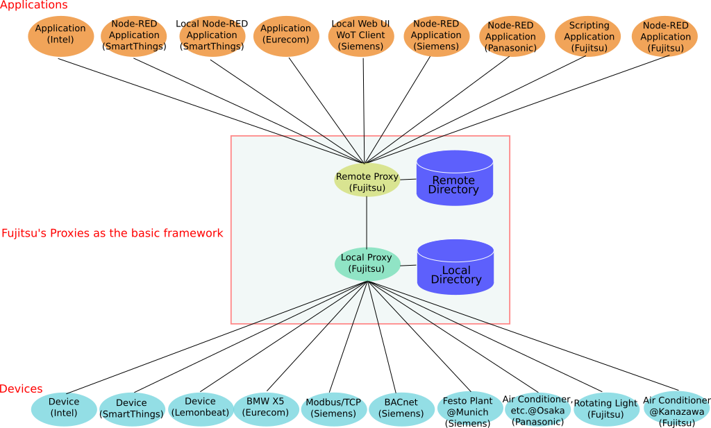
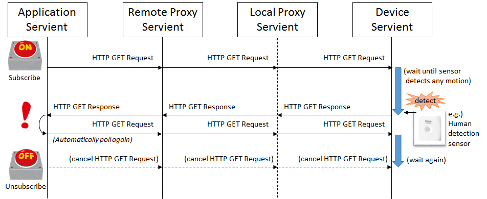
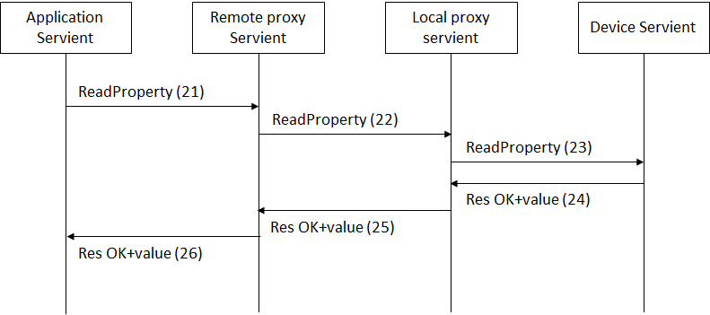
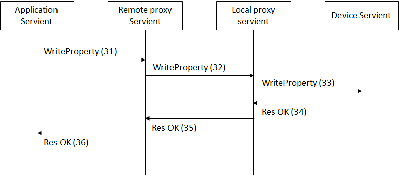
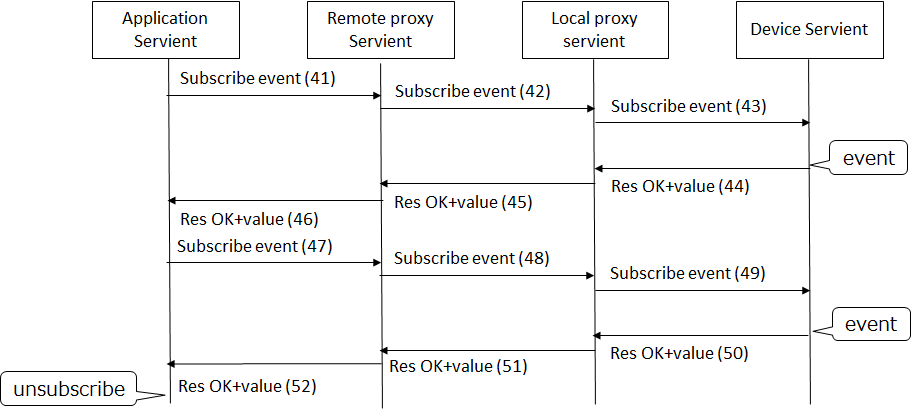

# PlugFest Preparation for Prague F2F 2018

# 1. Introduction

This document describes a general information related to the next plugfest in Prague F2F meeting. The detail specification will be descirbed in the guideline document, please see https://github.com/w3c/wot/blob/master/plugfest/2018-prague/guideline.md.

## 1.1 Backgroud

In the past plugfest, we've already checked consistency of the interfaces of two Servients provided by different members. They were combinations of application and device, or device to device. These application and devices were compatible to rWoT and talked with it. To setup a larger scale system, the gateawy functions are required to connect multiple applications and devices located on the different places. We'd introduced proxy Servients in the Burlingame plugfest to archieve this purpose. As a result of this, a variety of devices settled in some cases could be connected from the application running both on the cloud and on the local controlers.
The figure below shows the diagram of all the Serviente connected to the network of the plugfest. 8 companies brought applications, remote proxies, local proxies and devices as WoT Serivients or protocol converters with legacy devicee, such as home appliances, building facilities, factory facilities and vihcles.


## 1.2 Use case

Some use cases are described in below but not limited to the followings.

(1) Smart home
This is the smarthome application that the application on the smartphone can control the air conditioner in the house. The agent and the gateway have gateway functions that connects with applications, devices, and gateways.


(2) Smart factory


(3) Connected car


# 2. Servients

All servients should register their TDs to a central Thing Directory for discovery purposes.
Thingweb's Directory should be used for this purpose. To register a TD, send:
```
POST  http://plugfest.thingweb.io:8081/td
Content-Type: application/ld+json
{... your TD ...}
```

to which the server should reply with the location of the created resource for your TD (`http://plugfest.thingweb.io:8081/td/04fg5a` in that case):
```
201 Created
Location: /td/04fg5a
```

A GUI is also available at http://plugfest.thingweb.io:8081 to manually register TDs (_no error handling yet_).

## 2.1 4-layered Servients

3 types of WoT Servients was derived from the use case described in 1.2. These are defined below:  
* Device Servient: WoT Servient with Exposed Thing, e.g. devices
* Application Servient: WoT Servient with Consumed Thing, e.g. applications
* Proxy Servient: WoT Servient with both Exposed and Consumed Thing, e.g. gateways

The Proxy Servient are seperated to 2 types fo them, Remote Proxy and Local Proxy. The Remote Proxy Servient is deployed on the Internet and connected with the Applicationd Serivent and the Local Proxy Servient. The Local Proxy Servient is done on the Local network and connects with the Remote Proxy Servient and the Device Servient. The layered diagram is shown below.


## 2.2 Servients and Protocols
Notes: The following contents has been just copied from Barlingame table. Please modify below directly or this powerpoint, https://github.com/w3c/wot/tree/master/plugfest/2018-prague/servients_prague.pptx

<table>
  <tr>
    <th>Servients</th>
    <th colspan="2">Fujitsu</th>
    <th colspan="2">Panasonic</th>
    <th>Internet Reserach Institute</th>
    <th colspan="2">Siemens</th>
    <th>Lemonbeat</th>
    <th colspan="2">Intel</th>
    <th colspan="2">SmartThings</th>
    <th>EURECOM</th>
  </tr>
  <tr>
    <td>Application</td>
    <td>Scripting App.</td>
    <td>NodeRED</td>
    <td>Scripting App.</td>
    <td>NodeRED</td>
    <td>NodeRED</td>
    <td>Scripting App.</td>
    <td>WebUI</td>
    <td></td>
    <td>AWS WoT Skill</td>
    <td>AlexNet Recog Service</td>
    <td>NodeRED Local</td>
    <td>NodeRED Remote</td>
    <td></td>
  </tr>
  <tr>
    <td>=protocol</td>
    <td>HTTP</td>
    <td>HTTP(s)</td>
    <td colspan="2"></td>
    <td>HTTP(s)</td>
    <td>HTTP, CoAP, BACnet, Modbus</td>
    <td>HTTP, CoAP</td>
    <td></td>
    <td colspan="2">HTTPS</td>
    <td colspan="2">HTTP</td>
    <td></td>
  </tr>
  <tr>
    <td>Remote Proxy</td>
    <td colspan="2">Fujitsu Cloud</td>
    <td colspan="2"></td>
    <td></td>
    <td colspan="2">WoS Messaging Service</td>
    <td></td>
    <td colspan="2">Cloud proxy shadow</td>
    <td colspan="2">Remote Gateway</td>
    <td></td>
  </tr>
  <tr>
    <td>=protocol</td>
    <td colspan="2">HTTP(s)+WS</td>
    <td colspan="2"></td>
    <td></td>
    <td colspan="2">(tunnel)</td>
    <td></td>
    <td colspan="2">HTTPS/CoAP(s)</td>
    <td colspan="2">HTTP + MQTT</td>
    <td></td>
  </tr>
  <tr>
    <td>Local Proxy</td>
    <td>Local Gateway</td>
    <td>Local Gateway</td>
    <td colspan="2"></td>
    <td></td>
    <td colspan="2">WoS Messaging Service, TD Registration Agent</td>
    <td></td>
    <td colspan="2">Local Proxy</td>
    <td colspan="2">Local gateway</td>
    <td></td>
  </tr>
  <tr>
    <td>=Protocol</td>
    <td>HTTP</td>
    <td>HTTP</td>
    <td>HTTPS (+ WSS)</td>
    <td>HTTP</td>
    <td></td>
    <td colspan="2">HTTP</td>
    <td>HTTP</td>
    <td colspan="2">CoAP</td>
    <td colspan="2">HTTP + MQTT</td>
    <td>HTTP</td>
  </tr>
  <tr>
    <td>Device</td>
    <td>Sensors(Luminance sensor, Humidity sensor, Temperature sensor, Accelerometer), Rotating Light</td>
    <td>Air conditioner, LED light, Blind</td>
    <td>LED light, Air conditioner (home/car), Robot Cleaner, Amazon Echo Dot, Google Home mini</td>
    <td>WoT Simulator, Google Home mini</td>
    <td></td>
    <td colspan="2">Remote Festo Plant (valve, pump, levelmeter), BACnet Demonstrator, Logo! Demonstrator, RGB LED Light</td>
    <td>Sensors(Luminance sensor, Humidity sensor, Temperature sensor), Binary actuator</td>
    <td colspan="2">OCF RGB light, OCF Light, OCF Buzzer, OCF temperture, OCF Button, OCF Proximity, OCF Slider, Still camera</td>
    <td colspan="2">Dimmable Light(ST), Motion Sensor(IPSO), Loudness Sensor(IPSO), Illuminance Sensor(IPSO),
    <td>Sensors and Actuators in the car(BMW X5)</td>
  </tr>
</table>


## 2.3 Servients from plugfest participants ( diagram )



## 2.4 Details of Servients

### 2.4.1 Application Servients

Panasonic:
 - Scripting App.: Panasonic demo applications. (Local/Internet+LAN/HTTPS(+WSS))
 - NodeRED: would like to connect to the all servients. (Local/Internet+LAN/HTTPS(+WSS))

Hitachi: (not yet fully implemented)
 - Collect data from Things via Remote Proxy Servient(s) and visualize its data.
   - NodeRED
   - Logstash + Elasticsearch + Kibana

### 2.4.2 Remote Proxy Servients
### 2.4.3 Local Proxy Servients

Fujitsu:
 Remote/Local proxy Servients provide the following functions
 - Thing directory
 - Registry and discovery opeartions
 - Read and Write properties operations
 - Event operation

 See Appendix for the sequence diagrams and the interfaces between applications/devices and proxies.

### 2.4.4 Device Servients

Panasonic:
 - [LED light](TDs/PanasonicTDs/huegroup-p1.jsonld): on/off, RGB properties (Remote/Internet/HTTPS)
 - [Air conditioner home](TDs/PanasonicTDs/air-conditioner-p1.jsonld): on/off, mode, temperature, wind level properties and events (Remote/Internet/HTTPS(+WSS))
 - [Air conditioner car](TDs/PanasonicTDs/electric-bulletin-board-p2.jsonld): on/off, number properties (Remote/Internet/HTTPS)
 - [Robot Cleaner](TDs/PanasonicTDs/cleaner-p1.jsonld): on, turn left/right, go straight, go home, go area 1/2/3 actions (Remote/Internet/HTTPS)
 - [Amazon Echo Dot](TDs/PanasonicTDs/amazon-echo-p1.jsonld): "Coming"/"Going" event (Local/Internet/HTTPS(+WSS))
 - [Google Home mini](TDs/PanasonicTDs/google-home-p1.jsonld): "Coming"/"Going" event (Local/Internet/HTTPS(+WSS))
 - [Google Home mini](TDs/PanasonicTDs/google-home-p2.jsonld): speech action (Local/LAN/HTTP)
 - WoT Simulator: can simulate the WoT devices easily. (Local/LAN/HTTP)

(Note: Panasonic Remote Servients requires JSON Web Token. Also actual URL is hidden. Please contact)


# 3 Plugfest scenarios

Examples of scenario involving semantic querying:
- Outlier detection: gather temperature data from different sources and compare them
- Energy saving: turn heating off when a window opens in the same room
- Meta-action: switch on a light either by changing its value or by invoking an action
- Circle: all lamps in the same room sequentially switch off their nearest neighbor that is still on
- An application which detects the motion in a room and controls the AC operation in  a room.
Devices: air conditioner (Fujitsu and Panasonic), human detection sensor (Panasonic and SmartThings)
- An application which controls the AC in  a room based on the room temperature.
Devices: air conditioner (Fujitsu and Panasonic), temperature sensor (Lemonbeat, Intel, SmartThings)
- An application which controls a lamp in  a room based on the brightness in the room.
Devices: light (Fujitsu, Intel, SmartThings), Luminous sensor (Lemonbeat, SmartThings)
- An application which controls a lamp in  a room based on the motion detection in the room.
Devices: light (Fujitsu, Intel, SmartThings), human detection sensor (Panasonic and SmartThings)


## 3.1 Event / Observable using HTTP Long Polling
- Participants
  - Panasonic, Fujitsu, (welcome to join)
- Purpose
  - We would like to test "Event" and "observable" interoperability using "HTTP Long polling" as a first step.
- Application Scenarios
  - When an application receives an event / observes and detects that the property status is changed using "HTTP Long polling", the application informs through a light and a voice.
- Functionality and Roles
  - Application
    - Node-RED
  - Proxy
    - Remote and Local Gateway
  - Device
    - LED light, Air conditioner, Amazon Echo Dot, Google Home mini, Sensors, Rotating Light
- Steps
  1. TD of devices are registered to Local Proxy manually, or using POSTMAN. (Sequence A.1)
  2. Application retrieves TDs from Remote Proxy. (Sequence A.2)
  3. Applicatoin reads TD, subscribe event / observe property and receive changes (see following diagram)
  
    - Pattern 1: Property observe
      - Application reads air-conditioner-p1.jsonld TD, finds properties with "observable": true and its form with "rel": "observe" and "subProtocol": "LongPoll", then calls HTTP GET to corresponding "href" which will be pending until the property changes.
      - Application receives GET response and detects that the property has changed.
    - Pattern 2: Event
      - Application reads amazon-echo-p1.jsonld TD, finds "ask" event and its form with "subProtocol":"LongPoll", then calls HTTP GET to corresponding "href" which will be pending until the event fires.
      - Application receives GET response and detects that the event has fired.
  4. Application writes Rotating Light's "OperationStatus" property and invokes Google Home mini's "speech" action. (Sequence A.4)
  5. Repeats 3. to 4.
  6. TD of devices are unregistered from Local Proxy manually, or using POSTMAN. (Sequence A.7)
- Security Consideration
  - JSON Web Token (JWT) is needed, when you access to Panasonic servient.

# 4 Tools

The [Thingweb project](https://github.com/thingweb/) provides various tools to view TDs (WebUI), test them (Thingweb playground) and register and discover them (Thingweb Directory). See [plugfest.thingweb.io](http://plugfest.thingweb.io/) for more details.

# 5 Schedule

Sat 24.3.18:  9:00-18:00  
Sun 25.3.18:  9:00-18:00  

Venue: Oracle Czechia Office
U Trezorky 921/2, 158 00 Praha 5 - Jinonice-Praha 5

# 6 Requirements for PlugFest Setting

| Participant | Number of Participants | Number of Power outlets | Network | Remarks |
|-------------|------------------------|-------------------------|---------|---------|
| Panasonic   | 3                      | 2                       | Wi-Fi(b/g/n), Ports: 22, 80, 443, 1880, 8001, 8003, 8091 | |
| Fujitsu     | 4                      | 2                       | Wi-Fi   |         |
| IRI         |                        |                         | Wi-Fi   |         |
| Siemens     | 4+(1)                  | 2                       | Wi-Fi   |         |
| Intel       | 1                      | 1                       | Wi-Fi and/or wired Ethernet | External ports: 22, 80, 443. Will bring own router and power bar.   |
| SmartThings | 1                      | 1                       | Wired   | 4sq ft table space |
| EURECOM     | 2                      | 2                       | Wi-Fi   |         |
| Oracle      | 1                      | 1                       | Wi-Fi   |         |
| Hitachi     | 1                      | 1                       | Wi-Fi(Ports: 443/tcp,443/udp(optional))   | use for note PC to access corporate servers via VPN. |
| Paciello    | 1                      | 1                       | Wi-Fi   |Will only need power outlet for laptop. Won't be bringing additional equipment.|
| Others      |                        |                         | Wi-Fi   |         |

Notes:
 - Deadline is March 21st.
 - Power outlets Type-A will be provided by the venue.
 - Anyone who has requirements for ports outside of 80/443/22 should send an email to Oracle.
 - You have to bring displays, if need.


# 7 Implementation guidelines

* "name" field of Thing Description shall be unique among the things which will be registered to Fujitsu Proxy.  
  Recommended convention is 'Company name'+'Thing name'  
  e.g.) "name": "PanasonicAirConditionerP1"

# Appendix A: Sequence diagrams specified in Fujitsu's proxy servients

Appendix A describes sequence diagram among application, remote / local proxies, and device servient implemented for this plugfest by Fujitsu.

This section shows sequence diagram and message formats exchange among servients which protocol is only HTTP to be used in this sequence. The remote and local proxies bridges with STUN for NAT traversal in this sequence.

### A1 Register
A device servient is registered to the local proxy servient and remote proxy servient. The proxy servient returned the TD with public URL. The proxy servients have TD repositories to store TDs registered from the other servients.


*Example: using HTTP*

(1) HTTP POST http://lps.example.com/Things/register<BR>
Body: TD<BR>
(2) 201 Created<BR>

(3) (1) HTTP POST http://lps.example.com/Things/register<BR>
Body: TD<BR>

(4) 201 Created<BR>

## A2 Lookup
An application servient can lookup TDs registered the remote proxy servient with its URL. If the URL indicates the servient, it returns the list of the devices connected. If the URL specifies the devices registered on the proxy servient, it returns TD of it.


*Example: using HTTP*

(11) HTTP GET http://rps.example.com/Things/<BR>
Body: none<BR>

(12) 200 OK<BR>
Body: list of registered things [FujitsuAirConditioner, PanasonicAirConditioner, …]<BR>

(13) HTTP GET http://rps.example.com/Things/deviceName<BR>
Body: none<BR>

(14) 200 OK<BR>
Body: TD

## A3 Read property
The application servient sends a request to read the value of the property of the device servient to the remote proxy servient. The remote and local proxy servient relay to this request to the device servient.



*Example: using HTTP*

The application gets a value of a certain property of the device servient. For this purpose, it gets the URL for the property from TD of the device servient.

(21) HTTP GET http://rps.example.com/lps1/Things/deviceName/Property/temperature<BR>
Body: none<BR>

The remote proxy gets the URL for the property from TD of the device servient registered in the repository. "glps.example.com" is global address which can be accessed from remote proxy.

(22) HTTP GET http://glps.example.com/Things/deviceName/Property/temperature<BR>
Body: none<BR>

The local proxy gets the URL for the property from TD of the device servient registered in the repository.

(23) HTTP GET http://192.169.1.2/Things/deviceName/Property/temperature<BR>
Body: none<BR>

(24) 200 OK<BR>
Body: 25(value)<BR>

(25) 200 OK<BR>
Body: 25(value)<BR>

(26) 200 OK<BR>
Body: 25(value)<BR>

## A4 Write property
The application servient sends a request to write the value to the property of the device servient to the remote proxy servient. The remote and local proxy servient relay to this request to the device servient.



*Example: using HTTP*

The application puts a value of a certain property of the device servient. For this purpose, it gets the URL for the property from TD of the device servient.

(31) HTTP PUT http://rps.example.com/lps1/Things/deviceName/Property/status<BR>
Body: ON<BR>

The remote proxy puts the URL for the property from TD of the device servient registered in the repository.
"glps.example.com" is global address which can be accessed from remote proxy.

(32) HTTP PUT http://glps.example.com/Things/deviceName/Property/status<BR>
Body: ON<BR>

## A5 Subscribe and Event with Server Sent Event method
The application servient can obtain the change or the current status of the device servient via proxy servient using subscription procedures. The application servient sends a request to subscribe the property of the device servient via the remote and local proxy servient. The device servient keep to send the value of the specified property periodically.
Diagram A5 and A6 show the sequence diagarms for Subcribtion, Event handling, and Unsubscription for stopping event handling with using Server Sent Event method. 


*Example: using HTTP*

The application subscribes an event of the device servient to be periodically notified. The application gets URL for this event and send a request to the remote proxy servient.

(41) HTTP POST http://rps.example.com/lps1/Things/deviceName/Event/change<BR>
Body: none<BR>

The remote proxy gets the URL for the event from TD of the device servient registered in the repository.

(42) HTTP POST http://glps.example.com/Things/deviceName/Event/change<BR>
Body: none<BR>

The local proxy gets the URL for this event from TD of the device servient registered in the repository.

(43) HTTP POST http://192.169.1.2/Things/deviceName/Event/change<BR>
Body: none<BR>

The device servient sends a notify to the application via the local and remote proxy servient with Server Sent Events specified by W3C.  The device responses “200 OK” with a header “Context-Type: text/event-stream”.

(44)-(46) 200 OK<BR>
Context-Type:text/event-stream<BR>
Body: none<BR>

If this subscription succeeded, the events keep to be notified to the application via the local and remote proxy servients. This event is sent as chunk data.

(47)-(49) <BR>
Body: data:25(value)<BR>

## A6 Unsubscribe with Server Sent Event method
The application servient sends a request to unsubscribe to the remote proxy servient to stop to notify the event from the device servient.


*Example: using HTTP*

The application unsubscribes the event “change. The application deletes URL for this event and send a request to the remote proxy servient.

(51) HTTP DELETE http://rps.example.com/lps1/Things/deviceName/Event/change<BR>
Body: none<BR>

The remote proxy gets the URL for the event from TD of the device servient unregistered in the repository.

(52) HTTP DELETE http://glps.example.com/Things/deviceName/Event/change<BR>
Body: none<BR>

The local proxy gets the URL for this event from TD of the device servient unregistered in the repository.

(53) HTTP DELETE http://192.169.1.2/Things/deviceName/Event/change<BR>
Body: none<BR>

The device servient stops sending event and returns the response with “200 OK”.

(54)-(56) 200 OK<BR>
Body: none<BR>

### A7 Subbscribe and Event with Long Polliing method
Diagram A7 shows another implmentation for event handling with the Long Polling method.
The application servient sends a request to subscribe the property of the device servient to the remote proxy servient. The device servient keep to send the value of the specified property periodically or when some events happen until the application unsubscribes.



*Example: using HTTP*

The application subscribes an event of the device servient to be notified. The application gets URI for this event and send a request to the remote proxy servient.

(41) HTTP GET http://rps.example.com/lps1/Things/deviceName/Poll/eventName
Body: none

The remote proxy gets the URI for the event from TD of the device servient registered in the repository.

(42) HTTP GET http://lps.example.com/Things/deviceName/Poll/eventName
Body: none

The local proxy gets the URI for this event from TD of the device servient registered in the repository.

(43) HTTP GET http://device.example.com/poll/device/changed
Body: none

The device servient doesn’t send a response immediately and keep this connection until an event happens. When the value of the property is changed, the device servient sends an event notification to the application via the local and remote proxy servient with Long Polling method. The device responses “200 OK” with a value.

(44)-(46) 200 OK
Body: value

This flow of step from (41) to (46) will be repeated during the application sending requests.
In this case, “Unsubscribe” message dose not exist. If the application servient stop the subscription, it stop to send the request (47).

### A8 Unregister
The device servient unregister from the local proxy servient before shutdown. The local proxy servient unregister this device servient from the remote proxy not to access from the application.


*Example: using HTTP*

(61) HTTP DELETE http://lps.example.com/Things/deviceName<BR>
Body: none<BR>

(62) 200 OK<BR>
       Body:none<BR>

(63) HTTP POST http://rps.example.com/Things/deviceName<BR>
Body: none<BR>

(64) 200 OK<BR>
Body:none<BR>

# Appendix B: Changes from previous PlugFest in Burlingame
## B1 TD changes
* new link term on the top level
* link --> form
  form has "rel" field now also
* Property outputData --> Property schema
* Action inputData --> Action inputSchema
  Action outputData --> Action outputSchema
* Event outputData --> Event schema
* Type System changes
  fields --> field
  value --> schema
