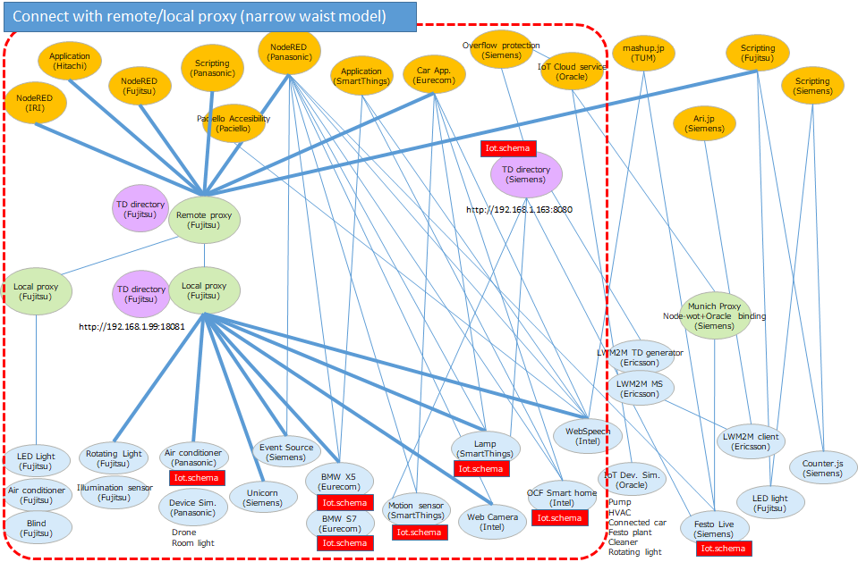
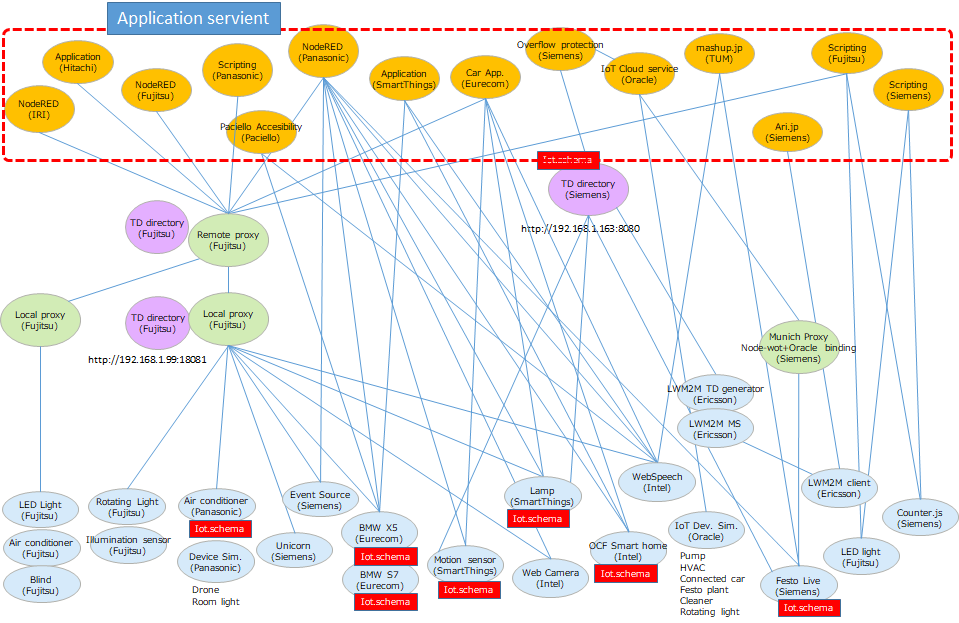
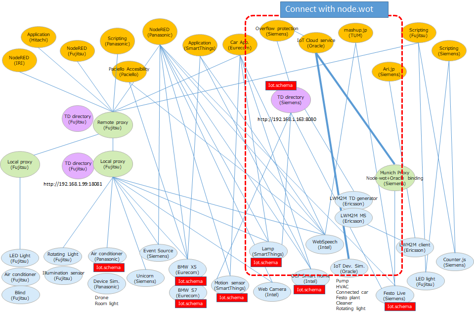
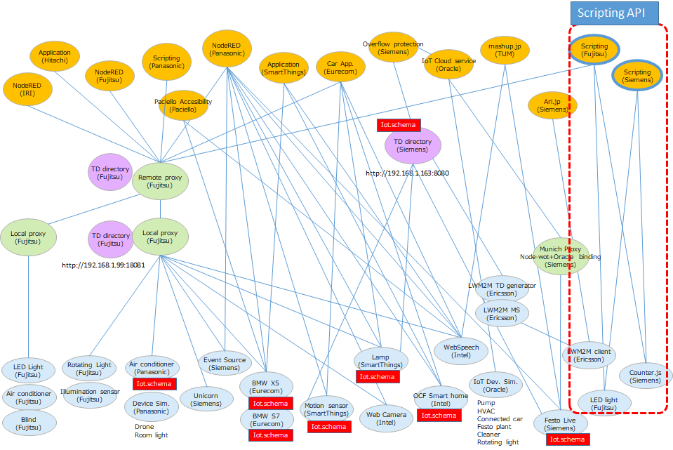
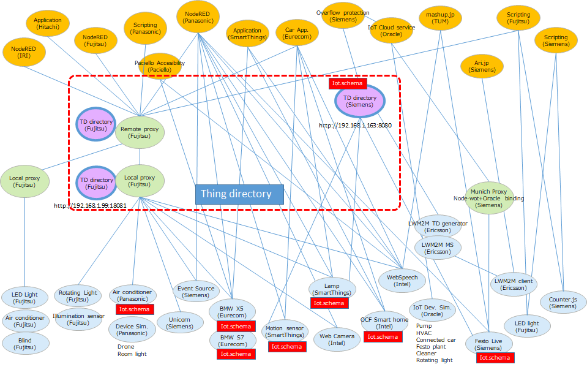
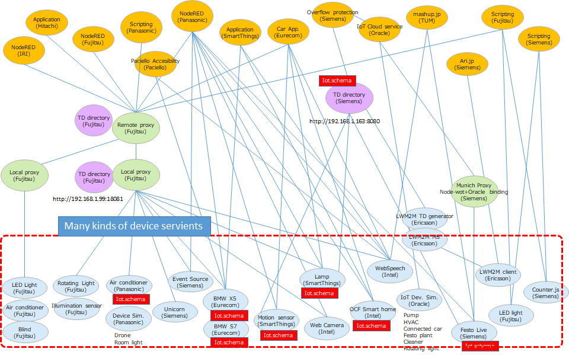
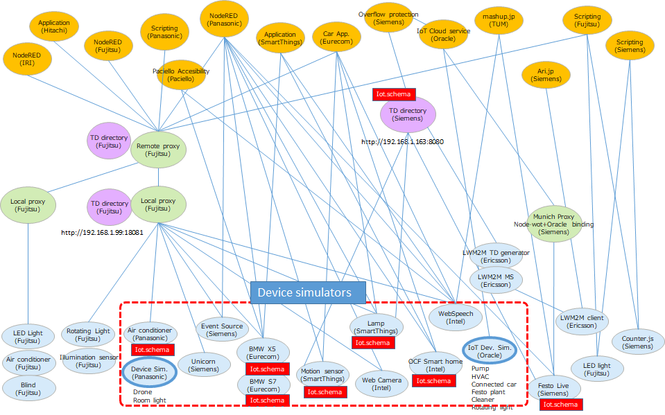
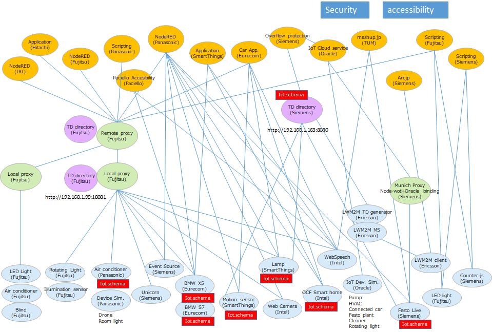
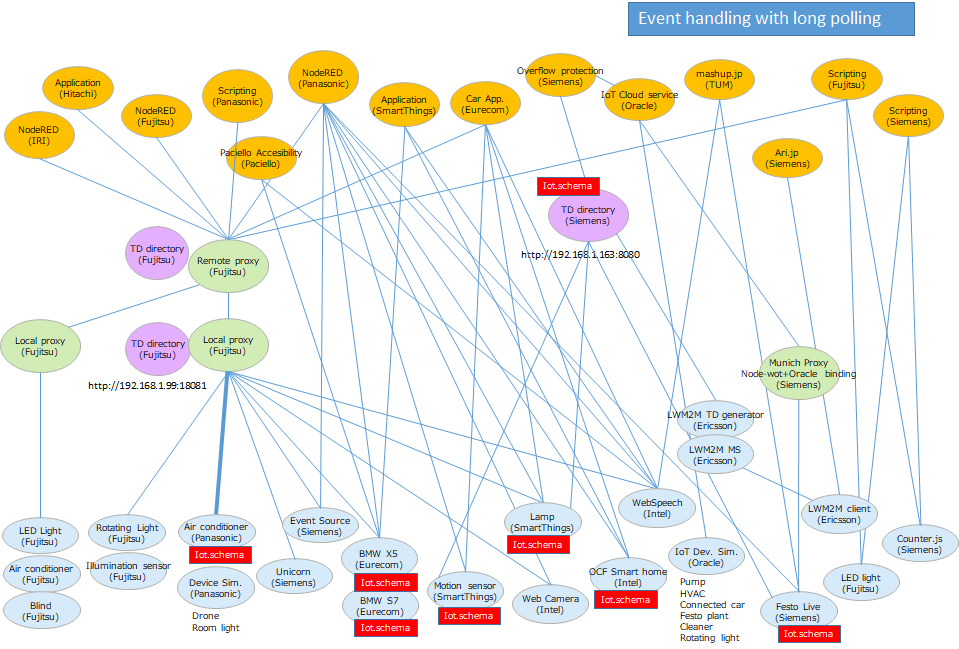

# Plugfest result in Prague

# 1. Introduction

This document describes the result of WoT plugfest held in Prague on 24-5 of March, 2018.

## 1.1 Participants

Oracle, Ericsson, EURECOM, Fujitsu, Hitachi, Intel, Internet Research Institute, The Paciello Group, Panasonic, SmartThings/Samsung Research, Siemens, Technical University of Munich(TUM)

## 1.2 WoT Servients

The drawing below is the ocnfiguration for the Prague plugfest.

# 2. Evaluation on checking points in Prague plugfest

## 2.1 Connect with remote/local proxy (narrow waist model)

### Fujitsu
   We provide remote/local proxy and our application(node-red) and devices connect them.

## 2.2 Application servient

### Fujitsu
   We use Node-RED to lookup TD and set/get property value and Action.
   Nimura-san use scripting api.

## 2.3 Connect with node-wot

### Fujitsu
   (future work)

## 2.4 Scripting API

### Fujitsu
   (Nimura-san will insert here)

## 2.5 Thing Directory 

### Fujitsu
   We provide simple one. Application Servients can lookup TDs by specifying the device's name.

## 2.6 Many kinds of device servients

### Fujitsu
   Local Devices: Rotary Beacon Light(connectet by EtherCAT) and Brightness Sensor(connectet by BLE)
   Remote Devices(in Japan): LED Light, Blind and Airconditioner (connected by Echonet LITE)

## 2.7 Device simulators

### Fujitsu
   (future work)

## 2.8 Semantic discovery

### Fujitsu
   (future work)

## 2.9 Security

### Fujitsu
   We use bearer token for access the remote/local proxy.

## 2.10 Accessibility

### Fujitsu
   (future work)

## 2.11 Event handling with long polling

### Fujitsu
   Brightness Sensor support long polling

# 3. Issues for the next plugfest

## 3.1 followings should be improved for next:
- Use the same schema between members
- Security
- Accessibility

## 3.2 Thing directory will be specified more detail
- Two different interfaces provided by Siemens and Fujitsu
- Directory interface should be specified
- Roles of directory and proxy should be specified in Fujitsu proxy
## 3.3 Web browser as a WoT Servient will be connected
- Fujitsu and Panasonic implemented 

## 3.4 Collecting TD and servient information should be needed
- Please upload your TDs to github and give some explanation of your servients.

## 3.5 Network topology variations
- Collect use cases of network topology.

## 3.6 Interface between servients
- Specify interface and sequence diagram
- Describe these in appendix of Architecture document.

## 3.7 Meta applications

## 3.8 CORS issue when using Scripting app on browser. (inserted by Panasonic)
- To be accessed by browser through XMLHTTPRequest, WoT Servients need to add "Access-Control-Allow-Origin: * " header in it's response to the requests including OPTIONS method.

## 3.9 Multiple "form" issue when using Fujitsu proxy (inserted by Panasonic)
- Fujitsu proxy currently does not support multiple "form" for one property.
- In Panasonic TD, "read/write" and "observe" to a same property is expressed as two different HTTP endpoints
  ->changes to two different property were necessary.

    
