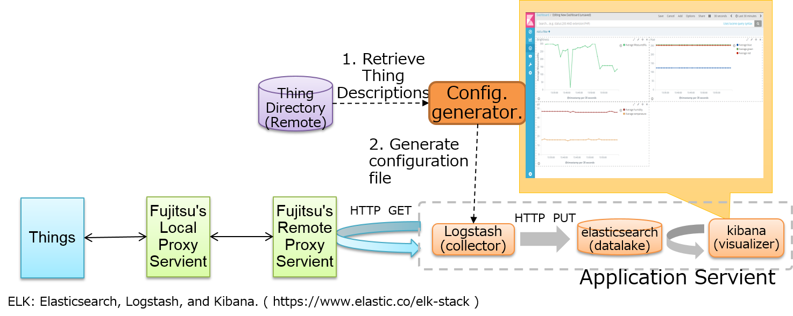
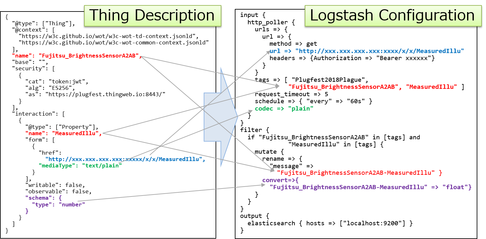
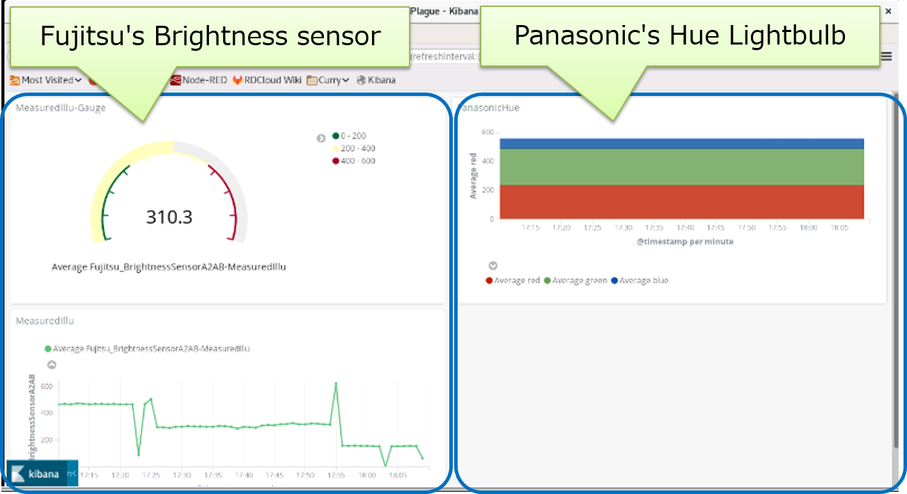
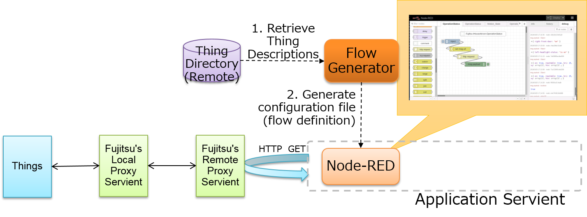
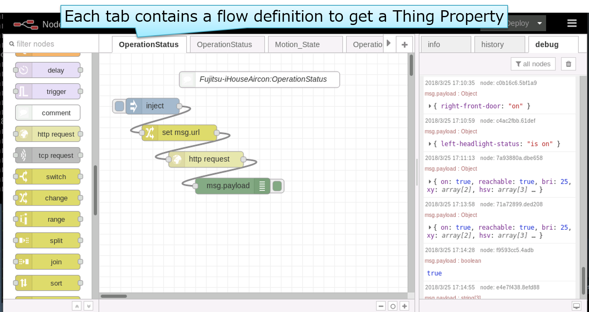

# Plugfest result --- Hitachi

## Configuration 

We've implemented two Application Servients. Each servient generates configuration file for commonly-used IoT Tools (Logstash and Node-RED), and retrieve properties of Things via Fujitsu's Remote Proxy(using HTTP GET).

## Lessons Learned

Items below are from "Checking point for the plugfest" in [PlugfestSummary180418.pdf](./docs/PlugfestSummary180418.pdf) by Matsukura-san.

1. Connect with remote/local proxy (narrow waist model)

   It is useful for application developer (on the Internet) to aggregate all local device servient access.

2. Application servient

   Our Servients are example of "minimal Servient implementations", which is mentioned in [the Architecture document](https://w3c.github.io/wot-architecture/#application).  We can easily connect to WoT device using IoT tools that support HTTP REST API call.
   It might be a good idea to check connectivity of other existing IoT tools for broader adoption of WoT.
   And also, it may be better to mention legacy *applications* (i.e. existing, commonly-used IoT tools) connectivity in the Architecture document, same as legacy *devices*.

3. Connect with node-wot

   (future work)

4. Scripting API

   (future work)

5. Thing Directory 

   We just crawl all TDs in Fujitsu's directory.  Using search functions from application servient is future work.

6. Many kinds of device servients

   Our application only collect properties on each devices.  Not yet utilized each characteristic of device.
   Utilizing them based on semantic annotations is future work.

7. Semantic discovery

   (future work)

8. Security, Accessibility

   We used bearer token for access the remote proxy.  The token is received by a mail and is included in configuration file by hand.  These process is needed to improve using more sophisticated manner (e.g. OAuth etc.)

9. Event handling with long polling

   (future work)

10. Device simulators

    (future work)

## Detail of implementations 

### Application 1: using ELK stack

In this application, we use Thing Description to generate configuration of existing IoT data collector solution, [Logstash](https://www.elastic.co/products/logstash).

Figure below is detail of configuration file generation.

Figure below is visualization using [Kibana](https://www.elastic.co/products/kibana).

### Application 2: using Node-RED

In this application, we use Thing Description to generate program ([Node-RED](https://nodered.org/)'s flow).
The Flow Generater generates skeleton flows for retrieve each property of Things.

Figure below is an example of generated flow skelton.

