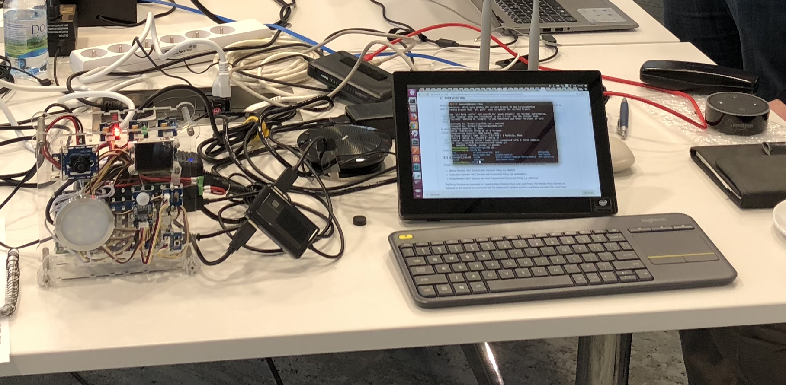

# Plugfest Results - Intel

## Test Hardware

* UP2 Gateway with USB Camera and Speakers
* Two Edison Endpoint Nodes with various sensors (Button, Illuminance, Motion), actuators (Light, RGB and single-color LEDs, Buzzer) and a USB Camera
* Local network switch

### Test Software

### Things
* Web Camera Thing
    * HTTP API
    * USB 720p fisheye camera with Video4Linux controls
    * Processing via ImageMagick (cropping)
    * Operations: 
        - frame get, frame observe (JPEG image)
        - exposure set, exposure get, exposure observe (JSON number)
        - crop (action; JSON input, JPEG image output)
    * Observe implemented using long polling
    * Security: HTTPS + Basic Authentication (mostly disabled locally during plugfest)
    * NAT Traversal: SSH Tunnel to cloud
    * Automatic Thing Directory registration (Siemens Thing Directory)
    * Thing Description introspection
    
* Web Speech Thing
    * HTTP API
    * Operations:
        - action: speak (given text string, says it)
        - returns when action is complete
    * Security: HTTPS + Basic Authentication (mostly disabled locally during plugfest)
    * NAT Traversal: SSH Tunnel to cloud
    * Automatic Thing Directory registration (Siemens Thing Directory)
    * Thing Description introspection
    
* OCF Smart Home
    * Subset of OCF test Devices supported by "Smart Home Demo"
        - LEDs (red, green, blue)
        - Push-button
        - Motion sensor (IR)
        - Illuminance
        - RGB LED
        - Buzzer
        - Light (via MOSFET; capable physically of variable brightness, OCF just on/off)
    * OCF Devices running as services on Edison-based "nodes" with CoAP/CBOR network interfaces
    * An instance of the `iot-rest-api-server` running on gateway
        - Translates CoAP/CBOR to HTTP/JSON
    * Metadata translator running on gateway 
        - Automatically generates TDs dynamically from OCF metadata
        - Both CoAP and HTTP network interfaces
    * Automatic Thing Directory registration (Siemens Thing Directory)
        - Relatively short timeout allows updates when devices disabled
