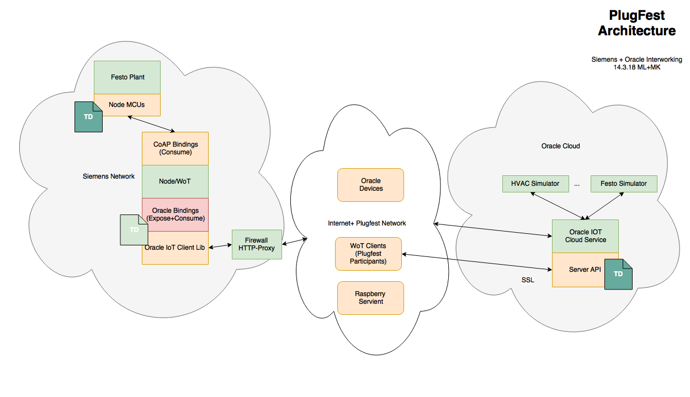
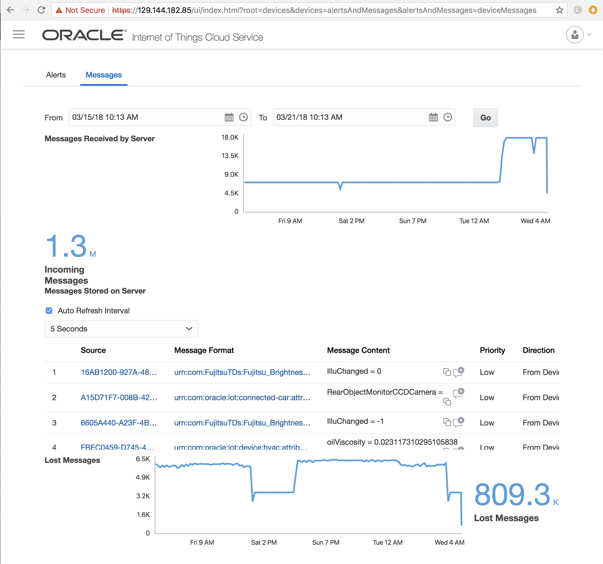

### 2.4.5 Tooling

#### 2.4.5.1 TD2DM.js

The Oracle IoT Cloud Service defines a "Device Model" concept, which is a mechanism to define the properties, actions and events provided by a class of devices. 

A WoT Thing Description can be converted into a Device Model using the TD2DM converter. The result device model can be imported into the IoT cloud service and can be used to define simulated devices (see chapter 2.6)

# 2.5 Reference Cloud Environment

Oracle provides a demo instance of the Oracle IoT Cloud Service for the WoT plug fest and other test purposes.

Oracle's IoT Cloud Service is a commercial product, which is available at:
https://cloud.oracle.com/iot

For the W3C Web of Things work Oracle and Siemens integrated the node-wot reference implementation with the Oracle IoT Cloud Service product.

The Oracle IoT Cloud Service provides a management console, which can be used to define device models, manage devices, inspect messages and alerts and perform analytics.

The reference implementation and integration is available for participants at the plug fest to test interoperability scenarios.
The integration is described in [Oracle+node-wot_Integration_concept.pptx](docs/Oracle+node-wot_Integration_concept.pptx)

The Oracle IoT Cloud Service visualizes incoming messages and allows to look at message content.

The integration works both ways, i.e. for exposed and consumed things:

* Devices managed by the Oracle IoT Cloud Service can be consumed by WoT Things.
* WoT Things can be consumed by Devices in the IoT Cloud service.

The IoT Cloud Service manages devices via so-called device-models, which are a blueprint for device instances. Device models are very similar to Thing Descriptions.

Thing Descriptions can be automatically translated to Device Models with a small converter, the so called td2dm.js. This converter runs under node.js and is available here [td2dm.js](TDs/OracleTDs).

# 2.6. Device Simulator

The Oracle IoT Cloud Service Product contains a device simulator, that permits to create and test a Device Model, before the actual physical device is available.

The simulator can be used at the plug fest.

We have created simulations based on TDs from Siemens, Fujitsu, Panasonic and Eurecom using the td2dm converter as described in chapter 2.4.5.1.

