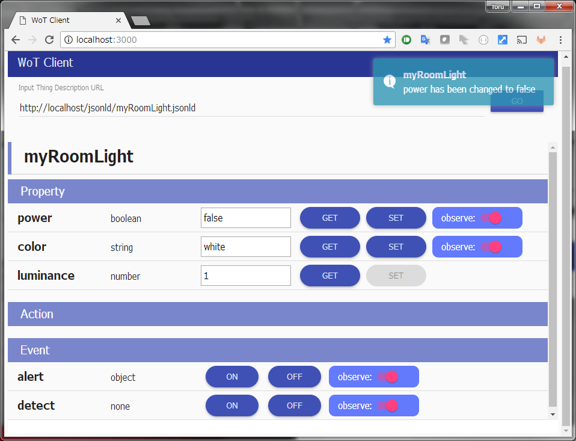
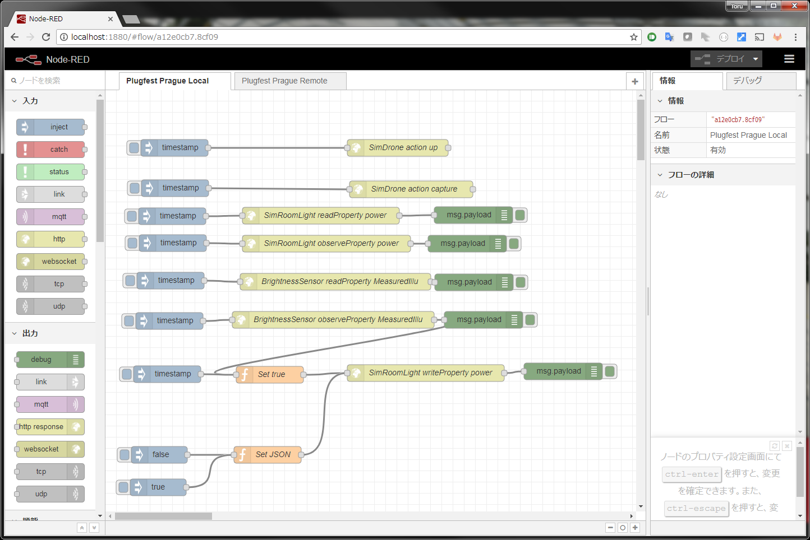
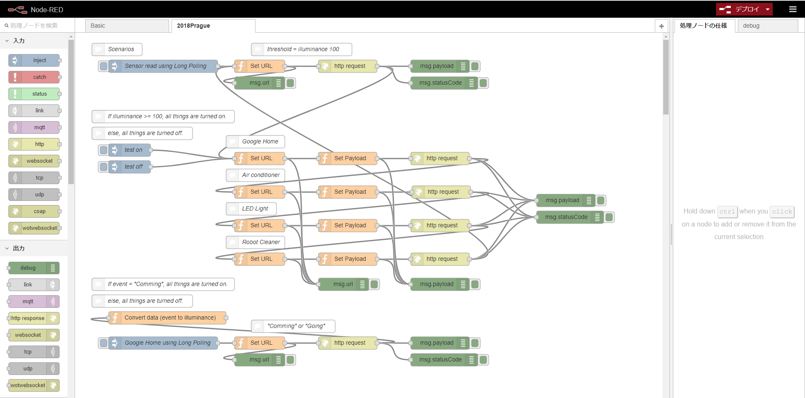
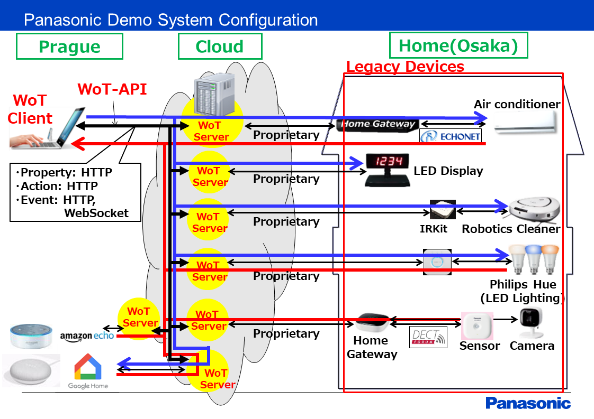
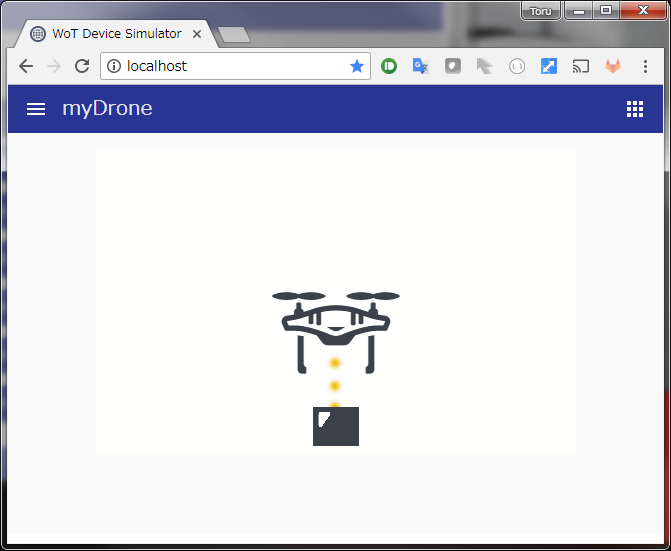
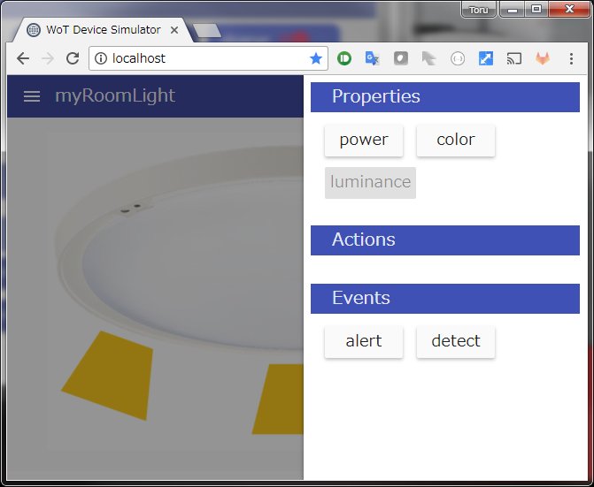

### 2.4.1 Application Servients
- Scripting App

    

    - Composition
        - Client Scripting API Javascript Library
          - Only supports consumed thing (no exposed thing support)
          - Only supoprts HTTP/HTTPS (no COAP/MQTT support)
          - Supports notification through HTTP Long Polling and Panasonic WebSocket method.
        - HTML+JavaScripting client
          - Generic WoT Client which reads Thing Description from the URL written in input field, then shows Properties/Actions/Events on its UI.
          - Supports read/write/observe(subscribe) of Properties.
          - Supports invoking Action.
          - Supports subscribing Event.
          - Observed Property change and firing Event are shown as desktop notification.
    - Plugfest result
        - Connected with following Panasonic Device Servients locally and through Fujitsu proxy
          - Actions of Drone on Panasonic Simulator
          - Property Observe and Events of Room Light on Panasonic Simulator

- Node RED

      

    

    - Plugfest result
        - Orchestrated Observe Property of Fujitsu Brightness Sensor to Write Property of Panasonic LED light, Air conditioner, Robot Cleaner and to invoke Action of Google Home speaking
        - Orchestrated Observe Property of Fujitsu Brightness Sensor to Write Property of Panasonic Room Light on Simulator
        - Connected with following Device Servients locally
          - Siemens: FestoLive, EventSource
          - Intel: OCF Smart Home RGB LED, Web Camera
          - SmartThings: Light, Motion Sensor
          - EUROCOM: BMW X5, BMW S7

### 2.4.4 Device Servients
- Remote Device Servients  
    - Composition
        
    - Plugfest result
        - Registered to Fujitsu proxy.
        - Connected with Panasonic Scripting App locally
        - Connected with Panasonic Node RED, orchestrated with Fujitsu Brightness Sensor.
        - Connected with Fujitsu Node RED through Fujitsu proxy
- Simulator

    

    

    - Composition
        - Simulator which provides HTTP WoT interface as well as HTML UI.
          - Supports local control of changing Properties and firing Events.
          - Supports remote control of read/write/observe(subscribe) of Properties, invoking Action and subscribing Event through WoT interface.
          - Supports showing GIF image including GIF animation, switched according to local and remote control.
          - Materials prepared at plugfest: Drone and Room Light
        - Event server which handles client connection for notifications (both Property Observer and Event; both HTTP Long Polling and Panasonic WebSocket method).
    - Plugfest result
        - Registered to Fujitsu proxy.
        - Connected with Panasonic Scripting App locally and through proxy.
        - Connected with Panasonic Node RED, orchestrated with Fujitsu Brightness Sensor.
