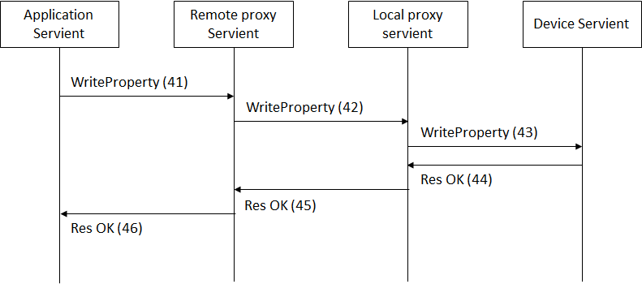
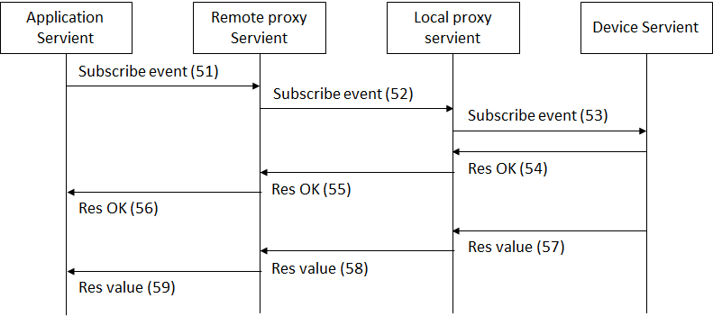
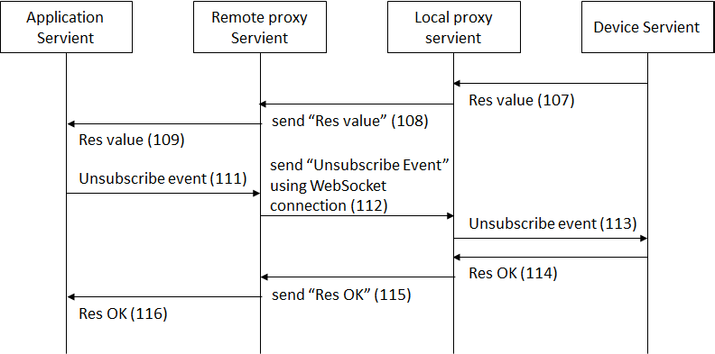

# PARTICIPANT PlugFest Result for Online September 2018

This document summerizes the results of the Online September PlugFest held Sep 25-27.

## 3 Checking points for Online September 2018 PlugFest

Test results can have one of 4 states:

* OK: Test passed
* NO: Test failed
   * Use "Issue: ..." to note down the reason
   * Comment if there is a known fix
* OT: Out-of-time to complete test
* NA: Test not applicable, e.g., because feature is not implemented
   * Comment if feature is planned to be implemented in the future

### 3.1 Testing Individually
#### 3.1.1 Validate Simplified TDs

* OK/NO/OT/NA
   * Issue: 
   * Comment: 

#### 3.1.2 Register with Thing Directory

* OK/NO/OT/NA
   * Issue: 
   * Comment: 

#### 3.1.3 Connect with Remote/Local Proxy

##### IMPLEMENTATION at URI

* OK/NO/OT/NA
   * Issue: 
   * Comment: 

#### 3.1.4 Connect with node-wot

* OK/NO/OT/NA
   * Issue: 
   * Comment: 

#### 3.1.5 Scripting API

* OK/NO/OT/NA
   * Issue: 
   * Comment: 

### 3.2 Testing in Client Role
#### 3.2.1 Metadata Handling

##### PARTNER
* OK/NO/OT/NA
   * Issue: 
   * Comment: 

#### 3.2.2 Read Property

##### HTTP

###### PARTNER
* OK/NO/OT/NA
   * Issue: 
   * Comment: 

##### CoAP

###### PARTNER
* OK/NO/OT/NA
   * Issue: 
   * Comment: 

##### MQTT

###### PARTNER
* OK/NO/OT/NA
   * Issue: 
   * Comment: 

##### Other

###### PARTNER + PROTOCOL
* OK/NO/OT/NA
   * Issue: 
   * Comment: 

#### 3.2.3 Write Property

##### HTTP

###### PARTNER
* OK/NO/OT/NA
   * Issue: 
   * Comment: 

##### CoAP

###### PARTNER
* OK/NO/OT/NA
   * Issue: 
   * Comment: 

##### MQTT

###### PARTNER
* OK/NO/OT/NA
   * Issue: 
   * Comment: 

##### Other

###### PARTNER + PROTOCOL
* OK/NO/OT/NA
   * Issue: 
   * Comment: 

#### 3.2.4 Observe Property

##### HTTP+Longpoll

###### PARTNER
* OK/NO/OT/NA
   * Issue: 
   * Comment: 

##### HTTP+Webhooks

###### PARTNER
* OK/NO/OT/NA
   * Issue: 
   * Comment: 

##### CoAP

###### PARTNER
* OK/NO/OT/NA
   * Issue: 
   * Comment: 

##### WebSockets

###### PARTNER
* OK/NO/OT/NA
   * Issue: 
   * Comment: 

##### MQTT

###### PARTNER
* OK/NO/OT/NA
   * Issue: 
   * Comment: 

##### Other

###### PARTNER + PROTOCOL
* OK/NO/OT/NA
   * Issue: 
   * Comment: 

#### 3.2.5 Invoke Action

##### HTTP

###### PARTNER
* OK/NO/OT/NA
   * Issue: 
   * Comment: 

##### CoAP

###### PARTNER
* OK/NO/OT/NA
   * Issue: 
   * Comment: 

##### MQTT

###### PARTNER
* OK/NO/OT/NA
   * Issue: 
   * Comment: 

##### Other

###### PARTNER + PROTOCOL
* OK/NO/OT/NA
   * Issue: 
   * Comment: 

#### 3.2.6 Subscribe Event

##### HTTP+Longpoll

###### PARTNER
* OK/NO/OT/NA
   * Issue: 
   * Comment: 

##### HTTP+Webhooks

###### PARTNER
* OK/NO/OT/NA
   * Issue: 
   * Comment: 

##### CoAP

###### PARTNER
* OK/NO/OT/NA
   * Issue: 
   * Comment: 

##### WebSockets

###### PARTNER
* OK/NO/OT/NA
   * Issue: 
   * Comment: 

##### MQTT

###### PARTNER
* OK/NO/OT/NA
   * Issue: 
   * Comment: 

##### Other

###### PARTNER + PROTOCOL
* OK/NO/OT/NA
   * Issue: 
   * Comment: 

#### 3.2.7 Security

##### SCHEME

###### PARTNER
* OK/NO/OT/NA
   * Issue: 
   * Comment: 

#### 3.2.8 Semantic integration

##### PARTNER
* OK/NO/OT/NA
   * Issue: 
   * Comment: 

#### 3.2.9 Accessibility

##### PARTNER
* OK/NO/OT/NA
   * Issue: 
   * Comment: 

### 3.3 Testing in Server Role
#### 3.3.1 Metadata

##### PARTNER
* OK/NO/OT/NA
   * Issue: 
   * Comment: 

#### 3.3.2 Read Property

##### HTTP

###### PARTNER
* OK/NO/OT/NA
   * Issue: 
   * Comment: 

##### CoAP

###### PARTNER
* OK/NO/OT/NA
   * Issue: 
   * Comment: 

##### MQTT

###### PARTNER
* OK/NO/OT/NA
   * Issue: 
   * Comment: 

##### Other

###### PARTNER + PROTOCOL
* OK/NO/OT/NA
   * Issue: 
   * Comment: 

#### 3.3.3 Write Property

##### HTTP

###### PARTNER
* OK/NO/OT/NA
   * Issue: 
   * Comment: 

##### CoAP

###### PARTNER
* OK/NO/OT/NA
   * Issue: 
   * Comment: 

##### MQTT

###### PARTNER
* OK/NO/OT/NA
   * Issue: 
   * Comment: 

##### Other

###### PARTNER + PROTOCOL
* OK/NO/OT/NA
   * Issue: 
   * Comment: 

#### 3.3.4 Observe Property

##### HTTP+Longpoll

###### PARTNER
* OK/NO/OT/NA
   * Issue: 
   * Comment: 

##### HTTP+Webhooks

###### PARTNER
* OK/NO/OT/NA
   * Issue: 
   * Comment: 

##### CoAP

###### PARTNER
* OK/NO/OT/NA
   * Issue: 
   * Comment: 

##### WebSockets

###### PARTNER
* OK/NO/OT/NA
   * Issue: 
   * Comment: 

##### MQTT

###### PARTNER
* OK/NO/OT/NA
   * Issue: 
   * Comment: 

##### Other

###### PARTNER + PROTOCOL
* OK/NO/OT/NA
   * Issue: 
   * Comment: 

#### 3.3.5 Invoke Action

##### HTTP

###### PARTNER
* OK/NO/OT/NA
   * Issue: 
   * Comment: 

##### CoAP

###### PARTNER
* OK/NO/OT/NA
   * Issue: 
   * Comment: 

##### MQTT

###### PARTNER
* OK/NO/OT/NA
   * Issue: 
   * Comment: 

##### Other

###### PARTNER + PROTOCOL
* OK/NO/OT/NA
   * Issue: 
   * Comment: 

#### 3.3.6 Subscribe Event

##### HTTP+Longpoll

###### PARTNER
* OK/NO/OT/NA
   * Issue: 
   * Comment: 

##### HTTP+Webhooks

###### PARTNER
* OK/NO/OT/NA
   * Issue: 
   * Comment: 

##### CoAP

###### PARTNER
* OK/NO/OT/NA
   * Issue: 
   * Comment: 

##### WebSockets

###### PARTNER
* OK/NO/OT/NA
   * Issue: 
   * Comment: 

##### MQTT

###### PARTNER
* OK/NO/OT/NA
   * Issue: 
   * Comment: 

##### Other

###### PARTNER + PROTOCOL
* OK/NO/OT/NA
   * Issue: 
   * Comment: 

#### 3.3.7 Security

##### SCHEME

###### PARTNER
* OK/NO/OT/NA
   * Issue: 
   * Comment: 

#### 3.3.8 Semantic integration

##### PARTNER
* OK/NO/OT/NA
   * Issue: 
   * Comment: 

### 3.4 Other issues

#### 3.4.1 Producing Running Actions and Event Instances

##### PARTNER (if applicable)
* OK/NO/OT/NA
   * Issue: 
   * Comment: 

#### 3.4.2 Consuming Running Actions and Event Instances

##### PARTNER (if applicable)
* OK/NO/OT/NA
   * Issue: 
   * Comment: 

#### 3.4.3 New Security Patterns

##### SCHEME + PARTNER (if applicable)
* OK/NO/OT/NA
   * Issue: 
   * Comment: 

#### 3.4.4 Miscellaneous

##### TOPIC

* OK/NO/OT/NA
   * Issue: 
   * Comment: 

## 4 Use cases

### USE CASE

* OK/NO/OT/NA
   * Issue: 
   * Comment: 

# Appendix A: Sequence diagrams of TD directory and proxy Servients implemented in Fujitsu

Appendix A describes sequence diagram of Fujitsu's implementations. Appendix A1 is TD director operation. How to register TDs to the directory and to look and get TD information from it. Appendix A2 and A3 describe sequence diagrams and message formats exchanged between servients. Both cases support firewall and NAT traversal between remote and local proxies, which bridges local networks and the Internet. NAT traversal technologies are STUN for A2 and WebScoket for A3.

This section shows sequence diagram and message formats exchange among servients which protocol is only HTTP to be used in this sequence. The remote and local proxies bridges with STUN for NAT traversal in this sequence.

## A1. TD directory operations

### A1.1 operations in case of one network 
A device servient registers its own TD to the TD directory. The TD directory returns OK with the URL of TD if succeeded. An application servient can lookup TDs registered the remote proxy servient with its URI. If the URI indicates the servient, it returns the list of the devices connected. If the URI specifies the devices registered on the proxy servient, it returns TD of it.

NOTE: URI for TD directory is http://tdd.example.com

*Example: using HTTP*

(1) HTTP POST http://tdd.example.com/Things/register 
Body: TD 
(2) 201 Created 

(3) HTTP GET http://tdd.example.com/Things/ 
Body: none 
 
(4) 200 OKBR>
Body: list of registered things [FujitsuAirConditioner, PanasonicAirConditioner, …] 
  
(5) HTTP GET http://tdd.example.com/Things/deviceName 
Body: none 

(6) 200 OK 
Body: TD 

(7) HTTP DELETE http://tdd.example.com/Things/deviceName 
Body: none 

(8) 200 OK 
Body:none 

### A1.2 operations in case of separated networks

NOTE: URI for local and remote TD directories are http://ltdd.example.com and http://rtdd.example.com

*Example: using HTTP*

(11) HTTP POST http://ltdd.example.com/Things/register 
Body: TD 
(12) 201 Created 
  
(13) (1) HTTP POST http://ltdd.example.com/Things/register 
Body: TD 

(14) 201 Created 

(15) HTTP GET http://rtdd.example.com/Things/ 
Body: none 
 
(16) 200 OKBR>
Body: list of registered things [FujitsuAirConditioner, PanasonicAirConditioner, …] 
  
(17) HTTP GET http://rtdd.example.com/Things/deviceName 
Body: none 

(18) 200 OK 
Body: TD 

(19) HTTP DELETE http://ltdd.example.com/Things/deviceName 
Body: none 

(20) 200 OK 
Body:none 

(21) HTTP DELETE http://rtdd.example.com/Things/deviceName 
Body: none 

(22) 200 OK 
Body:none 

## A2 Sequence diagrams for Servients

### A2.1 Read property
The application servient sends a request to read the value of the property of the device servient to the remote proxy servient. The remote and local proxy servient relay to this request to the device servient.

*Example: using HTTP*

The application gets a value of a certain property of the device servient. For this purpose, it gets the URL for the property from TD of the device servient.

(31) HTTP GET http://rps.example.com/lps1/Things/deviceName/Property/temperature 
Body: none 

The remote proxy gets the URL for the property from TD of the device servient registered in the repository. "glps.example.com" is global address which can be accessed from remote proxy.

(32) HTTP GET http://glps.example.com/Things/deviceName/Property/temperature 
Body: none 

The local proxy gets the URL for the property from TD of the device servient registered in the repository.

(33) HTTP GET http://192.169.1.2/Things/deviceName/Property/temperature 
Body: none 

(34) 200 OK 
Body: 25(value) 

(35) 200 OK 
Body: 25(value) 

(36) 200 OK 
Body: 25(value) 

### A2.2 Write property
The application servient sends a request to write the value to the property of the device servient to the remote proxy servient. The remote and local proxy servient relay to this request to the device servient.

*Example: using HTTP*

The application puts a value of a certain property of the device servient. For this purpose, it gets the URL for the property from TD of the device servient.

(41) HTTP PUT http://rps.example.com/lps1/Things/deviceName/Property/status 
Body: ON 

The remote proxy puts the URL for the property from TD of the device servient registered in the repository.
"glps.example.com" is global address which can be accessed from remote proxy.

(42) HTTP PUT http://glps.example.com/Things/deviceName/Property/status 
Body: ON 
  
The local proxy puts the URI for the property from TD of the device servient registered in the repository.

(43) HTTP PUT http://192.169.1.2/Things/deviceName/Property/status 
Body: ON 
  
(44) 200 OK 
Body: none 
  
(45) 200 OK 
Body: none 

(46) 200 OK 
Body: none 
  

### A2.3 Subscribe and Event with Server Sent Event method
The application servient can obtain the change or the current status of the device servient via proxy servient using subscription procedures. The application servient sends a request to subscribe the property of the device servient via the remote and local proxy servient. The device servient keep to send the value of the specified property periodically.
Diagram A5 and A6 show the sequence diagarms for Subcribtion, Event handling, and Unsubscription for stopping event handling with using Server Sent Event method. 

*Example: using HTTP*

The application subscribes an event of the device servient to be periodically notified. The application gets URL for this event and send a request to the remote proxy servient.

(51) HTTP POST http://rps.example.com/lps1/Things/deviceName/Event/change 
Body: none 

The remote proxy gets the URL for the event from TD of the device servient registered in the repository.

(52) HTTP POST http://glps.example.com/Things/deviceName/Event/change 
Body: none 

The local proxy gets the URL for this event from TD of the device servient registered in the repository.

(53) HTTP POST http://192.169.1.2/Things/deviceName/Event/change 
Body: none 

The device servient sends a notify to the application via the local and remote proxy servient with Server Sent Events specified by W3C.  The device responses “200 OK” with a header “Context-Type: text/event-stream”.

(54)-(56) 200 OK 
Context-Type:text/event-stream 
Body: none 

If this subscription succeeded, the events keep to be notified to the application via the local and remote proxy servients. This event is sent as chunk data.

(57)-(59)  
Body: data:25(value) 

### A2.4 Unsubscribe with Server Sent Event method
The application servient sends a request to unsubscribe to the remote proxy servient to stop to notify the event from the device servient.

*Example: using HTTP*

The application unsubscribes the event “change. The application deletes URL for this event and send a request to the remote proxy servient.

(61) HTTP DELETE http://rps.example.com/lps1/Things/deviceName/Event/change 
Body: none 

The remote proxy gets the URL for the event from TD of the device servient unregistered in the repository.

(62) HTTP DELETE http://glps.example.com/Things/deviceName/Event/change 
Body: none 

The local proxy gets the URL for this event from TD of the device servient unregistered in the repository.

(63) HTTP DELETE http://192.169.1.2/Things/deviceName/Event/change 
Body: none 

The device servient stops sending event and returns the response with “200 OK”.

(64)-(66) 200 OK 
Body: none 

### A2.5 Subbscribe and Event with Long Polliing method
Diagram A7 shows another implmentation for event handling with the Long Polling method.
The application servient sends a request to subscribe the property of the device servient to the remote proxy servient. The device servient keep to send the value of the specified property periodically or when some events happen until the application unsubscribes.

*Example: using HTTP*

The application subscribes an event of the device servient to be notified. The application gets URI for this event and send a request to the remote proxy servient.

(71) HTTP GET http://rps.example.com/lps1/Things/deviceName/Poll/eventName
Body: none

The remote proxy gets the URI for the event from TD of the device servient registered in the repository.

(72) HTTP GET http://lps.example.com/Things/deviceName/Poll/eventName
Body: none

The local proxy gets the URI for this event from TD of the device servient registered in the repository.

(73) HTTP GET http://device.example.com/poll/device/changed
Body: none

The device servient doesn’t send a response immediately and keep this connection until an event happens. When the value of the property is changed, the device servient sends an event notification to the application via the local and remote proxy servient with Long Polling method. The device responses “200 OK” with a value.

(74)-(76) 200 OK
Body: value

This flow of step from (71) to (76) will be repeated during the application sending requests.
In this case, “Unsubscribe” message dose not exist. If the application servient stop the subscription, it stop to send the request (47).

## A3. Sequence diagrams using WebScoket

Another sequence diagrams to go beyond NAT and firewall is described in this section. WebScoket is used for the connection between remote and local proxy servient. In this case, the local proxy servient creates WebSocket connection to the remote proxy servient and keep it until closing. The messages between the remote and local proxy servients described in session A2 are carried over this WebSocket connection.

### A3.1 Setup a connection
The local proxy servient established a WebSocket connection to the remote proxy servient before beginning interaction between the application and device servients. After the establishment of WebSocket connection, the application can access and control the device via the proxies in the same way described in A2. The following sequence uses WebScoket connection for the NAT traversal instead of STUN described in A2.

*Example: using HTTP and WebSocket for NAT traversal*

The local proxy connects to the remote proxy using WebSocket in activating. Then the remote proxy accesses the local proxy through the WebSocket connection.

(91) Create Websocket connection “ws://rps.example.com:WebSocketServerPort/” 
Body: none 

(92) Accept 
Body: none 

The local proxy connects to the remote proxy using WebSocket in activating. Then the remote proxy accesses the local proxy through the WebSocket connection.

(93) Destroy Websocket connection “ws://rps.example.com:WebSocketServerPort/” 
Body: none 

(94) Accept 
Body: none 

### A3.2 Read Property
The application servient sends a request to get the value of the property of the device servient to the remote proxy servient. The remote and local proxy servients relay to this request to the device servient using WebSocket connection.

*Example: using HTTP and WebSocket for NAT traversal*

The remote proxy gets the URI for the property from TD of the device servient registered in the repository. Then the remote proxy sends a message include the URI to the local proxy using WebSocket connection.

(92) send (HTTP GET http://lps.example.com/Things/deviceName/Property/temperature) 

The local proxy sends a message include the value to the remote proxy using WebSocket connection.

(95) send (200 OK, 25(value)) 

### A3.3 Set property
The application servient sends a request to set the value to the property of the device servient to the remote proxy servient. The remote and local proxy servients relay to this request to the device servient using WebSocket connection.

*Example: using HTTP and WebSocket for NAT traversal*

The remote proxy gets the URI for the property from TD of the device servient registered in the repository. Then the remote proxy sends a message include the URI to the local proxy using WebSocket connection.

(102) send (HTTP POST http://lps.example.com/Things/deviceName/Property/status) 

The local proxy sends a message include the value to the remote proxy using WebSocket connection.

(105) send (200 OK) 

### A3.4 Subscribe and Event
The application servient sends a request to subscribe the property of the device servient to the remote proxy servient. The device servient keep to send the value of the specified property periodically and the local proxy servient send the value to the remote proxy servient using WebSocket connection.

*Example: using HTTP and WebSocket for NAT traversal*
The remote proxy gets the URI for the event from TD of the device servient registered in the repository. Then the remote proxy sends a message include the URI to the local proxy using WebSocket connection.

(112) send (HTTP POST http://lps.example.com/Things/deviceName/Event/change) 

The device servient sends a notify to the application via the local and remote proxy servient with Server Sent Events specified by W3C.  The device responses “200 OK” with a header “Context-Type: text/event-stream”.

(115) send (200 OK, Context-Type:text/event-stream) 

If this subscription succeeded, the events keep to be notified to the application via the local and remote proxy servients. This event is sent as chunk data.

(118) send (data:25(value)) 

### A3.5 Unsubscribe
The application servient sends a request to unsubscribe to the remote proxy servient to stop to notify the event from the device servient.

*Example: using HTTP and WebSocket for NAT traversal*
The remote proxy gets the URI for the event from TD of the device servient unregistered in the repository. Then the remote proxy sends a message include the URI to the local proxy using WebSocket connection.

(122) send (HTTP DELETE http://lps.example.com/Things/deviceName/Event/change) 

The device servient stops sending event and returns the response with “200 OK”.

(125) send (200 OK) 

