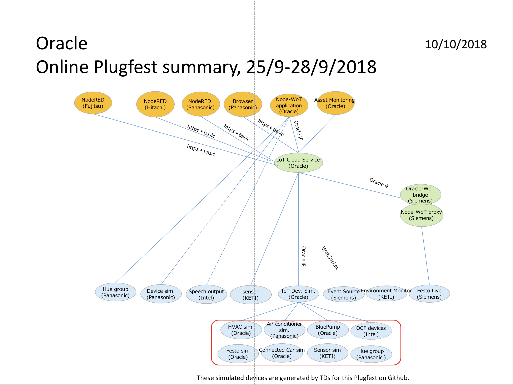
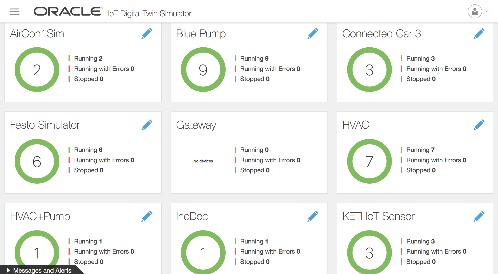
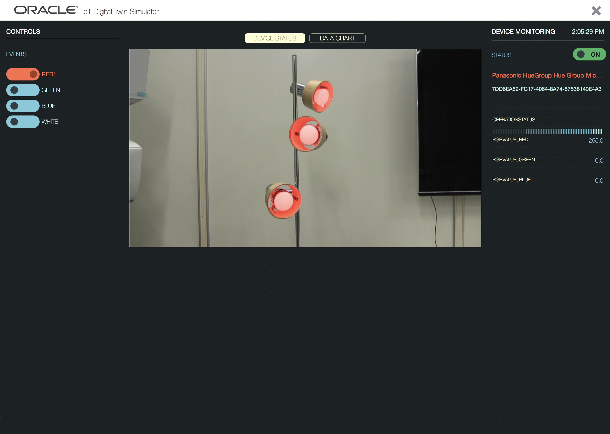

# Oracle PlugFest Result for Online September 2018

This document summerizes the results of the Online September PlugFest held Sep 25-27.

## 3 Checking points for Online September 2018 PlugFest

Test results can have one of 4 states:

* OK: Test passed
* NO: Test failed
   * Use "Issue: ..." to note down the reason
   * Comment if there is a known fix
* OT: Out-of-time to complete test
* NA: Test not applicable, e.g., because feature is not implemented
   * Comment if feature is planned to be implemented in the future

## Result of Oracle projects

### 3.1 Testing Individually

#### 3.1.1 Validate TDs

##### Oracle tried to validate some TDs using [Thingweb Playground](https://github.com/thingweb/thingweb-playground)

* NO
   * Issue: JSON Schema validation error occurred at @context of  TDs. It was caused by old URLs in the TDs ("https://w3c.github.io/wot/w3c-wot-td-context.jsonld", "https://w3c.github.io/wot/w3c-wot-common-context.jsonld"). 
   * Oracle updated the dm2td converter to generate proper TDs.
 
#### 3.1.2 Register with Thing Directory

* OT

#### 3.1.3 Connect with Remote/Local Proxy

* NA

#### 3.1.4 Connect with node-wot

* OK
  * Oracle connected to the node-wot instance hosted at Siemens to access and control the Festo plant.
  * Oracle hosted a node-wot instance and a bridge-servient to interface with Panasonic's hue group.
  * We ran out of time to connect with other devices from Intel, Panasonic and others.

#### 3.1.5 Scripting API

* NA

### 3.2 Testing in Client Role

##### Oracle used the hosted node-wot instance and the bridge-servient to interface between the Oracle IOT Cloud Service and devices that provide a TD with HTTP bindings.

#### 3.2.1 Metadata Handling

* OK

#### 3.2.2 Read Property

##### HTTP

* OK

##### CoAP

* NA

##### MQTT

* NA

##### Other

* NA

#### 3.2.3 Write Property

##### HTTP

* OK

##### CoAP

* NA

##### MQTT

* NA

##### Other

* NA

#### 3.2.4 Observe Property

##### HTTP+Longpoll

* NA
* node-wot extension required.

##### HTTP+Webhooks

* NA
* node-wot extension required.

##### CoAP

* NA

##### MQTT

* NA

##### Other

##### Simple WebSocket

* NA

#### 3.2.5 Invoke Action

##### HTTP

* OK

##### CoAP

* NA

##### MQTT

* NA

##### Other

* NA

#### 3.2.6 Subscribe Event

##### HTTP+Longpoll

* NA
* node-wot extension required.

##### HTTP+Webhooks

* NA
* node-wot extension required.

##### CoAP

* NA

##### MQTT

* NA

##### Other

* NA

#### 3.2.7 Security

##### Basic authentication

###### Speech service (Intel)

* OT

##### Bearer token

###### Home Devices (Panasonic)

* OK

##### OAuth2

* NA
* planned for a future plug fest.

#### 3.2.8 Semantic integration

* OT

#### 3.2.9 Accessibility

* NA

### 3.3 Testing in Server Role

#### Device Simulators

Oracle provided several [TDs] for simulated devices (https://github.org/w3c/wot/plugfest/2018-sept-online/TDs/Oracle)
for each plug fest participant.

 
 
Several simulators were built based on TDs from other participants during the plug fest.  

Example:
 
   

#### 3.3.1 Metadata

* OK

#### 3.3.2 Read Property

##### HTTP

* OK

##### CoAP

* NA

##### MQTT

* NA

##### Other

* NA

#### 3.3.3 Write Property

##### HTTP

* OK

##### CoAP

* NA

##### MQTT

* NA

##### Other

* NA

#### 3.3.4 Observe Property

##### HTTP+Longpoll

* NA
* node-wot extension required.

##### HTTP+Webhooks

* NA
* node-wot extension required.

##### CoAP

* NA

##### MQTT

* NA

##### Other

###### Simple WebSocket

* NA

#### 3.3.5 Invoke Action

##### HTTP

* OK

##### CoAP

* NA

##### MQTT

* NA

##### Other

* NA

#### 3.3.6 Subscribe Event

##### HTTP+Longpoll

* NA
* node-wot extension required.

##### HTTP+Webhooks

* NA
* node-wot extension required.

##### CoAP

* NA

##### MQTT

* NA

##### Other

###### Simple WebSocket

* NA

#### 3.3.7 Security

##### Basic Auth

* OK

#### 3.3.8 Semantic integration

* OT

### 3.4 Other issues

#### 3.4.1 Producing Running Actions and Event Instances

* NA

#### 3.4.2 Consuming Running Actions and Event Instances

* NA

#### 3.4.3 New Security Patterns

* NA

#### 3.4.4 Miscellaneous

* NA

## 4 Use cases

## Monitoring and Control of Devices

### Home Use Cases

	

### Industrial Use Cases

 

	

