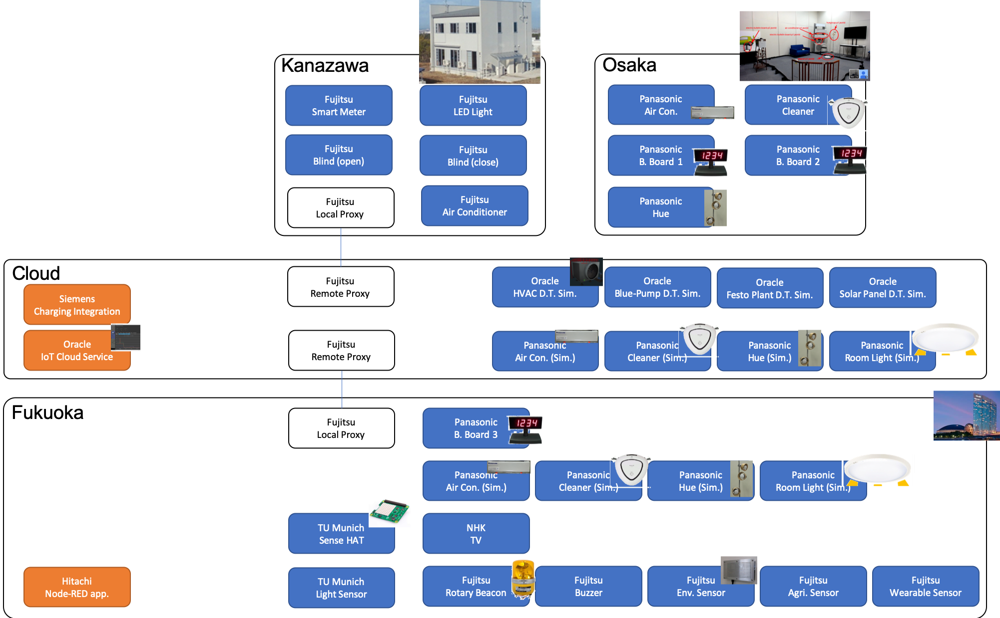
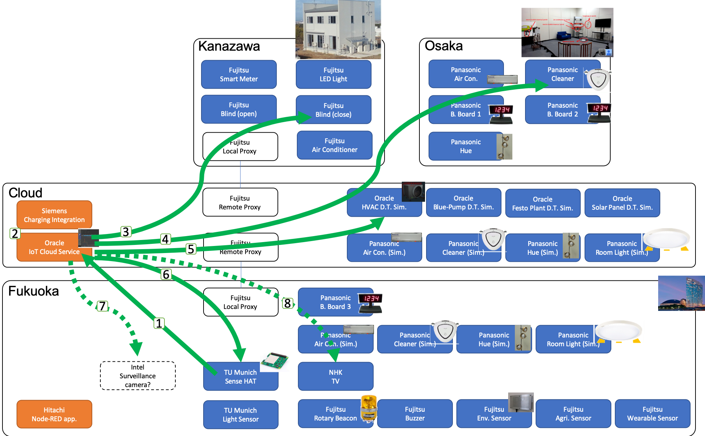

# W3C TPAC - Sept 2019
## W3C Web of Things Interoperability Demos

## Preparation Wiki:
https://www.w3.org/WoT/IG/wiki/F2F_meeting,_16-20_September_2019,_Fukuoka,_Japan#Demo_preparation_.2814-15_or_16-17_Sep_2019.29

# Expected demo participants

Oracle, Intel, Siemens, Hitachi, Panasonic, Fujitsu, TU Munich, Smart Things, NHK

# Demo devices

| Company   | Things/Devices/System/Tools         | Infrastructure requirements, e.g. open ports, power sockets, Wifi | Comments           |Contact|
|-----------|-------------------------------------|-------------------------------------------------------------------|--------------------------|-------|
| Oracle    | IoT Cloud Service                   | Wifi                                                              |  | Michael.Lagally@oracle.com |
| Oracle    | HVAC Digital Twin Simulator | Wifi                                                              |   | Michael.Lagally@oracle.com |
| Oracle    | Blue-Pump Digital Twins Simulator | Wifi                                                              |   | Michael.Lagally@oracle.com |
| Oracle    | Festo Plant Digital Twin Simulator | Wifi                                                              |   | Michael.Lagally@oracle.com |
| Oracle    | Solar Panel Digital Twin Simulator | Wifi                                                              |   | Michael.Lagally@oracle.com |
| Siemens    | Charging-Integration Demo | Wifi                                                              |  Cloud Service / Application | Christian.Glomb@siemens.com |
| Panasonic | Smart home lab in Osaka ([Air Conditioner](TDs/Panasonic/airConditioner_p1.jsonld), [Robotics Cleaner](TDs/Panasonic/cleaner_p1.jsonld), [Bulletin Board 1](TDs/Panasonic/electricBulletinBoard_p1.jsonld), [Bulletin Board 2](TDs/Panasonic/electricBulletinBoard_p2.jsonld), [Philips Hue lighting](TDs/Panasonic/huegroup_p1.jsonld)) | Wifi / Lan; ext ports 443, 8003, 8443 | | yamada.takesi@jp.panasonic.com |
| Panasonic | Bulletin Board in local ([Bulletin Board 3](TDs/Panasonic/electricBulletinBoard_p3.jsonld)) | Wifi / Lan; ext ports 443, 8002, 8003, 8443; 2 power | | yamada.takesi@jp.panasonic.com |
| Panasonic | Online simulator ([Air Conditioner](TDs/Panasonic/PanaSimAirConditioner5.jsonld), [Robotics Cleaner](TDs/Panasonic/PanaSimCleaner5.jsonld), [Philips Hue lighting](TDs/Panasonic/PanaSimHueGroup5.jsonld), [Room lighting](TDs/Panasonic/PanaSimRoomLight5.jsonld)) | Wifi / Lan; ext ports 443, 3000-3011, 8003, 8443 | | yamada.takesi@jp.panasonic.com |
| Panasonic | Local simulator (Air Conditioner, Robotics Cleaner, Philips Hue lighting, Room lighting) | Wifi / Lan; 1 power | More devices could be added to discuss about cross domain business models, use cases and scenarios. | yamada.takesi@jp.panasonic.com |
| NHK    | Hybridcast-Application Demo | Wifi / LAN                                                          |   | endou.h-hc@nhk.or.jp |
| Fujitsu   | 2 Local proxies. One is in smart home in Japan, another is in Fukuoka. | Wifi / Lan; 1 power | ...  | suzuki.takahisa@fujitsu.com, r.matsukura@fujitsu.com |
| Fujitsu   | Remote proxy. Connect 2 Local proxies above. |  | ...  | suzuki.takahisa@fujitsu.com, r.matsukura@fujitsu.com |
| Fujitsu   | Local devices: Rotary beacom light, Buzzer, Environment sensors (Temperature, Humidity, Air pressure, Human detection, 3-axis acceleration, Brightness sensors), Agricuture sensor (Temperature, Humidity, Brightness, UV index, CO2), and Wearable sensor (Temperature, 3-axis acceleration, Brightness sensor).   |  | ...  | suzuki.takahisa@fujitsu.com, r.matsukura@fujitsu.com |
| Fujitsu   | Smart home devices (remote): Smart meter, LED light, Air conditioner, and Window blind Open, Close. |   | ...  | suzuki.takahisa@fujitsu.com, r.matsukura@fujitsu.com |
| TU Munich   | Sense HAT |   | Environments sensors, LED matrix and joystick  | ege.korkan@tum.de |
| TU Munich   | Light Sensor |   | Light sensor  | ege.korkan@tum.de |
| Hitachi     | (Tool) Node Generator | Wifi | Node-RED node generator and application | kunihiko.toumura.yv@hitachi.com | 
| Intel   | [Simple Web Camera](TDs/Intel/intel-camera.jsonld) | WiFi / LAN, 1 Power. Local http:9191. Ext https basic:8098, digest:8099. Long poll observe. | Camera frame grabber and cropping service | michael.mccool@intel.com |
| Intel   | [Web Speak](TDs/Intel/intel-speak.jsonld)         | WiFi / LAN, 1 Power. Local http:8085. Ext https basic:8096, digest:8097. | Speech synthesizer/speaker | michael.mccool@intel.com |

## Diagram of the Demo Devices described in the above table

**Kaz's Note:** The diagram above doesn't include Intくel's devices. I thought we had once removed Intel's devices from the table and there was a conflict about that, so once reverted Intel's devices within the table above.

# Demo Scenarios

The following scenarios demonstrate the interoperability of devices across different manufacturers.

## Smart Home demos

### Scenario: Automatically turn off devices when user leaves the room (Contact: Oracle)

#### Description:
An environment sensor is capable of identifying when a room is empty by measuring the oxygen level.
When the "room empty" condition is detected, the room is cleaned by a vacuum cleaner, lights are turned off, window blinds are closed and a surveillance camera is turned on.

#### Device interactions (Proposal)

* Environment sensor (Simulation?) (TUM has humidity, temperature, pressure sensors)
* Detect when room is empty and trigger the following actions (Oracle)
* Close window blinds (Fujitsu)
* Clean the room (Panasonic)
* HVAC system simulation in a building (Siemens)
* Turn off the lights (Smart Things?) (TUM)
* Turn on a surveillance camera (Intel)
* NHK ?
...

### Smart Home Demo (Contact: Panasonic)

#### Scenario: 
Home appliances communicate with the gateway using existing home protocol such as ECHONET Lite, OCF, etc. and provide functions through the WoT API.

#### Device interactions (Proposal)
* Say "I'm home"/"Bye" to Google Home (Panasonic)
then
* Turn on/off home appliances in the smart home lab at Osaka Japan (Panasonic)
* Turn on/off bulletin board in Munich (Panasonic)
* Turn on/off buzzer (Fujitsu)
* Turn on/off Intel-OCF-LED (Intel)
* Turn on/off Blue Pump (Oracle)
* Turn on/off DotStar and HUE Lights (TUM)
* NHK ?

### Private smart home demo (Contact: Mozilla)

#### Description:
Mozilla's [WebThings Gateway](https://iot.mozilla.org/gateway) will run on the local Wi-Fi network and also be exposed to the Internet via a secure tunelling service.
Example commercial smart home devices from different vendors using different smart home protocols will be monitored, controlled and automated via a single web UI (hosted by the gateway) that can be
interacted with via a browser, or by third party apps and services using the [Web Thing API](https://iot.mozilla.org/wot/) and OAuth.
Example Maker/developer boards programmed as [web things](https://iot.mozilla.org/framework) which directly expose the Web Thing API will also operate on the local Wi-Fi network, and be managed by the gateway.

### Hybridcast Application Demo (Contact: NHK)

#### Scenario: 
Home smart devices behave according to TV programs.

Hybridcast applications emit information about tv programs for smart home devices. 
(Hybridcast is a Japanese Integrated Broadcast-Broadband system. Hybridcast applications are HTML5 applications that work on Hybridcast TV.)

User application receives the information and controlls smart home devices.

#### Device interactions (Proposal)
* Hybridcast TV play programs and sends out information about the programs.
* User application which receives information about TV programs
    * get TDs from Fujitsu proxy
    * stops Robotics Cleaner (Panasonic) 
    * changes the color of Panasonic Hue (Panasonic)
    * shows web applications on a smart mirror or a refrigerator display

## Industrial integration scenarios

### Scenario Automatically alert and protect citizens when a chemical plant has an accident (Contact: Oracle)

#### Description
An environment sensor is capable of measuring air quality by measuring the oxygen level.
During an industrial process, when a low oxygen condition is detected by the
Oracle IoT-Cloud Service Asset Monitoring application, connected devices take
the appropriate action to protect and alert citizens, such as draining a tank
in the factory, turning off all air-conditioners, flash alert and warning lights,
publish alert messages and make voice announcements.

#### Device interactions (Proposal)

* (Initially) A robot arm is doing an operation continuously (TUM)
* Environment sensor monitors air quality. TUM)
* Cloud service discovers anomaly, critical condition and triggers the following actions (Oracle)
* Drain the tank in a chemical factory (Siemens ?)
* Flash a warning light (Fujitsu)
* Turn off all air conditioners (Panasonic)
* Bring the robot arm to a safe position (TUM)
* Make voice announcements (Intel)
...

## Smart Building, Smart City

### Energy management for commercial buildings (Contact: Siemens)

#### Description
Reduce load charge power to stay under the peak power you get from the grid.
AC condition is monitored, charge power is reduced, if AC is on.

#### Devices:
* Grid Simulation (Siemens)
* monitoring simulated ECoG Charger, indicating power consumption, start charging (EcoG)
* Simulated Building management system (Siemens)
* Air conditioner (Panasonic)

### Enhancing power efficiency for smart home (Contact: Fujitsu)
Monitors power consumption and detects exceed the limit, stops some appliances to reduce the consumption.

#### Device interactions (Proposal)
* Smart meter monitors power consumption (Fujitsu)
* Turn on an air conditioner (Fujitsu)
* Turn on another air conditioner (Panasonic)
* EcoG stops charging (EcoG)
* Storage battery start discharging (Fujitsu)
* Smart home application monitors and controls these devices.

# Demo infrastructure

## Displays
NHK screen (43") with dedicated stand - visualize hybridcast connected application
TBC.: - Can we use the screen for visualizing other content? (cloud service, gateway dashboard, Hangouts)?
TBC.: - TV remote, cursor, keyboard?

## Intel 15" monitor (hdmi) + 15" laptop

## Panasonic: Google home, LED number display, Small display (~13")

## Fujitsu: 13" PC, checking on display

## Siemens: Simulation, Laptop t.b.d.

# Logistics + Constraints:

## Demo opportunities:

There are the following four possible opportunities for the WoT demo but we won't use the Devloper meetup option on Monday this time.

1. Whole week: Panasonic's demo table at the lunch place
    * a table of 60cm x 180cm is available
    * title plate for the demo table is needed
    
2. Wednesday: Breakout session - 13:30-14:30  
    * We prefer tranquility of the "after lunch" slot.
    * 1st hour after lunch we have a dedicated demo room
    * consider to include a slide demo for companies not present, e.g. BMW, EcoG, ...
    * to be added to the [Session Idea Wiki](https://www.w3.org/wiki/TPAC/2019/SessionIdeas)

3. Wednesday: Dedicated demo session - 15:30-16:30
    * 2nd hour there's only one table for WoT - need a poster
    * already added to the [Demo Session Wiki](https://www.w3.org/wiki/TPAC2019/Demos)

4. ~~Monday evening: Developer meetup~~
    * This time it requires sponsoring: https://www.w3.org/2019/09/Meetup/
    
### Session schedule

| Date/time             | 1. Panasonic Table   | 2. Breakout Session | 3. Demo Session | Comment |
|----------------------:|:--------------------:|:----------------:|:------------:|------------|
| Monday:    9:00-10:00 | ?                    |       --         |     --       |            |
|           10:00-11:00 | ?                    |       --         |     --       |            |
|           11:00-12:00 | ?                    |       --         |     --       |            |
|           12:00-13:00 | ?                    |       --         |     --       |            |
|           13:00-14:00 | ?                    |       --         |     --       |            |
|           14:00-15:00 | ?                    |       --         |     --       |            |
|           15:00-16:00 | ?                    |       --         |     --       |            |
|           16:00-17:00 | ?                    |       --         |     --       |            |
|           17:00-18:00 | ?                    |       --         |     --       |            |
||||||
| Tuesday:   9:00-10:00 | ?                    |       --         |     --       |            |
|           10:00-11:00 | ?                    |       --         |     --       |            |
|           11:00-12:00 | ?                    |       --         |     --       |            |
|           12:00-13:00 | ?                    |       --         |     --       |            |
|           13:00-14:00 | ?                    |       --         |     --       |            |
|           14:00-15:00 | ?                    |       --         |     --       |            |
|           15:00-16:00 | ?                    |       --         |     --       |            |
|           16:00-17:00 | ?                    |       --         |     --       |            |
|           17:00-18:00 | ?                    |       --         |     --       |            |
||||||
| Wednesday: 9:00-10:00 | ?                    |       --         |     --       |            |
|           10:00-11:00 | ?                    |       --         |     --       |            |
|           11:00-12:00 | ?                    |       --         |     --       | Breakout 1 |
|           12:00-13:30 | ?                    |       --         |     --       | Lunch      |
|           13:30-14:30 | ?                    | WoT demo         |     --       | Breakout 2 |
|           14:30-15:30 | ?                    |       --         |     --       | Breakout 3 |
|           15:30-16:30 | ?                    |       --         | WoT demo     | Break+Demo |
|           16:30-17:30 | ?                    |       --         |     --       | Breakout 4 |
|           17:30-18:30 | ?                    |       --         |     --       | Report     |
||||||
| Thursday:  9:00-10:00 | ?                    |       --         |     --       |            |
|           10:00-11:00 | ?                    |       --         |     --       |            |
|           11:00-12:00 | ?                    |       --         |     --       |            |
|           12:00-13:00 | ?                    |       --         |     --       |            |
|           13:00-14:00 | ?                    |       --         |     --       |            |
|           14:00-15:00 | ?                    |       --         |     --       |            |
|           15:00-16:00 | ?                    |       --         |     --       |            |
|           16:00-17:00 | ?                    |       --         |     --       |            |
|           17:00-18:00 | ?                    |       --         |     --       |            |
||||||
| Friday:    9:00-10:00 | ?                    |       --         |     --       |            |
|           10:00-11:00 | ?                    |       --         |     --       |            |
|           11:00-12:00 | ?                    |       --         |     --       |            |
|           12:00-13:00 | ?                    |       --         |     --       |            |
|           13:00-14:00 | ?                    |       --         |     --       |            |
|           14:00-15:00 | ?                    |       --         |     --       |            |
|           15:00-16:00 | ?                    |       --         |     --       |            |
|           16:00-17:00 | ?                    |       --         |     --       |            |
|           17:00-18:00 | ?                    |       --         |     --       |            |

## Goal: Demonstrate Interoperability among WoT WG members

Wifi should be available, open ports ?

## Posters
