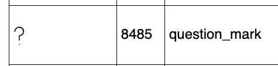
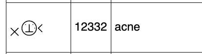

# Registry Mechanism Analysis

This file summarizes registry approaches found in W3C, IETF and IANA.

## Analysis of the W3C Process Document Registry Track

Please see [the presentation from TPAC 2023](https://github.com/w3c/wot/blob/main/PRESENTATIONS/2023-09-tpac/2023-09-14-WoT-TPAC-Registry-Korkan.pdf) as well as [the W3C Process document's relevant part](https://www.w3.org/policies/process/#registries).

Below is a short summary:

- A W3C registry is a table surrounded by rules on how to govern that table. Each entry in that table is called a **Registry Entry**
- The W3C Process Document gives some rules, but each registry needs to extend these in the **Registry Definition** section.
- A registry can be its own document, called **Registry Report**, or a section in a document, called **Registry Section**.
- Defining a registry requires wide review and consensus.
- Contents of a registry table can be updated (added, removed, etc.) without any wide review or even without a group, as long as the updates follow the rules set in the Registry Definition section.
- The lifecycle of the registry and its entries needs to be defined.

## Analysis of other W3C Registries

### TTWG Boilerplate

Timed Text Working Group has a boilerplate for creating registry sections in W3C documents.
After creating a custom registry mechanism as part of TTML Media Type Definition and Profile Registry (see our analysis [here](https://github.com/w3c/wot/blob/main/registry-analysis/Readme.md#ttml-media-type-definition-and-profile-registry)), they have created it as part of the evaluation of the new registry track mechanism.

- Rendered version:  <https://w3c.github.io/ttwg/boilerplate/registry/>
- GitHub link: <https://github.com/w3c/ttwg/tree/main/boilerplate/registry>

They also provide a checklist: <https://w3c.github.io/ttwg/boilerplate/registry/#application-checklist>

#### Custodian

If TTWG exists, it is TTWG. If not, it is the W3C Team.
Important to note that change management depends on who the custodian is.

#### Change Process

The document does not differentiate between entry, modification and removal as everthing is a change.

- Change request can be an issue or email. However, when a PR changes the registry, an issue MUST be created and linked to PR.
- Issue can be opened by anyone and a PR can be opened by TTWG members.
- Custodian WG: PR is merged following the group decision policy (not a task force level decision)
- Custodian W3C Team: Change request goes through wide review. A PR can be asked to be made or the Team creates the PR but in the end the Team applies the changes.

#### States of an Entry

- An entry goes through provisional, final and deprecated states but none of them are mandatory. A new entry should be in provisional but may be in final.
- Provisional entries can be changed, deleted, the entry key can be reused (duplicates). Analogy: having two provisional coap binding entries is possible.
- Final entries cannot be deleted, reused or changed. It can be become deprecated. Analogy: A final coap binding cannot get a new operation with a PR.
- Deprecated entries cannot be deleted or changed. If a deprecated entry was final before, its key cannot be reused. Analogy: If we want to add a new operation to the coap binding, we need to deprecate the current one, add a new entry who key is different. E.g. coap2024 gets deleted and coap2025 arrives with the new operation.
- You can go from provisional to deprecated. In that case, you can reuse the key later on.

### Official W3C Registry Track Registries

Documents that confirm to <https://www.w3.org/2023/Process-20230612/#registries>.
That section should be read first by everyone.
They can be queried at <https://www.w3.org/TR/?filter-tr-name=&status%5B%5D=dry&status%5B%5D=cry&status%5B%5D=ry>.
First Analysis as a presentation in TPAC 2023: <https://github.com/w3c/wot/blob/main/PRESENTATIONS/2023-09-tpac/2023-09-14-WoT-TPAC-Registry-Korkan.pdf>

#### Important Notes

- We cannot make normative references to the registry content. This is probably important for the profile discussions. 
  - Extract from the W3C Process document:

  > If there are entries that must be implemented, or any other such restrictions, they must be defined or documented in the referencing specification without dependency on the registry. For example, “All implementations must implement the Basic-Method as defined in the registry” is not acceptable; a change to the definition of the Basic-Method in the registry would then affect conformance. Instead, the requirement must be complete in the specification, directly or by reference to another specification. For example “All implementations must recognize the name Basic-Method, and implement it as defined by section yy of IETF RFC xxxx”. (The Registry should nonetheless contain Basic-Method as an entry.)

  - Extract from WebCodecs
  
  > Implementers of WebCodecs are not required to support any particular codec nor registry entry.

#### WebCodecs Codec Registry

**Status:** Active (Last publication Jan 2024)
**Creation:** Since [13 October 2022](https://www.w3.org/TR/2022/DRY-webcodecs-codec-registry-20221013/) a Draft Registry. FPWD was on 8 April 2021, still same name. Also see <https://www.w3.org/standards/history/webcodecs-codec-registry/>.

[This registry](https://www.w3.org/TR/webcodecs-codec-registry/) provides the means to identify and avoid collisions among codec strings and provides a mechanism to define codec-specific members of WEBCODECS codec configuration dictionaries.
This registry maintains a mapping between codec strings and registration specifications as described below.

##### Entry Format

- Unique codec string
- Common name string
- Link to the codec’s specification.

##### Submission and Modification Process

There are requirements on the codec string and what the specification should contain.

- Submission is done by filing an issue over GitHub
- The Media WG may seek expertise from outside the Working Group as part of its evaluation, e.g., from the codec specification editors or relevant standards group.
- The codec specification must be made available to the Working Group for evaluation.
- If the Working Group reaches consensus to accept the candidate, a pull request should be drafted (either by editors or by the party requesting the candidate registration) to register the candidate. The registry editors will review and merge the pull request.
- Existing entries cannot be deleted or deprecated. They may be changed after being published through the same process as candidate entries.

##### Custodian

Media WG if it exists. Not clear what happens if the WG closes.

#### W3C Alternative and Augmented Communication (AAC) Symbol Registry

**Status:** Kind of Active (Last publication December 2022) (WG still active) but not finalized (Draft Registry)
**Creation:**  Oct 2022

This [document](https://www.w3.org/TR/aac-registry/) provides reference numbers and symbols for symbol attribute.
The symbol attribute identifies the concept for symbols used in AAC devices, etc., for users who comprehend content more effectively when AAC (rather than just natural language alone) is used to convey meaning. The symbols are an alternative vocabulary, and multiple symbol sets exist today.
The symbol attribute accepts a numeric reference number.
See examples below

- 
- 

##### Entry Format

- Index number
- (English) Text associated to index number to explain it
- SVG or pointer to an SVG with the symbol

They maintain a JSON file that maps the english text to the id.
Each symbol has an svg with the same id, i.e. 12332.svg is the symbol for `acne`.

##### Submission and Modification Process

The symbols are developed by the Blissymbolics Communication International (BCI) and this document is a joint work with them.

> Additions and extensions to the symbol and concept cross reference index are performed by time-tested BCI processes before they are migrated into this W3C Registry.

Other than this, they follow the process document.

##### Custodian

BCI if it exists. Not clear what happens if it closes.

### Custom Registry Mechanism Registries

Registries within W3C that do not use the Official W3C Registry Track.

#### TTML Media Type Definition and Profile Registry

**Status:** Active (Last updated Nov 2020)
**Creation:** 10 May 2016

This [document](https://www.w3.org/TR/ttml-profile-registry/#registry) defines a specific media type and a registry for associated "processor profiles".

##### Entry Format

- Entries must contain a unique ID, an absolute URI that identifies the profile, and contact information of the registrant
- Entries *should* contain links to the specification of the profile itself and its corresponding vocabulary

##### Submission and Modification Process

- Entries can be added, changed, or deleted
  - Although deletion is possible, entries are intended to be stable
- Requests are made via an email to the WG chair, and will be decided on in a WG meeting
- Decisions are made via consensus, the requestor is notified accordingly

##### Custodian

TTWG if it exists. Not clear what happens if it closes.

#### Media Source Extensions Byte Stream Format Registry

**Status:** Active (Last entries added May 2021)
**Creation:** 04 October 2016

This [document](https://www.w3.org/TR/mse-byte-stream-format-registry/) defines
a registry that maps between MIME-type/subtype pairs and byte stream format
specifications.
These are relevant for
[`SourceBuffer` objects](https://www.w3.org/TR/media-source/#sourcebuffer) which
are used for consuming audio and video streams.

##### Entry Format

Each entry consists of MIME type/subtype which is mapped to a publicly available
specification for a byte stream format.
It is recommended that the specification should be available without fees.

Furthermore, it has to be specified if a flag for generating timestamps needs to
be set with the byte stream format.

##### Submission Process

All requirements mentioned in the [Media Source Extensions](https://www.w3.org/TR/media-source/#byte-stream-formats) specification must be fulfilled.

New entries are submitted to a public mailing list where they are supposed to be
discussed and evaluated before adding them to the registry.
The process of approving a new entry is (apparently?) not formally specified.

##### Modification Process

The possibility to remove entries that fail to satisfy any of the mandatory requirements is explicitly mentioned.

##### Custodian

Media WG if it exists. Not clear what happens if it closes.

#### DID Specification Registries

**Status:** Active (Last updated Sep 2023)
**Creation:** 18 June 2020

This [document](https://www.w3.org/TR/did-spec-registries/) defines
a registry for all known global parameters, properties, and values used by the
Decentralized Identifier ecosystem.

##### Entry Format

- Entries must include a human-readable description and should have a clear and descriptive name.
- Entries must adhere to an IPR policy and do no harm to others (including legally and security-wise).
- Entries must link to a specification that makes it possible to implement the addition.
- Entries must specify a JSON-LD context (with a set of more fine-grained requirements).

##### Submission Process

New entries have to be submitted via a modification request
(as part of a PR on the registry's repository).

##### Modification Process

Entries must not be removed, only deprecated.

##### Custodian

DID WG if it exists. Not clear what happens if it closes.

#### XPointer Scheme Name Registry Policy

**Status:** Inactive? (Last registration request Nov 2021, still pending)
**Creation:** Nov 2005

This [document](https://www.w3.org/2005/04/xpointer-policy) defines a policy
that governs the registration of simple names for Scheme-Based XPointers.

##### Entry Format

Entries consist of a name and description.

##### Submission Process

- Entries are given out on a "first come, first serve" basis
- A W3C account is required
- Registration requests are made via a Web form
- After submission, registration is reviewed on a public mailing list where objections can be raised within one month
- In case of an objection, the Team Contact makes a decision within two weeks. If the objection is upheld, the submission can be revised or appealed within one week. Otherwise, it is rejected.
- In the case of an appeal, the W3C Director decides.
- In the case of no objection and an approval by the director, the request changes its state to "Registered". The other states are "Pending" and "Rejected".

##### Modification Process

A process for modifying an entry is not defined.
<!-- TODO: Double-check that this is really the case -->

##### Custodian

The WG if it exists. Not clear what happens if it closes. For normal registrations, W3C director and team is also involved so they are also a custodian of some kind.

#### Insights and Conclusion

After detailing the features of the individual registries, a summary and
conclusion of certain important aspects is given below.

##### Registration

In general, all of the registries above define a process for submitting new entries.
However, they vary in their complexity and the formality of the procedure for
admission.
Generally, the WG lead and sometimes -- in the case of an appeal -- even the W3C
directorate is involved in the decision.
However, all registries try to a consensus in one way or another, with different
levels of leadership acting as a mediator or coordinator of the process.

It probably makes sense to also focus on achieving consensus in the case of
our registries.
However, the process should not be too complicated while also
not leaving aspects too vague.

##### Components of a Registry Entry

Except for the XPointer scheme registry, all of the registries above require
formal specifications to be linked to from the registry.
Depending on the kind of registry, additional aspects need to be specified,
e.g., a JSON-LD `@context` when it comes to DID.

This emphasizes that special attention should be given to which parts need to be
included in a registry entry.
E.g., given the diverse nature of IoT protocols, we need to make sure to
allow for fitting all of them into our Binding Templates registry, while still
ensuring that all necessary components to work with a Protocol Binding are
included.

##### Deletion and Deprecation of Registry Entries

With the XPointer Scheme Registry being an exception once more, all registries
also define a way to delete or deprecate entries.
In the case of the "TTML Media Type Definition and Profile Registry" and the
"Media Source Extensions Byte Stream Format Registry", however, an entry is only
supposed to be deleted if it violates any of the mandatory requirements.

DID, however, only allows for the *Deprecation* of entries, which seems like a
a good way to avoid accidental breaking of deployed implementations.

##### Versioning

One aspect that is not explicitly covered in the registries mentioned above is
having different versions of the same entry.
New versions of the same document could be treated simply as a resubmission
while marking the old entries as deprecated (see the section on deletion and
deprecation above).
However, we could also opt for an explicit versioning mechanism for our
registries in order to, for instance, group different versions of a Binding
Template.

## Analysis of IANA Registries

Volunteer:  Cristiano Aguzzi

> Examples:
> 
> - <https://www.iana.org/assignments/websocket/websocket.xml>
> - <https://www.iana.org/assignments/language-subtag-registry/language-subtag-registry>
> - <https://www.iana.org/assignments/media-types/media-types.xhtml>

The Internet Assigned Numbers Authority (IANA) plays a crucial role in ensuring the proper functioning
of the Internet through various coordination mechanisms, collectively known as IANA functions. This report 
focuses on the Protocol Assignments function, closely coordinated with the Internet Engineering Task Force (IETF), 
providing insights into the potential establishment of a registry for protocol binding templates.

### IANA Procedures and RFC 8126

IANA, as outlined in RFC 8126, establishes common procedures for protocol assignments. These procedures may be supplemented
or modified by specific registries defined in corresponding RFCs. The submission of registrations is typically facilitated 
through web forms on the IANA website or via email.

### Generic Considerations

Even in seemingly unlimited spaces, a minimal review before assignment is often necessary to prevent hoarding or wastage of values 
and to ensure the legitimacy of requests. Balancing adequate review with ease of registration is crucial, considering 
requests from various entities.

Common review policies, as defined by RFC, include (order of strictness):

1. Private Use
2. Experimental Use
3. Hierarchical Allocation
4. First Come First Served
5. Expert Review
6. Specification Required
7. RFC Required
8. IETF Review
9. Standards Action
10. IESG Approval

The following subsections expand the guidelines for the main review policies that were used across the relevant examples
of registries selected by the Working Group (see later sections). 

#### First Come First Served

> ([RFC8126](https://datatracker.ietf.org/doc/html/rfc8126#section-4.4))

Streamlined review policy the requests are registered in a first come first served fashion and they are usually accepted without
any particular review. The requirement for acceptance is only that the request is well formed and does not clash with existing
registrations (e.g., for strings case-sensitive equality). Some registries might add some additional requirements but they are usually
regarding the format of the request and they are not used to add additional review steps to the process. Any registry that uses
this policy has to define a "change controller" an entity responsible for overseeing any change of the registry (e.g., protocol updates 
that deprecate old codes). The [RFC](https://datatracker.ietf.org/doc/html/rfc8126#section-4.4) advises any change controller to be 
careful "that the protocol retains wire compatibility". 

> It is also important to understand that First Come First Served really has no filtering.  Essentially, any well-formed request is
accepted.

#### Expert Review

> ([RFC8126](https://datatracker.ietf.org/doc/html/rfc8126#section-4.5))

The expert reviews policy requires the registry to define an expert for reviewing new registration requests. The role of the expert
is so important that IANA dedicates an [entire section](https://datatracker.ietf.org/doc/html/rfc8126#autoid-29) (see summary below) about this role 
and how to manage it. While is not mandatory, it is advised to provide additional documentation attached to a registration request 
to give the expert sufficient context to evaluate it. 

> The required documentation and review criteria, giving clear guidance to the designated expert, should be provided when defining the
> registry.

Another important aspect that needs to be laid out is the criteria for accepting requests or discarding them, it will help the expert
review process. Change controller should be defined here too. 

##### The role of Designed Expert in IANA

The designated experts play a crucial role in the IANA process, addressing the limitations of open mailing list discussions by providing
clear and expert advice. The motivation behind this approach is to ensure efficient evaluation of assignment requests and to delegate 
the evaluation process to subject matter experts. Designated experts are not gatekeepers but focus on evaluating requests for completeness, 
interoperability, and potential conflicts. Multiple experts may collaborate, and conflicts among them require resolution within the expert group. 
If an expert has a conflict of interest, they must recuse themselves, temporary experts may be appointed, and usually also replacements
are declared by the IEGS. The role of designated experts involves coordinating 
reviews that can vary in scope, consulting with technology experts, and following registry-specific criteria. Experts are accountable to the IETF community, and 
the evaluation process is transparent. 

### URI Schemes ([RFC 7595](https://www.rfc-editor.org/rfc/rfc7595.html))

**Registration policy** for provisional: [First Come First Served](#First_Come_First_Served)

**Registration policy** for permanent schemes : [Expert Review](#Expert_Review)

To register a new URI Scheme the RFC specifies the following steps (that should be followed regardless of the type):

1. **Check Existing Entries:** Verify if the desired scheme name is already registered in the IANA "Uniform Resource Identifier (URI) Schemes" registry. 
If it exists, choose a different name or update the existing specification.

2. **Prepare Registration Request:** Create a scheme registration request using the specified template in Section 7.4. 
This request can be part of an Internet-Draft or submitted alone, following the guidelines of [RFC5378].

3. **Review and Request Feedback:** If the registration is for a 'permanent' status, review the requirements in Section 3, 
then submit the request to the uri-review@ietf.org mailing list and other relevant lists for discussion. Allow time for 
comments and respond to them, making necessary revisions.

4. **Submit to IANA:** Submit the scheme registration request (possibly updated) or a pointer to the document containing it to IANA at iana@iana.org.

Upon receiving the request, IANA follows these steps:

1. **Completeness Check:** IANA checks the submission for completeness. If sections are missing or citations are incorrect, the request is rejected, and the registrant can resubmit a corrected request.

2. **Provisional Registration:** If the request is for 'provisional' registration and there's no existing entry for the same name, IANA adds the registration under the First Come First Served policy.

3. **Pending Review:** For other cases, IANA enters the registration request in the registry with the status marked as "Pending Review."

4. **Expert Review:** IANA requests Expert Review against the guidelines. The Designated Expert evaluates the request against the [criteria](https://www.rfc-editor.org/rfc/rfc7595.html#section-3).

5. **Decision for Permanent Registration:** For 'permanent' registration, the Designated Expert may accept it, suggest 'provisional' registration, request IETF review and IESG approval, or request additional review or discussion.

6. **Handling Conflicts:** If an entry already exists for the same name, the Designated Expert decides whether to reject the request or modify the existing entry to note separate use.

7. **Update Registration Status:** Once approved, IANA updates the registration status. If rejected, the "Pending Review" request is removed.

#### Custodian

IANA. No fallback plan exists.

### Websockets Subprotocols ([RFC 6455](https://datatracker.ietf.org/doc/html/rfc6455#section-11.5))

**Registration policy** : [First Come First Served](#First_Come_First_Served)

#### Custodian

IANA. No fallback plan exists.

The RFC adds a basic template with minor constraints/guidelines.

### Websockets extensions ([RFC 6455](https://datatracker.ietf.org/doc/html/rfc6455#section-11.5))

**Registration policy** : [First Come First Served](#First_Come_First_Served)

The RFC adds a basic template with minor constraints/guidelines.

#### Custodian

IANA. No fallback plan exists.

### Websockets version number ([RFC 6455](https://datatracker.ietf.org/doc/html/rfc6455#section-11.5))

**Registration policy** : IETF review

Interesting that the version number is itself in a registry and it regulated by the regular track for
standardization.

#### Custodian

IANA. No fallback plan exists.

### Media-types ([RFC 6838](https://datatracker.ietf.org/doc/html/rfc6838))

**Registration policy** : Custom

Differently from the other registry and from what is advised in RFC 8126 the registration
of Media-types follows its own defined steps. This registry has it's own section in [IANA Website](https://www.iana.org/form/media-types)
and it is composed by these steps:

1. Submission of the template
2. Review from a "Media types reviewer" which is quite similar to [Expert Review](#Expert_Review) but not explicitly stated in the RFC
3. Comments from the community: in any time comments can be sent and if IANA and the "Media types reviewer" agrees they can be attached in the media type registration

#### Custodian

IANA. No fallback plan exists.

## Appendix

### Useful Resources

- <https://www.w3.org/2020/01/registering-mediatypes> (we followed this for registering TD media type)
- IANA Guidelines: <https://www.iana.org/help> and <https://www.iana.org/help/protocol-registration>
