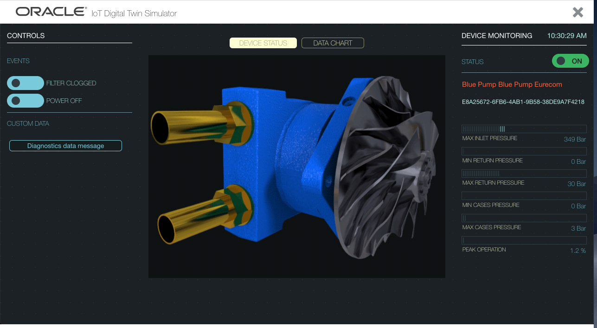
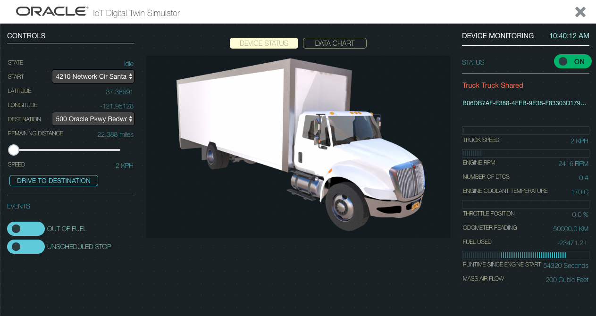

# Simulated devices in Oracle's Digital Twin Simulator

The Digital Twin simulator is available on a new server:
https://michaelw3cam7iotjls-michaelprod1.uscom-central-1.oraclecloud.com/ds

Please use the same credentials as with the previous instance.
If you meed access, please send an email to [Michael.Lagally@oracle.com](mailto://Michael.Lagally@oracle.com)

The following instances can be used by each company individually:

[Blue_Pump_Eurecom](./Blue_Pump_Eurecom.jsonld)  
[Blue_Pump_Fujitsu](Blue_Pump_Fujitsu.jsonld)  
[Blue_Pump_Hitachi](Blue_Pump_Hitachi.jsonld)  
[Blue_Pump_Intel](Blue_Pump_Intel.jsonld)  
[Blue_Pump_KETI](Blue_Pump_KETI.jsonld)  
[Blue_Pump_Panasonic](Blue_Pump_Panasonic.jsonld)  
[Blue_Pump_Siemens](Blue_Pump_Siemens.jsonld)  
[Blue_Pump_SmartThings](Blue_Pump_SmartThings.jsonld)  
[Blue_Pump_TUM](Blue_Pump_TUM.jsonld)  

[Connected_Car_Eurecom](Connected_Car_Eurecom.jsonld)  
[Connected_Car_Panasonic](Connected_Car_Panasonic.jsonld)  

The following simulators are shared across all WG members.
Please be aware that somebody else may be using the device simultaneously:

[Connected_Car_Shared](Connected_Car_Shared.jsonld)  

[Festo_Shared](Festo_Shared.jsonld)   

[HVAC_Shared](HVAC_Shared.jsonld)  

 

[Truck_Shared](Truck_Shared.jsonld) 
