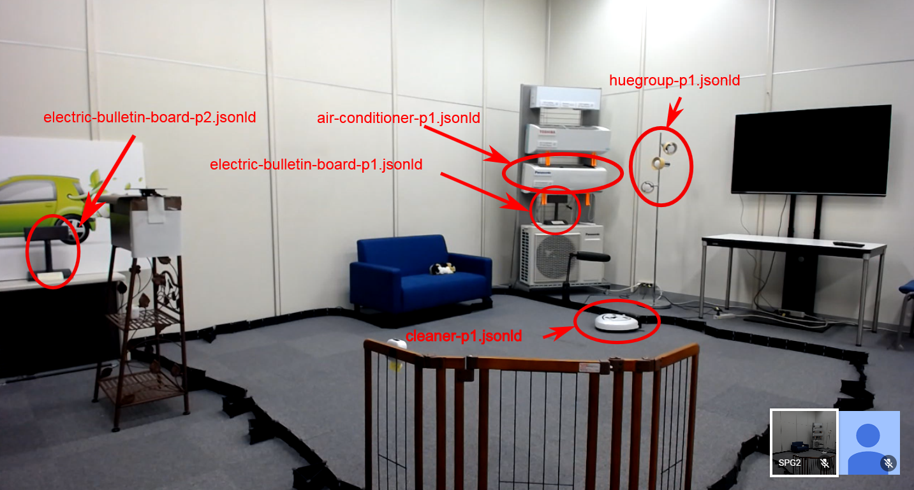

# Panasonic Thing Descriptions

## Things in Osaka lab (Video through Hangout)

- [Air Conditioner](../../inputs/Panasonic/panasonic-server-real/airConditioner_p1.jsonld)
- [Robotics Cleaner](../../inputs/Panasonic/panasonic-server-real/cleaner_p1.jsonld)
- [Bulletin Board 1](../../inputs/Panasonic/panasonic-server-real/electricBulletinBoard_p1.jsonld)
- [Bulletin Board 2](../../inputs/Panasonic/panasonic-server-real/electricBulletinBoard_p2.jsonld)
- [Bulletin Boards](../../inputs/Panasonic/panasonic-server-real/electricBulletinBoards.jsonld) (are Bulletin Board 1 and 2. A client must generate URIs according to the URI templates.)
- [Philips Hue lighting](../../inputs/Panasonic/panasonic-server-real/huegroup_p1.jsonld)

## Things in Local

- [Bulletin Board 3](../../inputs/Panasonic/panasonic-server-real/electricBulletinBoard_p3.jsonld)
- Available at F2F meeting.

## Online simulator

(Sample TDs of [special instance](https://w3c.p-wot.com:3009) which can be shared among participants simultaneously)

- [Air Conditioner](../../inputs/Panasonic/panasonic-server-simulator/PanaSimAirConditioner5.jsonld)
    - Note: "windVolumeLevel" is accessible through WoT interface, but inaccessible directly from the upper right grid icon on the simulator window now.
- [Robotics Cleaner](../../inputs/Panasonic/panasonic-server-simulator/PanaSimCleaner5.jsonld)
- [Philips Hue lighting](../../inputs/Panasonic/panasonic-server-simulator/PanaSimHueGroup5.jsonld)
    - Note: "blink" is accessible through WoT interface, but inaccessible directly from the upper right grid icon on the simulator window now.
- [Room lighting](../../inputs/Panasonic/panasonic-server-simulator/PanaSimRoomLight5.jsonld)

For other instances which can be accessed exclusively at a time, see [simulator portal](https://w3c.p-wot.com:3011) (Access restricted to testfest participants only).

## Local simulator

- You can use Local simulator just like Online simulator.
- Available at F2F meeting.
