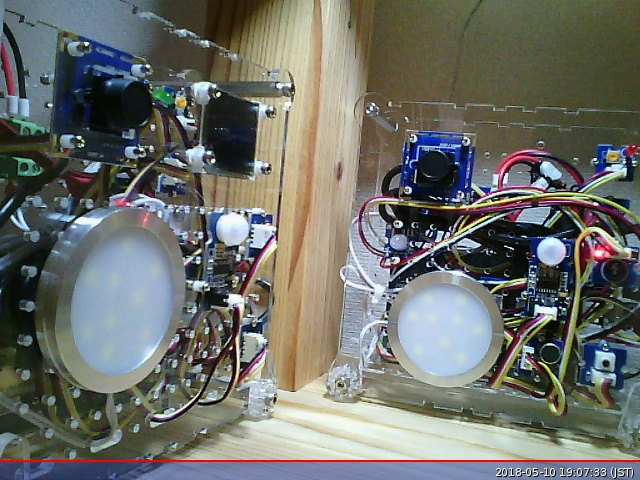

# Online Test Things

## Intel

### Simple Web Camera
Example image is given below.  Note that this does not auto-update; I am working on that, but it needs client-side script support (eg to follow the frame "observe" interaction) so will have to be implemented in HTML.

[Authentication information](https://lists.w3.org/Archives/Member/member-wot-ig/2018May/0000.html) - W3C WoT membership required to access.  Please do not repost in a public forum (for example, do not check the keys into a public github repo as part of a test suite...).

Summary of network API (see TDs for details):
* `/api` - get Thing Description
    * `/frame` - get last frame captured
        - `/observe` get next frame captured when ready (long polling)
    * `/exposure` - get/set manual exposure
        - `/observe` - observe changes in (manual) exposure (long polling)
    * `/crop` - get cropped version of last frame captured (an action using POST)
          
#### HTTPS and Basic Auth
* Camera 0 via California Digital Ocean Portal:
    [TD](https://portal.mmccool.net:28443/api) -
    [frame](https://portal.mmccool.net:28443/api/frame)
          [(observe)](https://portal.mmccool.net:28443/api/frame/observe) -
    [exposure](https://portal.mmccool.net:28443/api/exposure)
          [(observe)](https://portal.mmccool.net:28443/api/exposure/observe) -
    [crop](https://portal.mmccool.net:28443/api/crop)
* Camera 0 via Japan AWS Portal:
    [TD](https://tiktok.mmccool.org:28443/api) -
    [frame](https://tiktok.mmccool.org:28443/api/frame)
          [(observe)](https://tiktok.mmccool.org:28443/api/frame/observe) -
    [exposure](https://tiktok.mmccool.org:28443/api/exposure)
          [(observe)](https://tiktok.mmccool.org:28443/api/exposure/observe) -
    [crop](https://tiktok.mmccool.org:28443/api/crop)

#### HTTPS and Digest Auth
* Camera 0 via California Digital Ocean Portal:
    [TD](https://portal.mmccool.net:28444/api) -
    [frame](https://portal.mmccool.net:28444/api/frame)
           [(observe)](https://portal.mmccool.net:28444/api/frame/observe) -
    [exposure](https://portal.mmccool.net:28444/api/exposure)
           [(observe)](https://portal.mmccool.net:28444/api/exposure/observe) -
    [crop](https://portal.mmccool.net:28444/api/crop)
* Camera 0 via Japan AWS Portal:
    [TD](https://tiktok.mmccool.org:28444/api) -
    [frame](https://tiktok.mmccool.org:28444/api/frame)
           [(observe)](https://tiktok.mmccool.org:28444/api/frame/observe) -
    [exposure](https://tiktok.mmccool.org:28444/api/exposure)
           [(observe)](https://tiktok.mmccool.org:28444/api/exposure/observe) -
    [crop](https://tiktok.mmccool.org:28444/api/crop)
    
      
### Web Speak
Speech synthesizer service
TO DO: working, need to get online (similar structure to camera).   However, hard to test
remotely unless I also implement a "microphone" service...  may add capability to return an
audio file.

### OCF Smart Home Demo
Simulated OCF devices as well as actual physical instantiation using Grove sensors and Edisons.
See [repo](https://github.com/intel/SmartHome-Demo).  As an example, try the following (but you may have to
look up an updated `di` in the TD or the `oic/res`, as well as providing the "basic" authentication information in the headers):
* [https://portal.mmccool.net:9023/api/oic/a/led0mosfet?di=ea16d184-95ad-4af7-bfc9-53e86f55f3a4] - MOSFET LED 0
    - GET - returns JSON payload for light status
    - POST - updates light status with JSON payload

[Authentication information](https://lists.w3.org/Archives/Member/member-wot-ig/2018May/0003.html) - W3C WoT membership required to access.  Please do not repost in a public forum (for example, do not check the keys into a public github repo as part of a test suite...).

#### HTTPS Proxy and Basic Auth
* OCF Gateway (IoT REST API Server)
    - [`oic/res`](https://portal.mmccool.net:9023/api/oic/res)
    
#### HTTPS Proxy and Digest Auth
* OCF Gateway (IoT REST API Server)
    - [`oic/res`](https://portal.mmccool.net:9024/api/oic/res)

Also have plans to get working on
alternative hardware (eg Artik dev kit and/or ESP32) using 
[iotivity-constrained](https://github.com/iotivity/iotivity-constrained).
