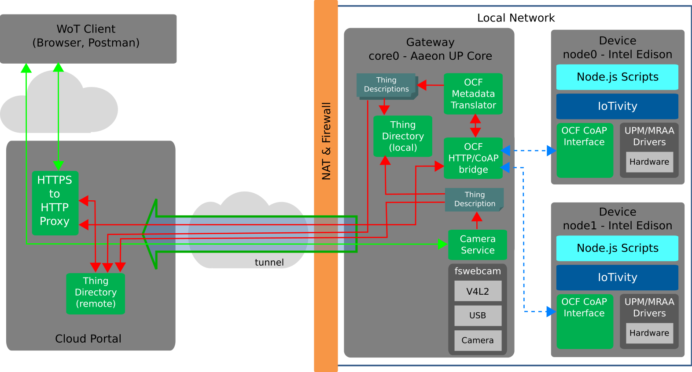
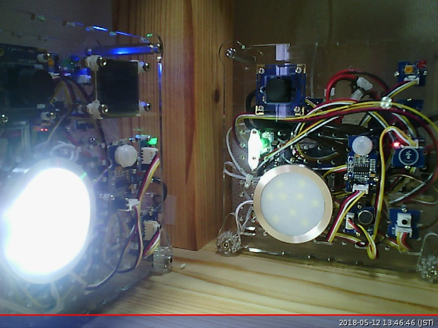

# Intel - Smart Home Demo including OCF Devices and NAT Traversal
**NOTE: MAY BE OCCASIONALLY OFFLINE DURING PREPARATIONS FOR BUNDANG PLUGFEST.**

This demonstration systems includes a combination of devices
with both web-service and OCF network interfaces
and shows how they can be coordinated.
As an example web-based device,
a simple web camera directly supporting an HTTP network interface has been implemented
which provides its own Thing Description.
In addition, the system includes a running implementation of the OCF Smart Home Demo.
The OCF Smart Home Demo in turn includes a number of CoAP-based OCF devices.
These OCF devices are supported by a CoAP/HTTP bridge service
and a metadata translator service running on a gateway.
The metadata translator automatically and dynamically generates Thing Descriptions from OCF metadata.
Multiple portals running in the cloud support secure remote access,
demonstrating both end-to-end private tunnels and proxied tunnels for NAT traversal.
Secure remote access is supported by HTTPS and multiple authentication mechanisms are demonstrated.
Finally, simultaneous gateway and cloud portal Thing Directory services support
both local and remote discoverability and access.

In the diagram below, secure, encrypted connections are shown in green and unencrypted connections
in red.  Red connections are only used within a system (eg behind a firewall) or over an encrypted
tunnel.  This diagram only shows the "production" network connections potentially useful in a 
real deployment.  The actual test system includes a number of other access points for test
purposes (all access points are however protected by tunnelling them through the proxy, so
authentication is required to access them).

### System Architecture


### Authentication
The Simple Web Camera service supports end-to-end security
(the endpoint itself handles TLS and authentication;
the gateway and proxy only provide transport of an encrypted stream
without access to it)
and so the "Direct Authentication Credentials" should be used.
The other services use the proxy tunnel configuration
(a service in the cloud portal provides a TLS endpoint
and authentication) and so the "Proxy Authentication Credentials"
credentials should be used.

* [Direct Authentication Credentials](https://lists.w3.org/Archives/Member/member-wot-ig/2018May/0000.html)
* [Proxy Authentication Credentials](https://lists.w3.org/Archives/Member/member-wot-ig/2018May/0003.html)

W3C WoT membership required to access these credentials.
Please do not repost them in a public forum
(for example,
do not check the keys into a public github repo as part of a test suite,
post on a forum,
share in a public messaging system, etc).
These will be updated peroidically so if an access does not work,
check that you have the latest version.

### Simple Web Camera
Example image is given below.
Note that this does not auto-update;
that is in progress,
but it needs client-side script support
(eg to follow the frame "observe" interaction)
so will have to be implemented in HTML.



Summary of network API (see TDs for details):
* `/api` - get Thing Description
    * `/frame` - get last frame captured
        - `/observe` get next frame captured when ready (long polling)
    * `/exposure` - get/set manual exposure
        - `/observe` - observe changes in (manual) exposure (long polling)
    * `/crop` - get cropped version of last frame captured (an action using POST)
          
#### HTTPS and Basic Auth
* Camera 0 via California Digital Ocean Portal:
    [TD](https://portal.mmccool.net:28443/api) -
    [frame](https://portal.mmccool.net:28443/api/frame)
          [(observe)](https://portal.mmccool.net:28443/api/frame/observe) -
    [exposure](https://portal.mmccool.net:28443/api/exposure)
          [(observe)](https://portal.mmccool.net:28443/api/exposure/observe) -
    [crop](https://portal.mmccool.net:28443/api/crop)
* Camera 0 via Japan AWS Portal:
    [TD](https://tiktok.mmccool.org:28443/api) -
    [frame](https://tiktok.mmccool.org:28443/api/frame)
          [(observe)](https://tiktok.mmccool.org:28443/api/frame/observe) -
    [exposure](https://tiktok.mmccool.org:28443/api/exposure)
          [(observe)](https://tiktok.mmccool.org:28443/api/exposure/observe) -
    [crop](https://tiktok.mmccool.org:28443/api/crop)

#### HTTPS and Digest Auth
* Camera 0 via California Digital Ocean Portal:
    [TD](https://portal.mmccool.net:28444/api) -
    [frame](https://portal.mmccool.net:28444/api/frame)
           [(observe)](https://portal.mmccool.net:28444/api/frame/observe) -
    [exposure](https://portal.mmccool.net:28444/api/exposure)
           [(observe)](https://portal.mmccool.net:28444/api/exposure/observe) -
    [crop](https://portal.mmccool.net:28444/api/crop)
* Camera 0 via Japan AWS Portal:
    [TD](https://tiktok.mmccool.org:28444/api) -
    [frame](https://tiktok.mmccool.org:28444/api/frame)
           [(observe)](https://tiktok.mmccool.org:28444/api/frame/observe) -
    [exposure](https://tiktok.mmccool.org:28444/api/exposure)
           [(observe)](https://tiktok.mmccool.org:28444/api/exposure/observe) -
    [crop](https://tiktok.mmccool.org:28444/api/crop)
       
### Web Speak
Speech synthesizer service.

TO DO: Service is working,
but need to get it online still (using a similar structure to the camera service above).
It is however hard to test this service remotely unless a "microphone" service is also available.
Looking into adding the capability to return an audio file both for this service
and for a microphone service.

### OCF Smart Home Demo
Simulated OCF devices as well as actual physical instantiation using Grove sensors and Edisons.
See [repo](https://github.com/intel/SmartHome-Demo).
As an example, try the following (but you may have to
look up an updated `di` in the TD or the `oic/res`,
as well as providing the "basic" authentication information in the headers):
* [https://portal.mmccool.net:9023/api/oic/a/led0mosfet?di=ea16d184-95ad-4af7-bfc9-53e86f55f3a4] - MOSFET LED 0
    - GET - returns JSON payload for light status
    - POST - updates light status with JSON payload
    
For example, to get the current status of the light,
using the URL above and the authentication information below,
you can issue a GET using
```
curl <url> --basic --user "<username>:<password>"
```
which will return some JSON showing the current status of the light.
To turn on the light, you can issue a POST using
```
curl <url> --basic --user "<username>:<password>" -d '{"value":true}'
```
and to turn it off, another POST using
```
curl <url> --basic --user "<username>:<password>" -d '{"value":false}'
```
You can also try `--digest` and some of the other URLs given in the resources below
(for example, the RGB light).
    
You can use the camera service above to check if the light is physically on or off.
Note that this is a very
bright light and will tend to wash out the camera exposure when it is on.

TDs are available from the services below, but in case the services
are down [here are some cached TDs](intel_sample_tds.jsonld).

**Caveats**:
* TD registration with the Thing Directory is currently broken
  so the Thing Directories are empty.
* Only TDs with local addresses are currently provided.
  However, the actual devices are accessible through
  the cloud portal.
  Replace the `base` with a base address for one of the portals, such
  as `https://portal.mmccool.net:9023/api/oic`,
  to get a TD usable from outside the local network.
* Some services are currently only available through the California portal.
* There is not yet have a European portal.
  The others will work, they will just have higher latency than necessary.
  
#### Guide to Resources
As the resources are available under multiple URLs
(different portals and authentication mechanisms)
common elements are explained here.
* OCF Gateway (IoT REST API Server; running on gateway) - **Normally Hidden.**
    - Access to network API provided by IoT REST API Server running on the local gateway,
      which translates OCF CoAP network interfaces to HTTP network interfaces.
    - These are visible only for test purposes.
      In an actual deployment they should be hidden (eg 
      blocked by the gateway firewall locally and definitely not tunnelled up to the cloud portal)
      to enhance privacy and security.
      In particular, listing what IoT devices are available is
      a privacy risk and advertising what software and hardware is running
      on a gateway is a security risk
      (as it makes it easier to identify vulnerable systems.)
    - Accessing the resource URL actually triggers a discovery scan which is
      (a) not scalable to large numbers of outside systems (eg a DOS risk) and
      (b) takes a few seconds to complete.
    - **oic/res**: OCF resource metadata.
    - **system**: Description of gateway hardware. 
* Metadata Bridge (ocf-wot-metadata-bridge running on gateway) - **Normally Hidden.**
    - Access to network API of OCF-WoT metadata bridge.
      Normally access to this would not
      be provided, even over the local network,
      as the API just provides a list of TDs generated and
      debugging information.
      As the TDs are made available via the Thing Directories below in normal
      operation, this API is only relevant for testing.
    - The metadata bridge periodically scans the OCF metadata and caches TDs, so this
      should return an array of TDs immediately but the information may be slightly stale.
      In particular, new OCF devices may not appear here (or in the Thing Directories) until
      a scan has been triggered,
      which is currently configured to happen every 10s or so.
    - **emd**: Returns an array of generated TDs with local links.
    - **md**: Returns an array of generated TDs with global links.
* Thing Directory (thingweb-directory)
    - Allows semantic search (SPARQL queries) of registered Thing Descriptions.
    - **etdir**: Edge Thing Directory that returns TDs with local links.
      This service is running on an edge gateway.
      A remote access URL is given here for testing only.
      Normally access to this service would not be provided outside the local
      network serviced by a particular gateway,
      as the links use IPv4 addresses that are only valid locally.
      However, on the local network this 
      Thing Directory allows access to local devices without needing to go to the cloud,
      which has advantages
      in some use cases (enhanced privacy, lower latency, and greater resilience).
    - **tdir**: Thing Directory.  Returns TDs with global links.
      This service is running in the cloud, is
      visible to the global internet,
      and can consolidate TDs from multiple edge systems.

#### HTTPS Proxy and Basic Auth
Via California Digital Ocean Portal:
* OCF Gateway: [oic/res](https://portal.mmccool.net:9023/api/oic/res) -
               [system](https://portal.mmccool.net:9023/api/system)
* Metadata Bridge: [emd](https://portal.mmccool.net:9029) -
                   [md](https://portal.mmccool.net:9031)
* Thing Directories: [etdir](https://portal.mmccool.net:9025) -
                     [tdir](https://portal.mmccool.net:9027)
    
#### HTTPS Proxy and Digest Auth
Via California Digital Ocean Portal:
* OCF Gateway: [oic/res](https://portal.mmccool.net:9024/api/oic/res) -
               [system](https://portal.mmccool.net:9024/api/system)
* Metadata Bridge: [emd](https://portal.mmccool.net:9030) -
                   [md](https://portal.mmccool.net:9032)
* Thing Directories: [etdir](https://portal.mmccool.net:9026) -
                     [tdir](https://portal.mmccool.net:9028)

TO DO: Get additional OCF endpoints working on
alternative hardware (eg Artik dev kit and/or ESP32) using 
[iotivity-constrained](https://github.com/iotivity/iotivity-constrained).
