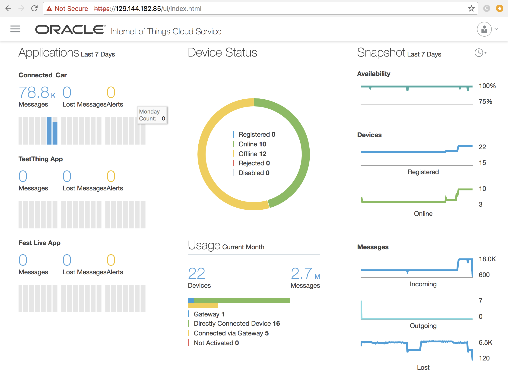
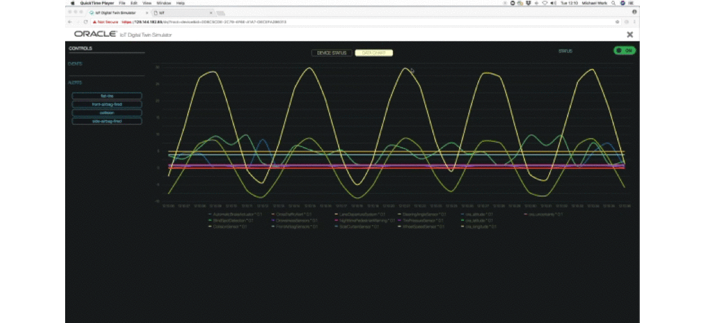
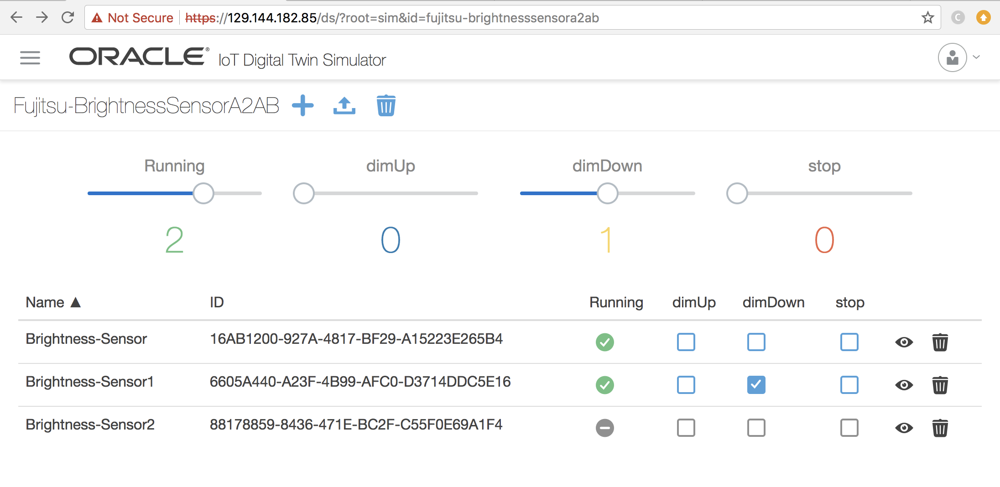

# Oracle IoT Cloud Service and Digital Twin Simulator test instances

Oracle provides a test instance of the IoT Cloud Service product and the Digital Twin Simulator for use by the WoT Workgroup for interoperability testing.

Both services are continuously available and online for interoperability testing by WoT WG members.

They can be used for:

* integrating devices to monitor and control from the IoT Cloud Service
* monitoring and controlling simulated devices from node-WoT 
* integrating other WoT reference implementations with the IoT Cloud Service

### IoT Cloud Service

The IoT Cloud Service is a PaaS platform that enables management on control of thousands of devices and processing of messages and alerts. 

It offers a Web frontend to manage device models and create applications.

 
 It can be used to monitor messages and alerts.

More information about Oracle's IoT SaaS and PaaS offerings can be found at: https://cloud.oracle.com/iot

### IoT Cloud Service and node-WoT integration

The node-WoT reference implementation can interact with the IoT Cloud Service and can be used to monitor and control node-WoT devices.
It is also possible to monitor and control devices from node-WoT that are managed by the IoT Cloud Service.

At the Prague plug-fest an integration with the Siemens Festo plant using node-WoT was demonstrated - an integration of other devices can easily be done.

### Digital Twin Simulator

The IoT Cloud Service product includes a Digital Twin Simulator, which can be used to easily create device simulations that can interact with node-WoT.

It allows to model the dynamic behavior of properties by mathematical functions and visualizes the change of properties over time.

The simulator enables the user to create and simulate device models, before an actual device implementation is available. 

It also allows to create multiple devices with just the push of a button.

### How to get access?

Since the IoT Cloud Service and the Digital Twin Simulator are on a single shared instance for all members of the workgroup, 
some coordination and cooperation is required.

If you would like to use the IoT Cloud Service with your node-WoT devices or the Digital Twin Simulator for creating device simulations, please contact Michael.Lagally@oracle.com 

