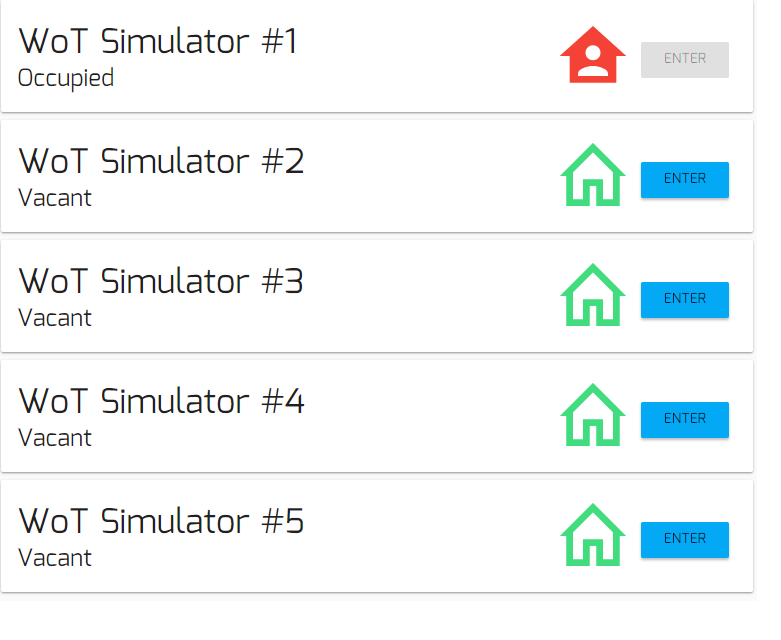
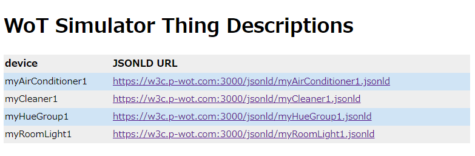
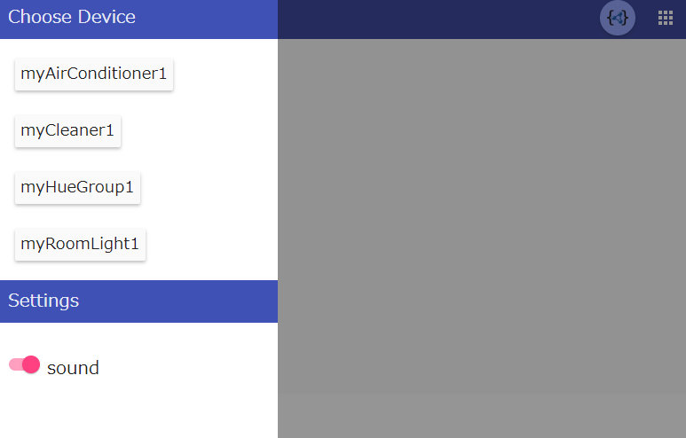
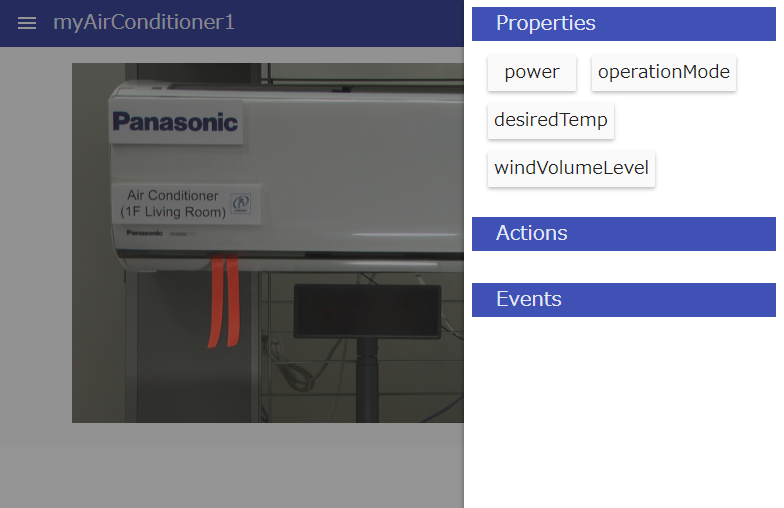

# Panasonic WoT Server Simulator

Panasonic provides online WoT Server Simulator for use by the WoT Workgroup for interoperability testing.

This service is continuously available and online for interoperability testing by WoT WG members.

It can be used for testing particular functionality of WoT Client as well as validating corresponding piece of specification.

### Usage
- Click "ENTER" of any of vacant simultor instance.

- GET TD from upper right "{}" icon.

- Choose menu from upper left hamburger icon.
  - Select device to simulate.
  - Sound on / off.
  

- Operate simulated device directly from upper right grid icon (this simulates local control of the device):
  - modify properties (if writable)
    - If the property is also observable, it will emit notification (to receive the notification, client needs to subscribe the observe property beforehands).
  - Emit event notification (to receive the notification, client needs to subscribe the event beforehands).
  

- Access to WoT interface of the device according to corresponding TD:
  - Supported interactions (depends each device)
    - Read and write (if writable) property
    - Invoke action
    - Subscribe to property (if observable) and event
  - Please add following HTTP header upon request:  
    X-PWOT-TOKEN: \<access token>

### Important Notice
- Please close simulator UI window while not in use, so that others can use the simulator instance.
- Please don't access to WoT interface which you are not currently in use (note that path and port number discribed in TD of each simulator instance differs).
- Please don't make frequent GET/PUT polling to WoT interface (e.g. < 5 seconds interval), to avoid system overloading.
- Please do not share id, password and access token with somebody outside of your company.

### Limitation
- You can only choose one simulated device to view/operate at once.
- Only HTTP(S) is supported for basic interaction (no CoAP support).
- Currently, only HTTP long polling is supported for notification (oberve property and event).
- Currently, only "myRoomLight*" has sound.
- Only Chrome is supported.

### How to get access?
If you would like to use the WoT Server Simulator, please contact kawaguchi.toru [at] panasonic.com
